````@raw html
---
title: Adaptive HSGP centering
description: "Reproducing the motorcycle HSGP case study: a noncentered pilot, per-frequency partial centering, and a fresh posterior fit."
---
````

# Adaptive HSGP centering

The difficult geometry of a Gaussian process is not necessarily resolved by
choosing one centered or noncentered parameterization for every coefficient.
Low and high HSGP frequencies can need different coordinates. This case study
follows [Generable's motorcycle example](https://www.generable.com/post/hsgp-reparam):
fit the noncentered model, inspect its geometry, choose one centering per basis
weight, and fit the reparameterized model from scratch.

The source workflow has a noncentered pilot and a selected-partial refit.
This extension compares both adaptation losses, post-hoc and online, alongside
fixed CP and NCP controls. Centered geometry remains the visual reference.

## The model

All 133 `MASS::mcycle` observations are used. A zero-mean squared-exponential
HSGP models the conditional mean, and another models the log conditional
standard deviation:

```text
mu(t)  = HSGP_mu(t)
eta(t) = HSGP_sigma(t)
y(t) ~ Normal(mu(t), exp(eta(t)))
```

Acceleration is divided by its sample standard deviation. Time is mapped to
`[-1,1]`. Each GP has **20** sine basis functions on `[-1.5,1.5]`, with the
source's `1/sqrt(1.5)` normalization. There is no additional population intercept.


The left panel shows frequencies 1, 2, 19 and 20; the dotted vertical lines mark
the observed domain. The right panel shows how increasing the length scale
suppresses the high-frequency weights.

### Hyperpriors and source equivalence

The source assigns independent `Normal(0,4)` priors to the **log** length scale
and **log** marginal standard deviation of each GP. BRM expresses these as
`LogNormal(0,4)` on the four positive parameters. The change of variables is
part of that equivalence:

```text
logpdf(LogNormal(0,4), exp(q)) + q = logpdf(Normal(0,4), q)
```

The `+q` is the unconstraining Jacobian. Each positive parameter has support
`(0, Inf)`, with no additional length-scale floor.

`research/adaptive_centering/audit_source.jl` compiles the immutable original
Stan program and compares it with the actual BRM-generated Stan model. Its
26 noncentered-model checks cover the coordinate mapping, normalized target including the
Jacobian, and all 44 gradient components. Across six tested points the largest
absolute density and gradient differences were `5.7e-14` and `4.3e-14`.
The companion `audit_partial_source.jl` checks the fresh partial model against
the original adaptive Stan program at 16 saved posterior positions. All 51
checks pass; the largest density and gradient differences are `9.95e-14` and
`5.59e-12`. These are comparisons of the actual generated targets, including
the source hyperpriors, not just algebraic prior identities.

### One BRM formula and its generated backends

This executable example reads the full dataset and uses the same 20-frequency
model as the sampling runs. The tabs expose its generated backends. All fits
on this page use StanBlocks/BridgeStan; the Turing tab shows generated code.

```@eval
Main.BRMDocsComparisons.comparison(@__MODULE__, raw"""
using Statistics

function adaptive_motorcycle_model()
    csv = joinpath(dirname(pathof(BayesianRegressionModels)), "..",
                   "research", "adaptive_centering", "mcycle.csv")
    rows = split.(readlines(csv)[2:end], ',')
    times = parse.(Float64, getindex.(rows, 2))
    accel = parse.(Float64, getindex.(rows, 3))
    xmin, xmax = extrema(times)
    x = @. -1 + 2 * (times - xmin) / (xmax - xmin)
    y = accel ./ std(accel)
    (@brm begin
        length_scale(mu, hsgp(x)) ~ LogNormal(0, 4)
        sd(mu, hsgp(x)) ~ LogNormal(0, 4)
        length_scale(sigma, hsgp(x)) ~ LogNormal(0, 4)
        sd(sigma, hsgp(x)) ~ LogNormal(0, 4)
        mu ~ hsgp(x; k=20, domain=(-1.5, 1.5))
        log(sigma) ~ hsgp(x; k=20, domain=(-1.5, 1.5))
        y ~ Normal(mu, sigma)
    end)((; x, y))
end
""", :adaptive_motorcycle_model;
    title="The full motorcycle model", require_stan=true)
```


## Fit the noncentered model

The mean and log residual-SD GPs each use 20 basis weights. NCP samples
standardized weights; CP samples physical weights. If $s_j$ is the spectral
SD of basis $j$, intermediate coordinates are $u_j=s_j^{c_j}z_j$.
The log spectral scale depends on both GP hyperparameters.

```julia
using Random, WarmupHMC
sb = SBBRMI(adaptive_motorcycle_model(); mod=@__MODULE__)
problem = StanBlocks.stan_instantiate(sb.model)
pilot = WarmupHMC.adaptive_warmup_mcmc(
    Xoshiro(1), problem; n_draws=10_000, monitor_ess=true)
```

The posterior function plot uses the native BRM prediction contract. The
left panel is the conditional mean; the right is the conditional residual SD.
The ribbons summarize continuous functions of time, rather than categorical
effects or replicated observations.

[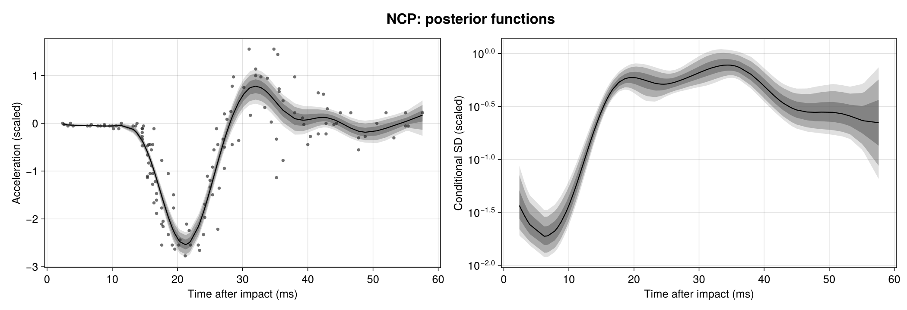](assets/centering-refresh-hsgp/posterior-ncp.png)

## Both losses, post-hoc and online

For a zero-mean random effect with log scale $\ell$, the centering family is
$u_c=\exp(c\ell)z$: $c=0$ is NCP and $c=1$ is CP. Its transformed effect
gradient is $g_c=\exp(-c\ell)g_z$. We compare two criteria, minimized separately
for each effect:

```math
L_{\mathrm{position}}(c)=\log\operatorname{sd}(u_c)-\operatorname{mean}(c\ell),
\qquad
L_{\mathrm{gradient}}(c)=\operatorname{cor}(u_c,g_c).
```

The second is a **signed** correlation: an independent Gaussian coordinate
has correlation $-1$ with its log-density gradient. The first uses positions
and the Jacobian, without a gradient term.

Both post-hoc arms use the same NCP pilot, select on `0:0.01:1`, then fit
afresh with the controls fixed. The gradient selector uses the pilot's saved
gradients. Both online arms select on the native `0:0.1:1` grid during warmup,
using the sampler's trajectory evidence and weights. They have no separate
pilot. Controls are frozen for the retained sampling phase.

The online gradient criterion is WarmupHMC's default. The research harness
selects the position criterion through the existing internal loss functions;
there is currently no public loss-selection keyword. The model, initialization
policy, seed and requested draw count are otherwise shared across the arms.

These runs use the active-position transport implementation published in
[WarmupHMC `6b377cb`](https://github.com/nsiccha/WarmupHMC.jl/commit/6b377cb23934022af5879d199a7c57abfac54c70).
When centering changes, the active position and the adaptation sample now
represent the same physical points before and after the change.

WarmupHMC returns **model coordinates** in `posterior_position`; checkpoints
retain sampler coordinates. Export checks their mapping, Jacobian-adjusted
density and saved gradients before making figures or scientific summaries.

[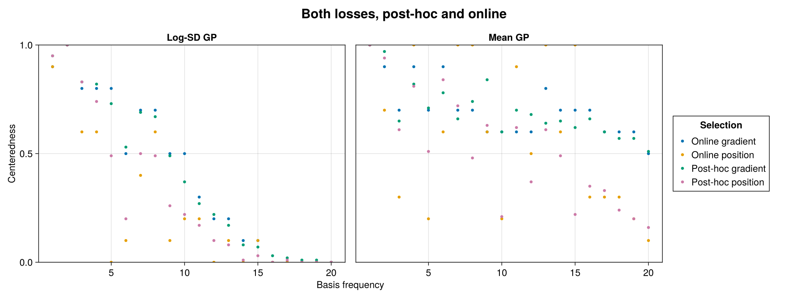](assets/centering-refresh-hsgp/centeredness.png)

## Fit with selected coordinates

All refreshed arms wrap the **same compiled noncentered Stan target**. The
post-hoc fits fix the selected centering controls; the online fits adapt them
during warmup. This keeps the target implementation shared across the matrix.
The original reproduction directory also demonstrates compiling selected
partial coordinates directly into a BRM model.

[](assets/centering-refresh-hsgp/posterior-post-hoc-position.png)

[](assets/centering-refresh-hsgp/posterior-post-hoc-gradient.png)

[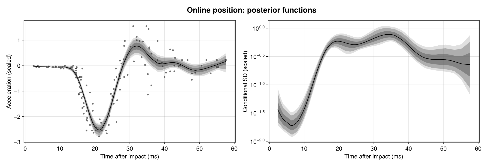](assets/centering-refresh-hsgp/posterior-online-position.png)

[](assets/centering-refresh-hsgp/posterior-online-gradient.png)

## Sampling efficiency and full workflow cost

Each completed arm has one chain, seed 1 and 10,000 retained draws. Every row
uses the same scientific quantities: **four GP hyperparameters, plus mean and conditional SD at each of the 94 distinct observed times (192 quantities)**. Standardized effects
are excluded from the minimum. Positive scales may be stored as logs;
rank-normalized bulk ESS is invariant under that monotone change.

| WHMC method | Total gradients | Sampling efficiency | Total efficiency |
|:--|--:|--:|--:|
| NCP | 4,648,422 | 1× | 1× |
| CP | 4,933,469 | 0.0227× | 0.0236× |
| Post-hoc position | 5,123,265 | 5.67× | 0.934× |
| Post-hoc gradient | 5,134,664 | 6.25× | 1.04× |
| Online position | 2,263,320 | 1.93× | 3.43× |
| Online gradient | 713,602 | 6.23× | 7.15× |


Both efficiency columns are relative to this study's **NCP + WarmupHMC**
baseline. Sampling efficiency is minimum bulk ESS divided by retained-sampling
gradient calls. Total efficiency divides that same minimum ESS by the full
workflow's gradient calls. The total includes initialization, all warmup and
adaptation, active-state reevaluations, and sampling. For each post-hoc row it
also includes the entire NCP pilot; the pilot's ESS is not added to the refit's.

Gradient counts measure target evaluations, a proxy for compute cost rather
than a wall-clock speed ratio. Compilation, plotting and independent audits
are outside the fitting counts. The complete numerical summaries, including
absolute ESS and both denominators, are in the linked result files.

Sampling divergences: **NCP: 99; CP: 707; Post-hoc position: 55; Post-hoc gradient: 43; Online position: 6; Online gradient: 12**. These are one-chain comparisons, so neither
the ranking nor a within-chain split R-hat establishes cross-chain convergence.

[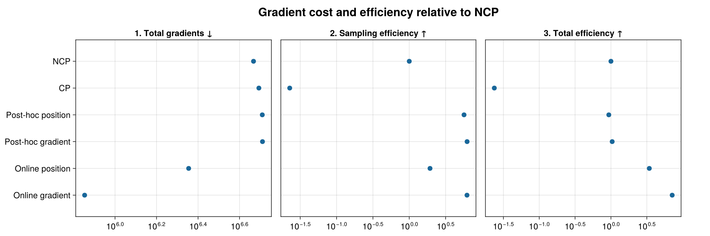](assets/centering-refresh-hsgp/efficiency.png)

The remaining divergences are material: these runs do not establish reliable
performance rankings for this broad-prior HSGP. Full centering is particularly
poor. Both online losses improve total efficiency over NCP in this run. The
post-hoc arms have a much cheaper sampling phase, but must amortize a large pilot.

The online gradient arm uses an additional numerical admissibility check in
[WarmupHMC `7aed40b`](https://github.com/nsiccha/WarmupHMC.jl/commit/7aed40b18bd4cdabb75330f285d5c9b355575ab9):
if a proposed centering cannot represent the stored adaptation points and
gradients with finite values, it keeps the previous coordinates and state.
One update was rejected in this run. The remaining arms use the same active-state
transport implementation without encountering this representability limit.

## Geometry of the fitted coordinates

The left column is always the **centered visualization baseline**, obtained
from the NCP pilot. The pilot comparison uses those same draws in CP and NCP.
The post-hoc and online panels each show their two newly fitted loss variants
in the coordinates actually used by the sampler. CP is the visual reference;
NCP remains the efficiency baseline. Axes are independent across panels.

[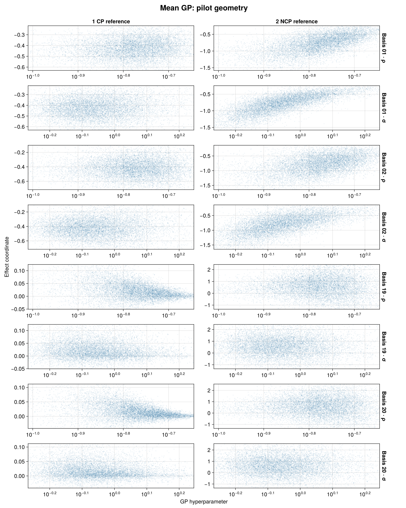](assets/centering-refresh-hsgp/pairs-pilot-mean-gp.png)

[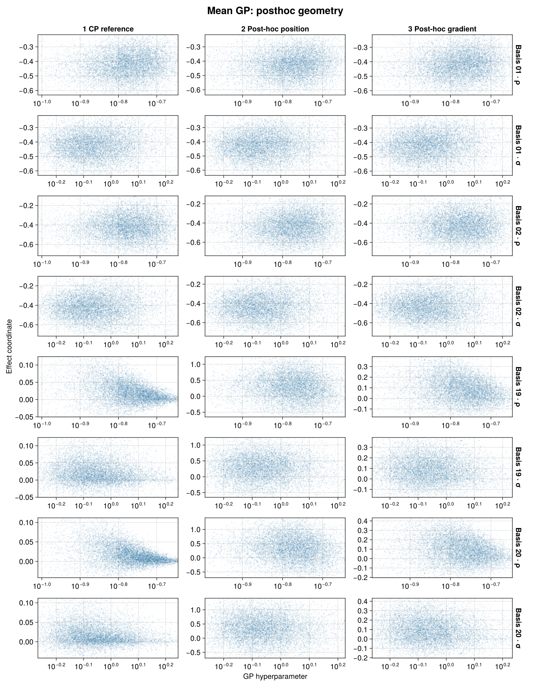](assets/centering-refresh-hsgp/pairs-posthoc-mean-gp.png)

[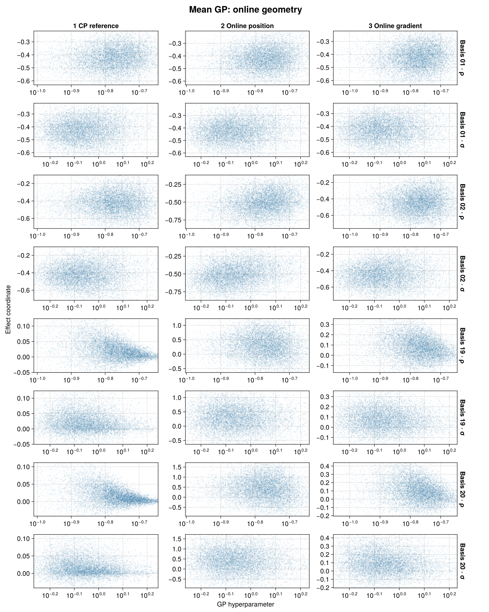](assets/centering-refresh-hsgp/pairs-online-mean-gp.png)

[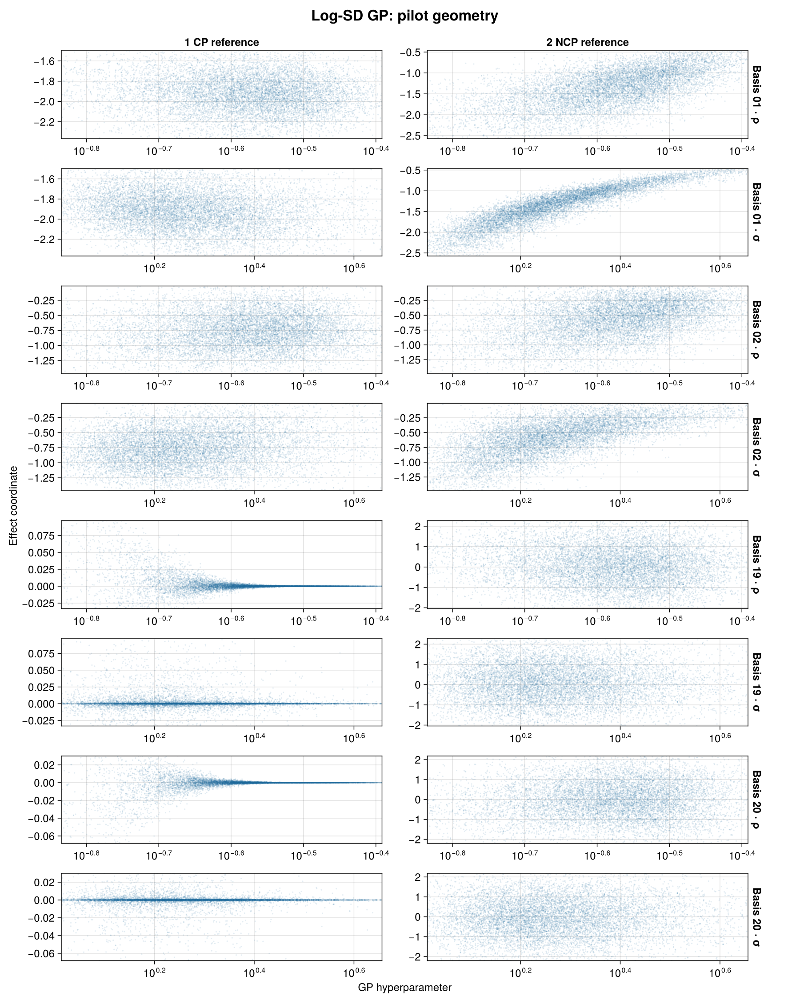](assets/centering-refresh-hsgp/pairs-pilot-log-sd-gp.png)

[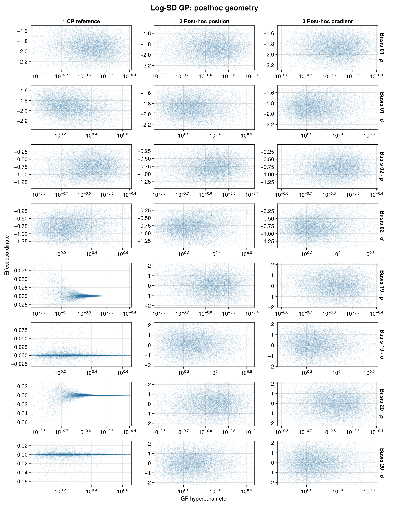](assets/centering-refresh-hsgp/pairs-posthoc-log-sd-gp.png)

[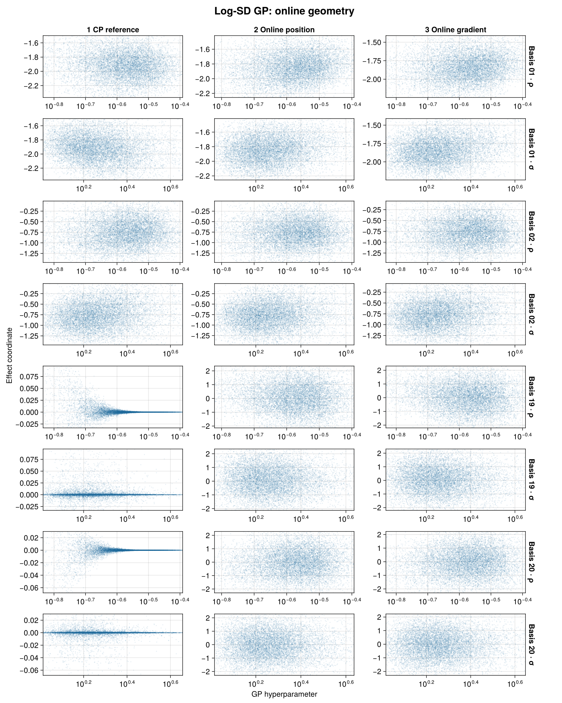](assets/centering-refresh-hsgp/pairs-online-log-sd-gp.png)

Rows show frequencies 1, 2, 19 and 20 against each GP hyperparameter: $\rho$
is the length scale and $\sigma$ the marginal SD. The
display zooms to the central 97.5% extent for readability; no observations are
deleted from the underlying scatter data or diagnostics. Display limits are
recorded alongside the figures. Each online loss has its own fitted column.

## Position and gradient in the displayed coordinates

These panels pair each displayed effect coordinate with its own log-density
gradient, using 1,000 evenly spaced retained draws. The CP reference transforms
the pilot's positions and gradients together. The fitted panels use gradients
saved in their actual sampler frame; they do not attach an NCP gradient to a
centered position.

[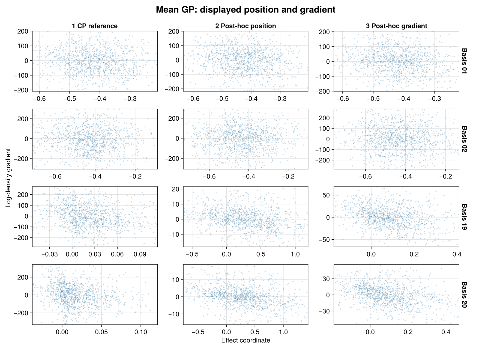](assets/centering-refresh-hsgp/gradients-posthoc-mean-gp.png)

[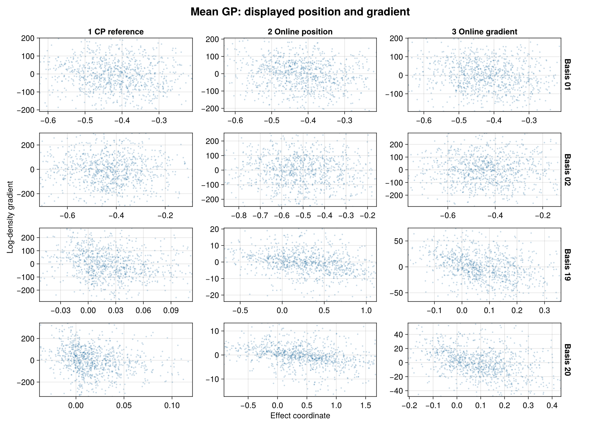](assets/centering-refresh-hsgp/gradients-online-mean-gp.png)

[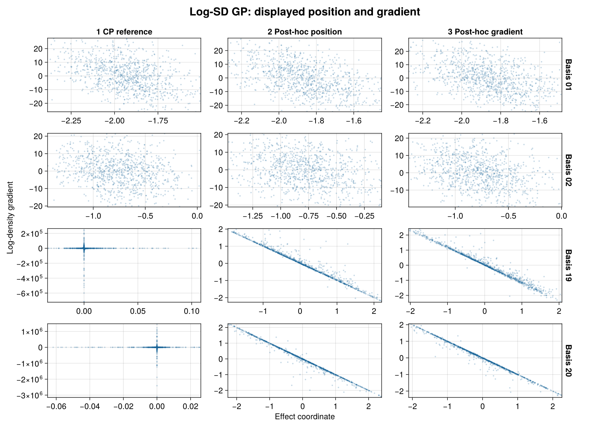](assets/centering-refresh-hsgp/gradients-posthoc-log-sd-gp.png)

[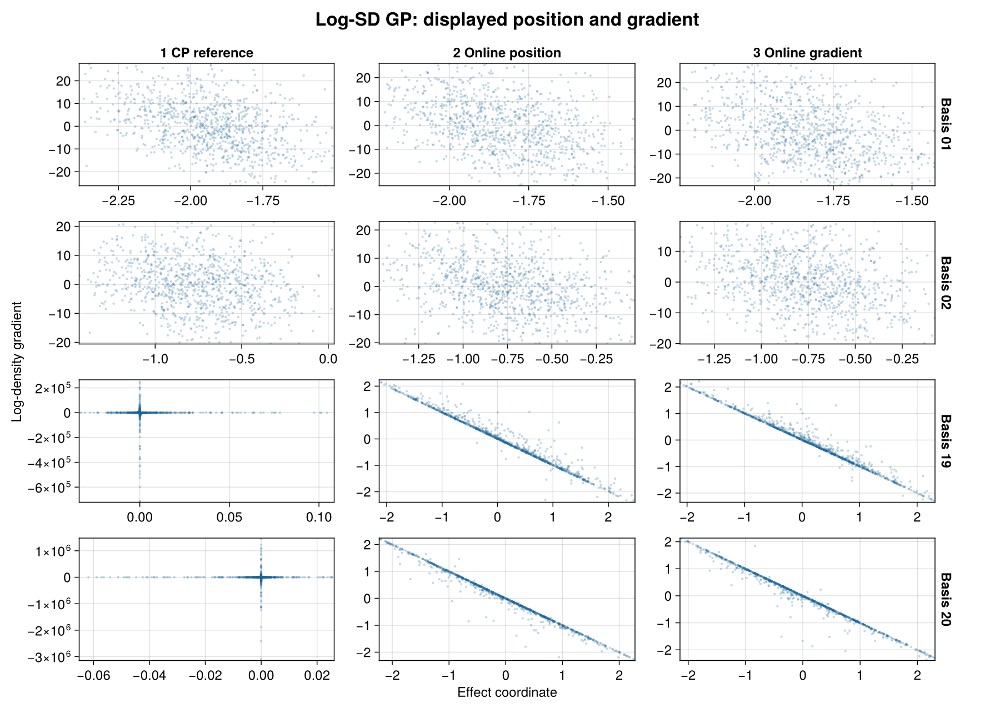](assets/centering-refresh-hsgp/gradients-online-log-sd-gp.png)

### Separate backend gradient comparison

A separate DynamicPPL/Enzyme gradient benchmark passed numerical agreement
checks against StanBlocks. Fixed-coordinate runtime ratios were
1.41–1.48× StanBlocks and the online
wrapper ratios were 1.03–1.19×. The committed receipt is
`test/receipts/turing_hsgp_gradients.tsv`. The fits and figures here remain
StanBlocks/BridgeStan results; the gradient benchmark is not
Turing posterior-sampling evidence.


## Reproduce and inspect

The [refresh harness](https://github.com/nsiccha/BayesianRegressionModels.jl/tree/ns/devibe/research/centering_refresh)
contains the driver, both loss selectors, saved-frame audits, export and AoV
plotting code. Its [results for this study](https://github.com/nsiccha/BayesianRegressionModels.jl/tree/ns/devibe/research/centering_refresh/results/hsgp)
contain the full efficiency denominators, per-quantity ESS and selected controls.
The original model directory retains the source specification and independent
density/gradient audit. The refresh uses those same model definitions.

Run `run.jl hsgp ncp OUTPUT` first, then request
`cp,posthoc_position,posthoc_gradient,online_position,online_gradient` with the
same output root. Completed arm directories are immutable. See the harness
README for the environment and full commands.
