````@raw html
---
title: Adaptive HSGP centering
description: "Reproducing the motorcycle HSGP case study: a noncentered pilot, per-frequency partial centering, and a fresh posterior fit."
---
````

# Adaptive HSGP centering

The difficult geometry of a Gaussian process is not necessarily resolved by
choosing one centered or noncentered parameterization for every coefficient.
Low and high HSGP frequencies can need different coordinates. This case study
follows [Generable's motorcycle example](https://www.generable.com/post/hsgp-reparam):
fit the noncentered model, inspect its geometry, choose one centering per basis
weight, and fit the reparameterized model from scratch.

The source workflow has two fits: a noncentered pilot and a selected-partial
refit. The centered plots transform the pilot draws. A third fit extends the
comparison with online adaptation during warmup.

## The model

All 133 `MASS::mcycle` observations are used. A zero-mean squared-exponential
HSGP models the conditional mean, and another models the log conditional
standard deviation:

```text
mu(t)  = HSGP_mu(t)
eta(t) = HSGP_sigma(t)
y(t) ~ Normal(mu(t), exp(eta(t)))
```

Acceleration is divided by its sample standard deviation. Time is mapped to
`[-1,1]`. Each GP has **20** sine basis functions on `[-1.5,1.5]`, with the
source's `1/sqrt(1.5)` normalization. There is no additional population intercept.

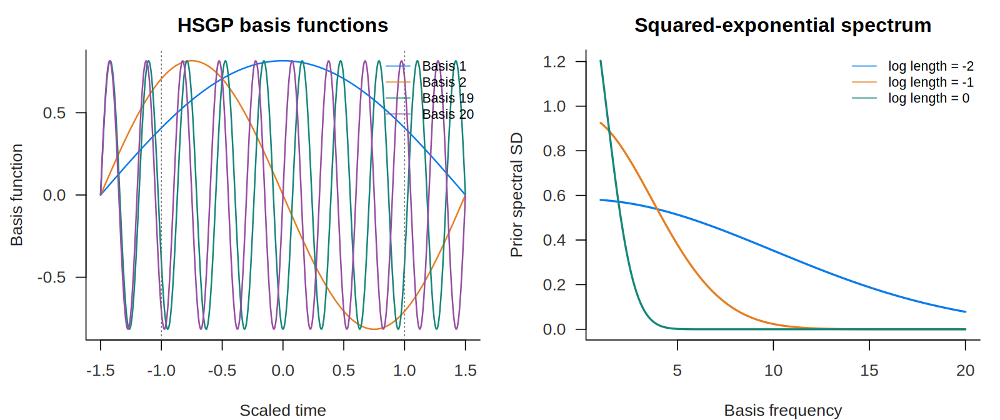

The left panel shows frequencies 1, 2, 19 and 20; the dotted vertical lines mark
the observed domain. The right panel shows how increasing the length scale
suppresses the high-frequency weights.

### Hyperpriors and source equivalence

The source assigns independent `Normal(0,4)` priors to the **log** length scale
and **log** marginal standard deviation of each GP. BRM expresses these as
`LogNormal(0,4)` on the four positive parameters. The change of variables is
part of that equivalence:

```text
logpdf(LogNormal(0,4), exp(q)) + q = logpdf(Normal(0,4), q)
```

The `+q` is the unconstraining Jacobian. Each positive parameter has support
`(0, Inf)`, with no additional length-scale floor.

`research/adaptive_centering/audit_source.jl` compiles the immutable original
Stan program and compares it with the actual BRM-generated Stan model. Its
26 noncentered-model checks cover the coordinate mapping, normalized target including the
Jacobian, and all 44 gradient components. Across six tested points the largest
absolute density and gradient differences were `5.7e-14` and `4.3e-14`.
The companion `audit_partial_source.jl` checks the fresh partial model against
the original adaptive Stan program at 16 saved posterior positions. All 51
checks pass; the largest density and gradient differences are `9.95e-14` and
`5.59e-12`. These are comparisons of the actual generated targets, including
the source hyperpriors, not just algebraic prior identities.

### One BRM formula and its generated backends

This executable example reads the full dataset and uses the same 20-frequency
model as the sampling runs. The tabs expose its generated backends. All fits
on this page use StanBlocks/BridgeStan; the Turing tab shows generated code.

```@eval
Main.BRMDocsComparisons.comparison(@__MODULE__, raw"""
using Statistics

function adaptive_motorcycle_model()
    csv = joinpath(dirname(pathof(BayesianRegressionModels)), "..",
                   "research", "adaptive_centering", "mcycle.csv")
    rows = split.(readlines(csv)[2:end], ',')
    times = parse.(Float64, getindex.(rows, 2))
    accel = parse.(Float64, getindex.(rows, 3))
    xmin, xmax = extrema(times)
    x = @. -1 + 2 * (times - xmin) / (xmax - xmin)
    y = accel ./ std(accel)
    (@brm begin
        length_scale(mu, hsgp(x)) ~ LogNormal(0, 4)
        sd(mu, hsgp(x)) ~ LogNormal(0, 4)
        length_scale(sigma, hsgp(x)) ~ LogNormal(0, 4)
        sd(sigma, hsgp(x)) ~ LogNormal(0, 4)
        mu ~ hsgp(x; k=20, domain=(-1.5, 1.5))
        log(sigma) ~ hsgp(x; k=20, domain=(-1.5, 1.5))
        y ~ Normal(mu, sigma)
    end)((; x, y))
end
""", :adaptive_motorcycle_model;
    title="The full motorcycle model", require_stan=true)
```

## 1. Fit the noncentered model

The source configuration is retained: one chain, `Xoshiro(1)`, 10,000 requested
draws, and ordinary WarmupHMC defaults including Pathfinder initialization.
The draw count is a floor, so the actual retained count is reported below.
Evaluation windows, target acceptance, tree depth and transformation settings
use their defaults.

```julia
pilot = WarmupHMC.adaptive_warmup_mcmc(
    Xoshiro(1), noncentered_problem; n_draws=10_000, monitor_ess=true)
```

`monitor_ess=true` preserves the diagnostic monitoring enabled by the source's
progress display; it does not retune the sampler.


The two panels show the conditional mean and conditional standard deviation,
not a posterior-predictive interval. Shading gives 90%, 80% and 50% central
credible intervals. Both use the source's standardized acceleration units;
the noise axis is logarithmic.

## 2. Inspect the geometry in different coordinates

For spectral standard deviation `s` and noncentered weight `z`, the physical
basis weight is `w = s*z`. In partial coordinates,

```text
u = s^c * z
u ~ Normal(0, s^c)
w = s^(1-c) * u
```

`c=0` is noncentered and `c=1` is centered. The physical prior and likelihood
stay the same; the sampler's coordinates and their matching Jacobian change.

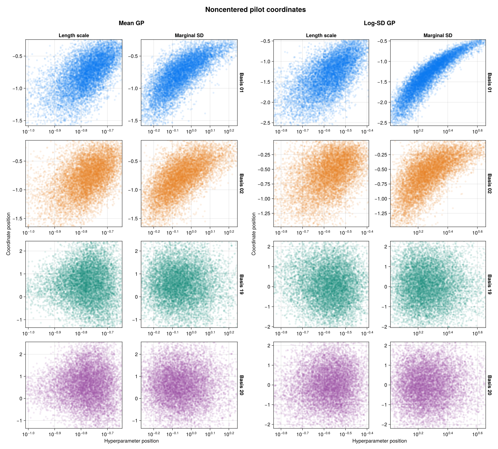

Rows show frequencies 1, 2, 19 and 20. Columns show the mean GP's length scale
and marginal SD, then the log-SD GP's length scale and marginal SD. The
hyperparameter axes are logarithmic. All 10,000 draws enter each pair plot.
Scatter axes zoom to the 1.25th–98.75th percentiles of each panel's marginal
positions: the central 97.5% on each axis, not a joint probability region.
Points outside that window remain in all calculations and saved draw tables.

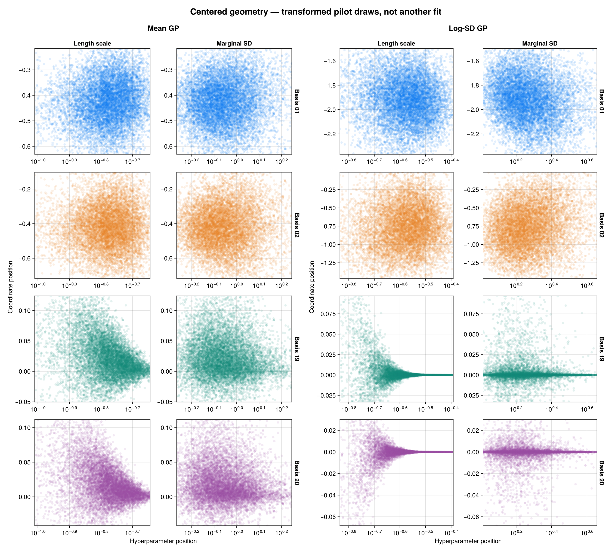

This is the **same pilot**, transformed to `w=s*z`. It reveals the centered
geometry without running another chain. A change that helps low frequencies
can make high frequencies much worse, which motivates choosing their
centeredness separately.

## 3. Select one centering per frequency

For each weight, the source searches `0:0.01:1` using

```text
loss(c) = log(std(z .* exp.(c .* log(s)))) - mean(c .* log(s))
```

BRM's `select_hsgp_centeredness` exposes this pilot-based selection. It uses
shifted exponents to evaluate the loss stably and reports candidates whose
partial-coordinate scales would underflow as inadmissible. The noncentered
endpoint remains available.

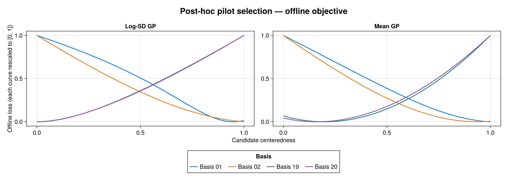

Each curve is rescaled to `[0,1]` for display, as in the source. Only its
minimum matters; losses from different frequencies are not compared by their
plotted heights. Gaps represent explicitly inadmissible candidates.

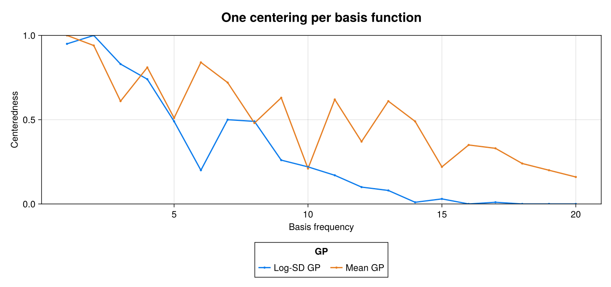

The selected vectors become ordinary model data through
`hsgp(...; centeredness=c_mu)` and `hsgp(...; centeredness=c_sigma)`.

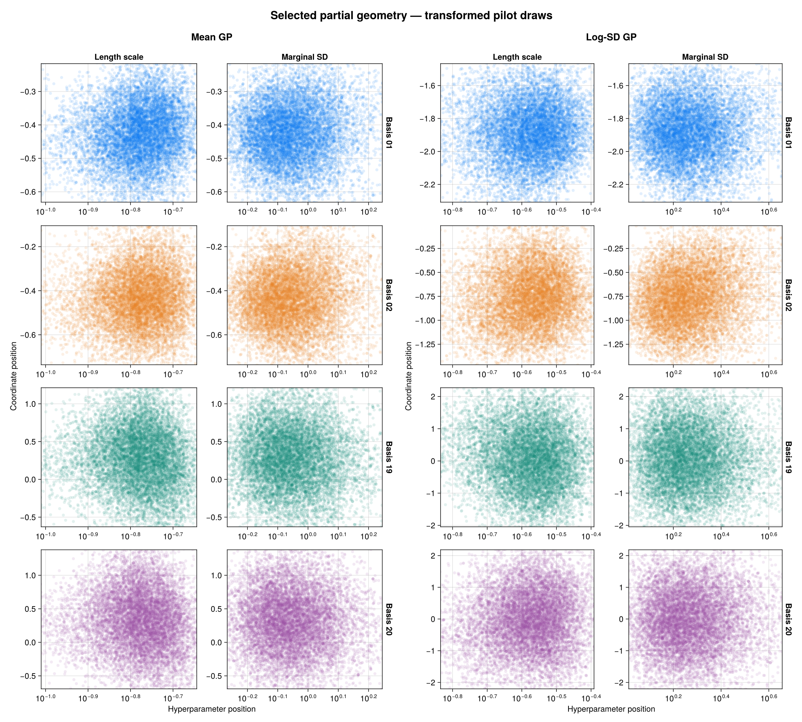

These panels apply the selected coordinates to the same pilot draws, so their
geometry can be compared directly with the noncentered and centered panels.
They are not the fresh refit's samples shown next.

## 4. Fit the selected partial model from scratch

The second fit starts fresh, again with `Xoshiro(1)`, 10,000 requested draws,
and ordinary WarmupHMC defaults. The pilot determines the coordinates, not
the posterior sample retained from the second fit.

```julia
refit = WarmupHMC.adaptive_warmup_mcmc(
    Xoshiro(1), selected_partial_problem; n_draws=10_000, monitor_ess=true)
```

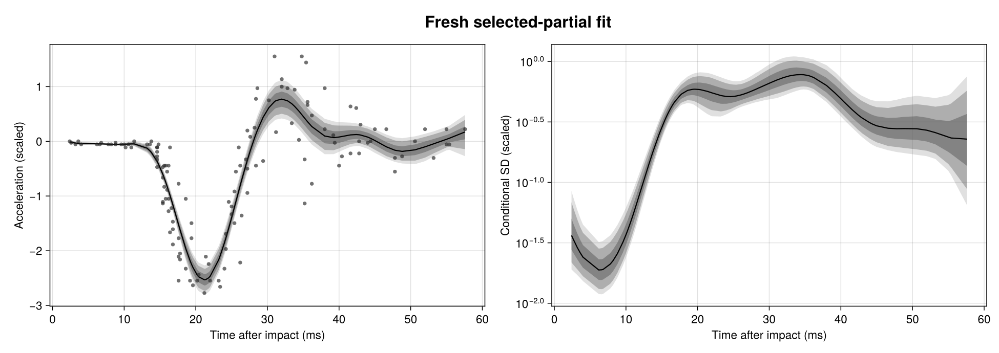

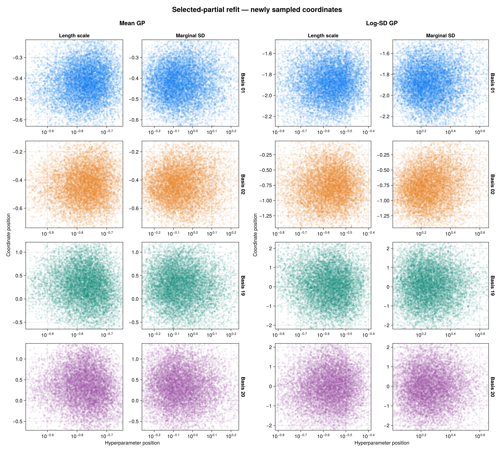

Both fits retained 10,000 draws with the configuration above:

| fit | max split R-hat | min bulk ESS | min tail ESS | divergences |
| --- | ---: | ---: | ---: | ---: |
| Noncentered pilot | 1.0009 | 1,922 | 2,160 | 99 (0.99%) |
| Selected-partial refit | 1.0013 | 2,436 | 2,783 | 36 (0.36%) |

The posterior curves agree visually and the low-frequency coordinate clouds
become less dependent on the hyperparameters. Divergences decrease, but do
not disappear. Both minimum bulk and tail ESS improve in this refit, but
obtaining its coordinates also required the pilot. The cost accounting below
includes that distinction; partial centering does not guarantee a clean fit.

An independent check applied the source's literal loss formula to every pilot
weight: all 40 selected values agree exactly with BRM's automated selection.
The full-fit receipts, candidate scores and figure checks pass 8,221 tests.

Rank-normalized split R-hat, bulk ESS and tail ESS are computed with
MCMCDiagnosticTools. As in the source's main example, each fit has one chain:
split R-hat is a within-chain diagnostic, not evidence that independent chains
agree. The divergences limit how confidently these samples can represent the
posterior, despite their favorable R-hat and ESS values.

ESS alone does not measure computational cost. The [cost comparison below](#compute-cost-and-ess-per-gradient)
reports measured runtime and exact total and retained-sampling gradient counts
for all three fits.

## Online adaptive centering

Online centering learns per-weight coordinates inside warmup instead of using
a separate pilot. BRM discovers the HSGP cells and constructs their transform:

```julia
online = adaptive_centering_problem(sb, stan_problem, enzyme_backend)
fit = WarmupHMC.adaptive_warmup_mcmc(
    Xoshiro(1), online; n_draws=10_000, monitor_ess=true)
learned = WarmupHMC.reparam_sources(online)
```

Returned draws are already back in the original model coordinates: do not
apply a second sampler-to-model back-transform. An explicit transformation
for a diagnostic plot is a separate operation, as shown below. The reproduction provides a separate
`run_online_stanblocks` entry point with the same full model and ordinary
sampler defaults; it is an extension, not one of the source's two fits.


The full online StanBlocks run retained 10,000 draws, with **zero divergences**,
maximum split R-hat `1.0016`, minimum bulk ESS `2,313`, and minimum tail ESS
`2,886`. This is encouraging evidence from one run, not a guarantee for other
data, seeds or models.

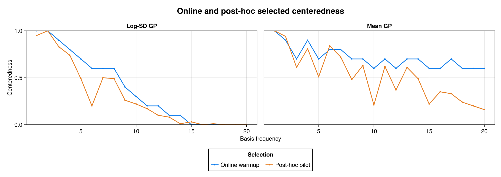

The online values come from warmup's `0:0.1:1` candidate grid; the offline
profile uses the source's finer `0:0.01:1` search over its separate pilot.
They are not expected to select identical values from different finite
trajectories and different objectives. Both preserve the same physical model
through their matching coordinate transform and Jacobian.

### Online pair plots

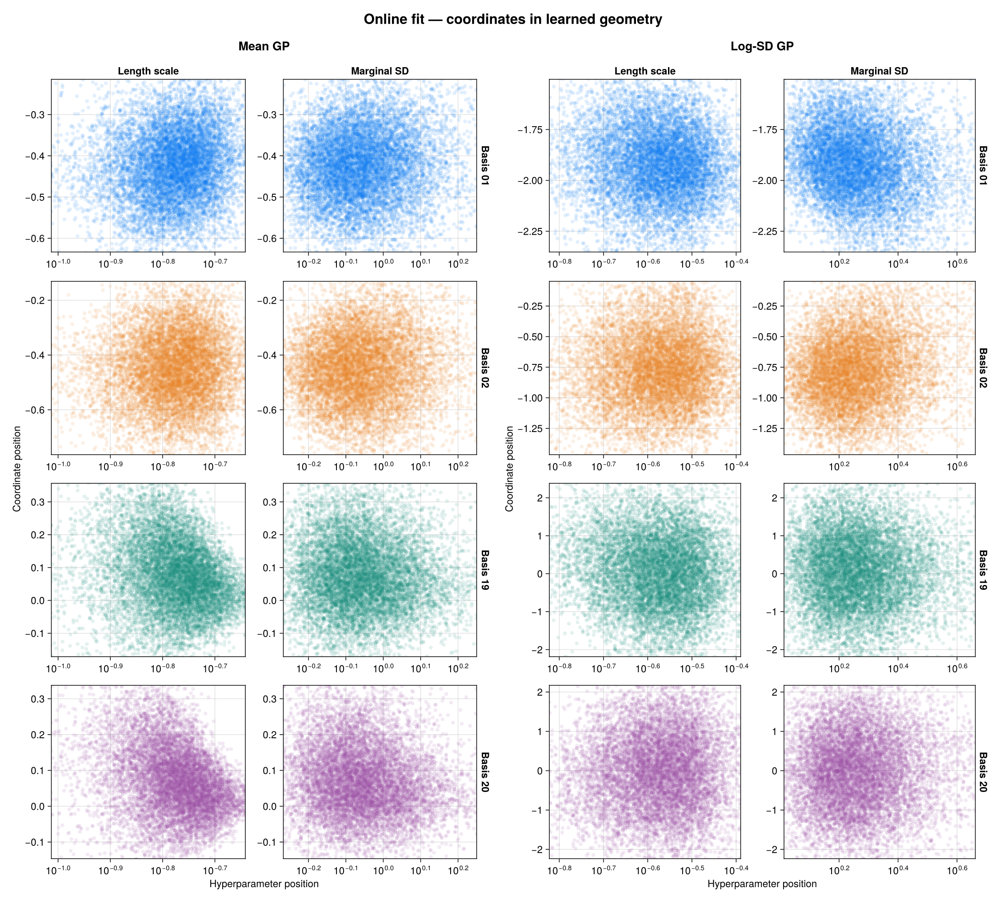

These pair diagnostics use all 10,000 online draws. BRM transforms each
returned NCP weight into its learned coordinate `u = s^c*z` exactly once for
display. Length-scale and
marginal-SD axes are logarithmic; each panel has its own coordinate scale.
This transformation neither samples a new posterior nor changes the physical
weights represented by the saved draws.

### Which loss is online centering minimizing?

The two selectors use different criteria. The post-hoc selector above uses
the source's KL-derived log-scale proxy,

```text
L_offline(c) = log(std(s^c*z)) - mean(c*log(s)).
```

WarmupHMC's online selector uses **weighted position–gradient correlation**
at its default `w₁=0`:

```text
u_c = s^c*z
g_c = ∂ log p_c / ∂u_c
L_online(c) = Cor_weighted(u_c, g_c).
```

It minimizes that signed correlation on `0:0.1:1`; it is not minimizing an
absolute correlation or reusing the offline loss. For an independent Gaussian coordinate,
the log-density gradient is a decreasing affine function of position, giving
correlation `-1`. The optional Jacobian/log-variance part of WarmupHMC's
criterion has zero weight under these defaults.

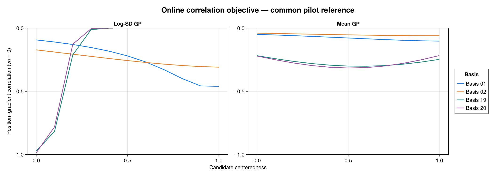

This plot evaluates WarmupHMC's native `candidate_scoring_losses` on the
**same 10,000 pilot draws** used by the offline diagnostic, with unit weights.
It facets only by GP: the coordinate frame in which the reference draws were
stored does not change the candidate loss landscape. A matched-draw audit
evaluated all 1,320 candidate comparisons across three representations of
those physical draws; their largest loss difference was `1.11e-15`.

Unlike the offline proxy plot, these are **raw, interpretable correlations**,
with fixed y-limits `[-1,0]` and no min–max scaling. Values near `-1` indicate
a nearly linear decreasing position–score relationship; values near zero
indicate a weak linear relationship. The exported scores remain unchanged.

This is a **retrospective objective diagnostic**, not a reconstruction of
the online run's warmup history. Actual online selection accumulates warmup
trajectory evidence and resets between adaptation windows. Saved posterior
draws do not retain that leaf stream, its weights, or those group boundaries,
so a posterior replay need not choose the exact centeredness learned online.

### Pair plots in gradient-loss-selected coordinates

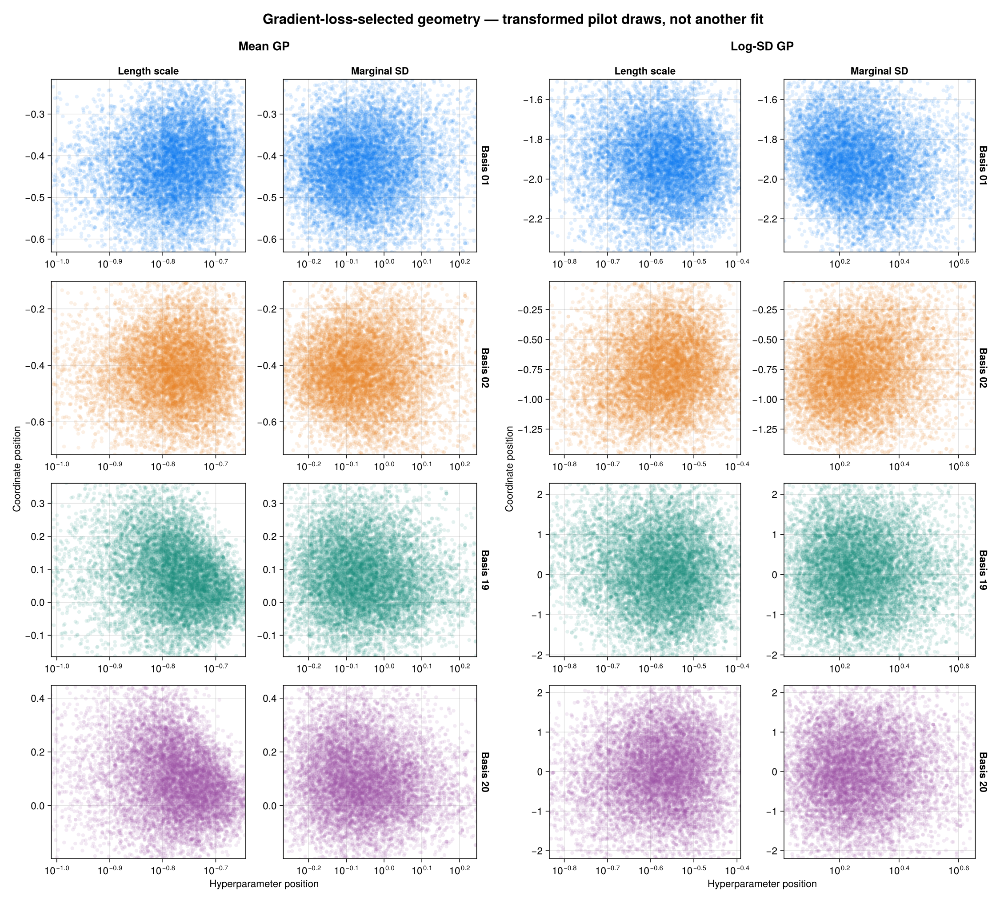

For this third geometry view, each basis exponent is the minimizer of its
native gradient-loss curve evaluated on the common pilot, over `0:0.1:1`.
The familiar hyperparameter pair plots then transform all 10,000 pilot draws
to those coordinates. **There is no additional fit.** These values need not
equal warmup's final online selections: the criterion is the same, but the
posterior pilot and the online warmup stream supply different finite evidence.

### Position versus gradient, without hyperparameter axes

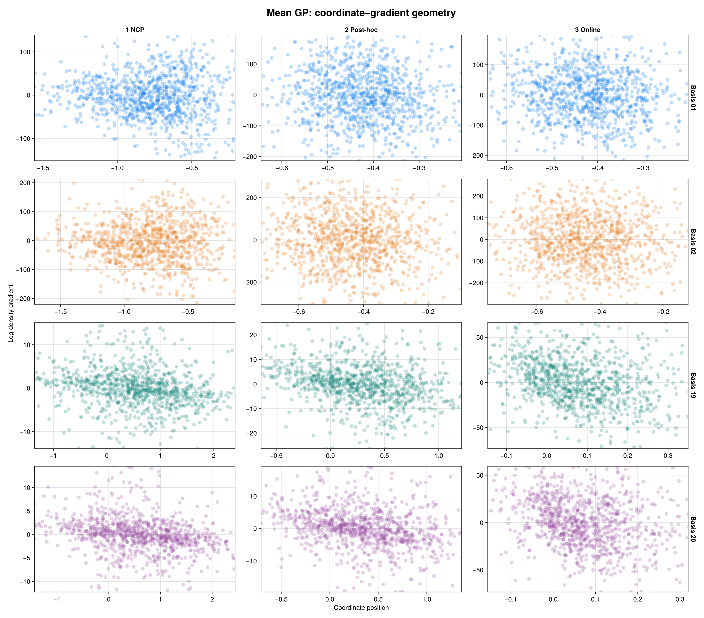

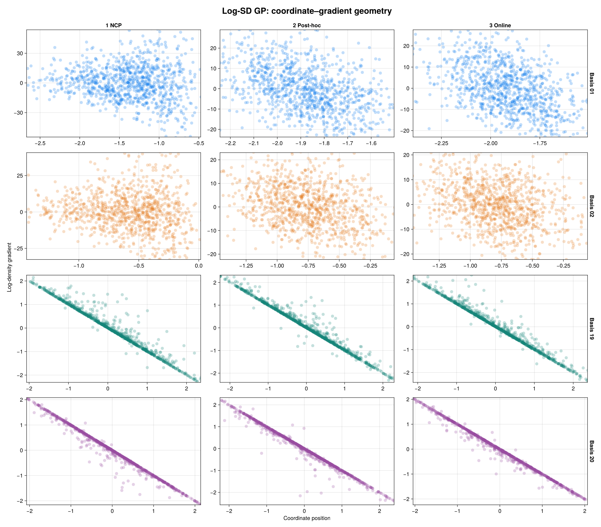

Here the columns genuinely change the displayed coordinates: NCP pilot,
post-hoc partial refit, and online fit in its learned geometry. Each facet
uses **1,000 evenly selected saved draws**, with transparent points; the
underlying gradient evaluations and loss calculations use all 10,000
draws per fit. The points are plotted directly, without smoothing or aggregation.
Gradient axes are independent between facets, because reparameterization
changes their units as well as the coordinate units. Each displayed axis uses
the central 97.5% marginal range of those plotted points, as in the pair plots.

The gradients come from the actual BRM-generated Stan target. At fixed
hyperparameters, BRM transports them with `g_c = s^(-c)*g_z` (or the equivalent
source-to-target exponent difference). The change-of-coordinate Jacobian is
constant with respect to this basis coordinate; its hyperparameter derivatives
are not being plotted here. Seventy-two independent finite-difference checks
of the displayed gradients passed, with maximum scaled error `3.95e-9`.
These scatter plots visualize a component of the correlation criterion;
their appearance alone is not an ESS or convergence guarantee.

### Backend gradient comparison

A separate DynamicPPL/Enzyme gradient benchmark passed numerical agreement
checks against StanBlocks. Fixed-coordinate runtime ratios were
1.41–1.48× StanBlocks and the online
wrapper ratios were 1.03–1.19×. The committed receipt is
`test/receipts/turing_hsgp_gradients.tsv`. The fits and figures here remain
StanBlocks/BridgeStan results; the gradient benchmark is not
Turing posterior-sampling evidence.

## Compute cost and ESS per gradient

Each fit records both exact counters using WarmupHMC `deeea1d` and Julia
1.10.11, with the model, priors, seed and sampling options specified above.
`report_costs.jl` verifies each saved fit's counters
against its final checkpoint; it never sums cumulative counters across windows.

- **Total NUTS gradients** include step-size adaptation and all discarded
  restart epochs, as well as retained sampling. They count DynamicHMC integration
  steps, **not** Pathfinder initialization or other setup gradient calls.
- **Sampling gradients** count only appended transitions corresponding to the
  final retained draws. They exclude adaptation and discarded epochs.
- Each ESS numerator is the **minimum over all 44 sampled model
  coordinates**, in that fit's reported parameterization, not a sum of ESS
  across parameters.

| Fit | Total NUTS gradients | Min bulk ESS / total | Sampling gradients | Min bulk ESS / sampling | Fit time |
| --- | ---: | ---: | ---: | ---: | ---: |
| Noncentered pilot | 4,648,302 | 0.000413 | 2,583,577 | 0.000744 | 89.8 s |
| Selected-partial refit | 850,127 | 0.002866 | 844,074 | 0.002886 | 15.0 s |
| Online adaptive centering | 3,158,978 | 0.000732 | 2,122,544 | 0.001090 | 159.4 s |

The two denominators answer different questions. Outside retained sampling,
the pilot spent **2,064,725** NUTS evaluations, the partial refit **6,053**,
and online adaptation **1,036,434**. Charging those costs changes the apparent
efficiency substantially. The NCP record contains late restarts that discard
epochs of 3,040 and 3,679 draws. The partial refit receives **only the selected
centering**, not the pilot's metric or warmup state: it runs fresh Pathfinder
initialization and has one early metric/step-size restart, followed by the final
50-transition step-size adaptation. Its 55 non-retained transitions cost those
6,053 evaluations.

The refit alone has about **3.88×** the pilot's
minimum bulk ESS per sampling gradient. But its coordinates required the pilot:
together they cost **5,498,429** total NUTS evaluations, giving **0.000443**
refit minimum bulk ESS per total gradient—only about **1.07×** the pilot alone.
The refit's numerator is used here; the two runs' ESS values are not added.

Online adaptation avoids the separate pilot and obtains about **1.77×** the
pilot's minimum bulk ESS per total NUTS evaluation (**1.46×** on sampling-only
cost), with zero observed divergences. Its total-gradient efficiency is about
**1.65×** the pilot-plus-refit workflow. The corresponding minimum tail-ESS
ratios, in table order, are `0.000465`, `0.003274`, `0.000913` per total
gradient and `0.000836`, `0.003297`, `0.001360` per sampling gradient.

**Gradient efficiency is not wall-clock speed.** The online wrapper also
performs coordinate transport and adaptation work, and its measured fit time
here is longer. Timings surround each sampler call, including initialization,
first-use Julia/AD compilation and checkpoint I/O, but excluding preceding
Stan compilation, post-fit extraction, plotting and offline centering selection.
The calls ran sequentially on one CPU core with one BLAS thread on a shared
host; they are not warmed or replicated timing benchmarks. The pilot and refit
calls together took **104.9 s**, before their intervening selection/processing
cost. The 99/36/0 divergences and single-chain limitations still qualify every
ESS comparison; these numbers do not establish universal superiority.

## Native BRM diagnostics, rendered with AlgebraOfVega

The fits use BRM models and WarmupHMC sampling. BRM owns logical-output
extraction, posterior-predictive execution, HSGP coordinate transport, and
gradient transport; WarmupHMC owns the online candidate scores. The research
scripts assemble the comparison panels and retain the scientific provenance.
All figures on this page are rendered in Julia with AlgebraOfVega.

Plotting is optional: `using BayesianRegressionModels, AlgebraOfVega` loads
BRM's plotting extension without adding plotting dependencies to fitting-only
workflows. Given a descriptor and matching saved draws, the reusable calls are:

```julia
using BayesianRegressionModels, AlgebraOfVega

# Constrained matrices have draws in rows and matching names in columns.
brm_posteriorplot(descriptor, constrained, names; logical=:mu, x=times)
brm_pairplot(descriptor, constrained, names;
    predictor=:mu, term=:hsgp_x, centeredness=learned_mu, bases=[1, 2, 19, 20])

# This simulates replicated observations through BRM's native :predict operation.
# It is different from plotting the latent conditional-mean ribbons above.
brm_ppcplot(descriptor, unconstrained; problem=stan_problem,
    response=:y, seed=1, x=times)

brm_centerednessplot(centering_rows; compare=true)
brm_centering_lossplot(online_loss_rows; ylimits=(-1, 0))
brm_centering_lossplot(offline_loss_rows; normalization=:minmax)
brm_gradientplot(gradient_rows; opacity=0.25, markersize=8)
```

`hsgp_coordinate_draws` prepares fitted or transformed coordinates and optional
basis gradients from descriptor-owned metadata. The HSGP diagnostics currently
support ungrouped squared-exponential terms and reject unsupported geometry.
WarmupHMC matrices use coordinates in rows: transpose them when calling these
BRM draw-table helpers. Conversely, `candidate_scoring_losses` expects
coordinates-by-draws matrices in its current source frame. The reproduction
scripts handle these boundaries explicitly.

## Reproduce and inspect the evidence

The script, plotting program, data and source audit are in
`research/adaptive_centering/`. The README documents the full commands.
`provenance.toml` and `packages.tsv` record the source/data hashes, exact code
and dependencies, seed, basis count and sampler configuration. Raw model-frame
draws are saved before plotting, and existing completed fits are never
silently overwritten.

Primary source boundaries:

- [Companion code at `0d00b853`](https://github.com/generable/public-materials/tree/0d00b8535e2c20c49017d03c7b060940eb8e7041/blog/hsgp-reparam).
- [Rdatasets at `1dcc2bf`](https://github.com/vincentarelbundock/Rdatasets/tree/1dcc2bf5f955cc1224a3e1307256e1fe86b68dae/csv/MASS).
- CSV SHA-256: `b89a1e4eb0391a982b32be3e378df00e8593ff9971e9425e9c5d7929b74f9801`.

Different library versions and parameter orderings can produce different
trajectories at the same seed. The recorded environment and source audits
identify the computation behind these results.
