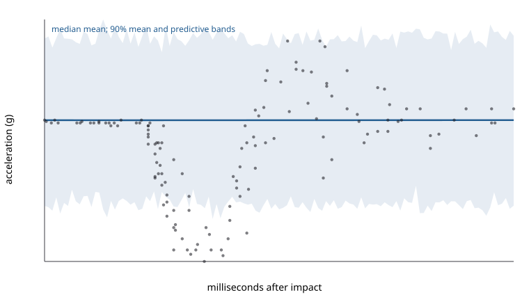

````@raw html
---
title: Adaptive HSGP centering
description: A reproducible heteroscedastic motorcycle case study comparing noncentered, centered, and pilot-selected HSGP coordinates in StanBlocks and Turing.
---
````

# Adaptive HSGP centering

Partial centering can be chosen independently for each HSGP frequency while
leaving the physical Gaussian-process prior unchanged. This case study
translates Generable's public motorcycle example into one BRM model, emits it
through both executable backends, and compares three coordinate systems with
fixed-seed multi-chain HMC.

## The model and its provenance

The response is acceleration from the 133-row `MASS::mcycle` dataset. One
squared-exponential HSGP models its conditional mean and a second models log
conditional standard deviation:

```text
mu(t)  = HSGP_mu(t)
eta(t) = HSGP_sigma(t)
y(t) ~ Normal(mu(t), exp(eta(t)))
```

The translation follows the source's executable preprocessing: acceleration
is divided by its sample standard deviation, and time is min–max mapped to
`[-1,1]` before evaluating the sine basis on `[-1.5,1.5]`. It retains 20 basis
functions and `Normal(0,4)` priors on each log length and marginal scale in the
source-faithful run. In BRM those are the equivalent positive-scale priors
`LogNormal(0,4)`.

Primary sources and immutable boundaries:

- [Generable article](https://www.generable.com/post/hsgp-reparam)
- [companion code at revision `0d00b853`](https://github.com/generable/public-materials/tree/0d00b8535e2c20c49017d03c7b060940eb8e7041/blog/hsgp-reparam)
- [Rdatasets source at revision `1dcc2bf`](https://github.com/vincentarelbundock/Rdatasets/tree/1dcc2bf5f955cc1224a3e1307256e1fe86b68dae/csv/MASS)

The committed CSV has SHA-256
`b89a1e4eb0391a982b32be3e378df00e8593ff9971e9425e9c5d7929b74f9801`.

## One formula, four generated views

The compact data below exist only to execute documentation generation. The
audited reproduction script uses all 133 observations and the same formula.
The nonuniform vectors demonstrate that centeredness is ordinary fixed model
data rather than pasted generated code.

```@eval
Main.BRMDocsComparisons.comparison(@__MODULE__, raw"""
adaptive_motorcycle_model = (@brm begin
    length_scale(mu, hsgp(x)) ~ LogNormal(0, 4)
    sd(mu, hsgp(x)) ~ LogNormal(0, 4)
    length_scale(sigma, hsgp(x)) ~ LogNormal(0, 4)
    sd(sigma, hsgp(x)) ~ LogNormal(0, 4)

    mu ~ hsgp(x; k=8, domain=(-1.5, 1.5), centeredness=c_mu)
    log(sigma) ~ hsgp(x; k=8, domain=(-1.5, 1.5), centeredness=c_sigma)
    y ~ Normal(mu, sigma)
end)((;
    x=[-1.0, -0.72, -0.43, -0.14, 0.14, 0.43, 0.72, 1.0],
    y=[0.0, -0.2, -1.1, -1.8, -0.5, 0.8, 0.3, 0.1],
    c_mu=[0.0, 0.0, 0.18, 0.37, 0.61, 0.79, 0.92, 1.0],
    c_sigma=[0.0, 0.07, 0.21, 0.46, 0.68, 0.84, 0.96, 1.0],
))
""", :adaptive_motorcycle_model;
    title="Heteroscedastic motorcycle HSGPs", require_stan=true)
```

This same-axis pair deliberately exercises target-scoped bindings:
`hsgp_x_*` belongs to `mu`, while `hsgp_log_sigma_x_*` belongs to
`log(sigma)`. The default single-HSGP StanBlocks spelling remains unchanged.

## What changes—and what does not

For one basis frequency, let `s` be its spectral standard deviation and `z`
its unit-normal weight. BRM's partial coordinate is

```text
u ~ Normal(0, s^c)
w = s^(1-c) u
```

so every `c` gives the same physical weight `w=s*z`. `c=0` is noncentered,
`c=1` is centered, and values between them interpolate continuously. The
coordinate density contributes the matching Jacobian. The acceptance test
checks that identity numerically, then compares normalized density and
projected gradients between generated Turing/Enzyme and
StanBlocks/BridgeStan models.

The pilot selector evaluates, for each frequency and candidate `c`,

```text
log(std(z .* exp.(c .* log(s)))) - mean(c .* log(s))
```

on the source's `0:0.01:1` grid. Computation uses shifted exponents and an
exact `c=0` branch. If a centered coordinate would underflow it is marked
inadmissible, while the noncentered endpoint remains available.

## Offline pilot/refit versus online warmup adaptation

The workflow here is intentionally two-stage:

1. sample a noncentered pilot;
2. choose one fixed `c` for each mean and log-scale basis weight;
3. put those two vectors in model data and refit from scratch.

The pilot is therefore part of analysis design and must not be reused as
posterior draws from the refit. WarmupHMC's online nonlinear adaptation is a
different algorithm: it learns a transform inside warmup and returns draws in
the target coordinates. The reproduction disables that online layer so the
three formula parameterizations—not an additional learned map—are what the
comparison measures.

## Bounded reproducibility artifact

The checked artifact uses the full dataset and model but reduces the basis
from 20 to 8 and runs four chains with 75 retained draws and a 350-gradient
first warmup window. This keeps the documentation gate bounded. It is useful
execution evidence, not a publication-quality Monte Carlo fit; in particular,
short-chain R-hat and ESS estimates should be read as diagnostics of this run,
not stable performance rankings.

| backend | geometry | max R-hat | min ESS | divergences | gradient evaluations | HMC seconds |
| --- | --- | ---: | ---: | ---: | ---: | ---: |
| StanBlocks | noncentered | 2.04 | 2.86 | 31 | 91,535 | 4.69 |
| StanBlocks | centered | 3.99 | 2.22 | 0 | 126,232 | 1.52 |
| StanBlocks | adaptive | 3.97 | 2.17 | 0 | 125,007 | 1.49 |
| Turing | noncentered | 3.41 | 2.18 | 29 | 111,017 | 282.33 |
| Turing | centered | 6.64 | 2.07 | 0 | 125,987 | 314.54 |
| Turing | adaptive | 4.29 | 2.19 | 0 | 124,749 | 307.24 |

Wall time covers the four sequential HMC chains and excludes Stan compilation
and one-time Enzyme preparation. The centered and adaptive fits removed the
pilot's divergences on both backends, but every max R-hat is far above 1.01 and
every minimum ESS is tiny. This run therefore **fails the convergence gate**.
It cannot establish that one coordinate is more efficient, nor can backend
seconds be generalized beyond these implementations on this host.

The pilot selected the following fixed mean/log-scale centeredness profiles:

| basis frequency | 1 | 2 | 3 | 4 | 5 | 6 | 7 | 8 |
| --- | ---: | ---: | ---: | ---: | ---: | ---: | ---: | ---: |
| mean HSGP `c` | 0.59 | 0.66 | 0.80 | 0.56 | 0.06 | 0.64 | 0.15 | 0.57 |
| log-scale HSGP `c` | 0.76 | 0.52 | 0.69 | 0.47 | 1.00 | 0.49 | 0.89 | 0.77 |

The curve artifact below exercises reconstruction on the original acceleration
scale: dark band is the conditional-mean 90% interval and pale band is a 90%
posterior-predictive interval. Because the fit failed its convergence gate,
these bands are a **pipeline smoke test, not a scientific posterior summary**.



The complete script, pinned data, machine-readable diagnostics, selected
centeredness values, posterior curve table, and plot source live under
`research/adaptive_centering/`. Run without `BRM_ADAPTIVE_K` for the
source-faithful 20-function truncation. The original article reports one chain
in its main workflow and a 40-chain appendix; neither is silently presented as
this bounded BRM run.

## Current support boundary

Fixed partial centering is supported for raw, ungrouped, nonperiodic
squared-exponential HSGPs. It fails closed for periodic bases, latent/model-
derived axes, `by`-specific weights, and `orthogonal_to` bases. Those variants
need distinct verified transforms; BRM does not silently reinterpret them as
the supported geometry.
