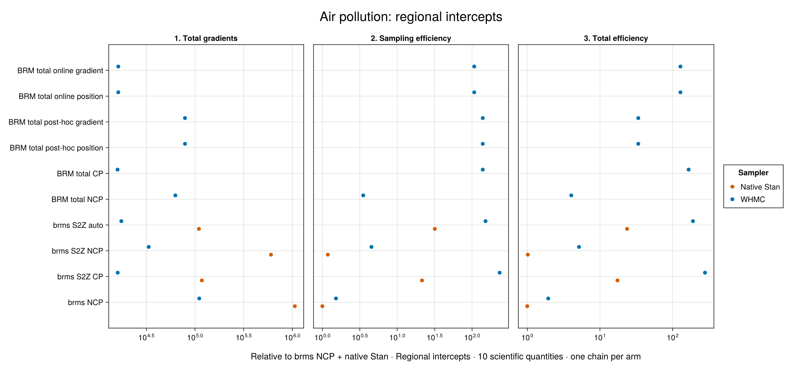
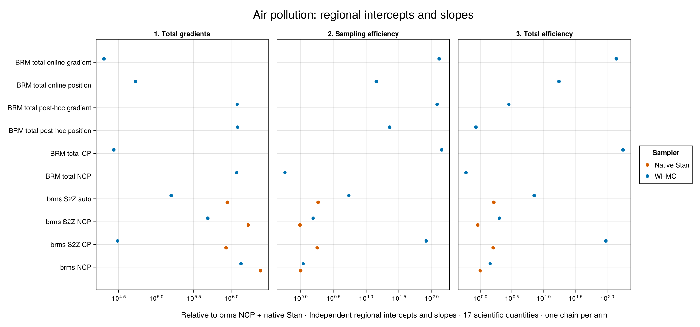
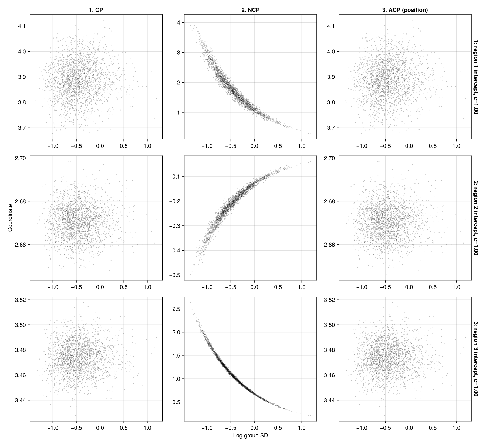
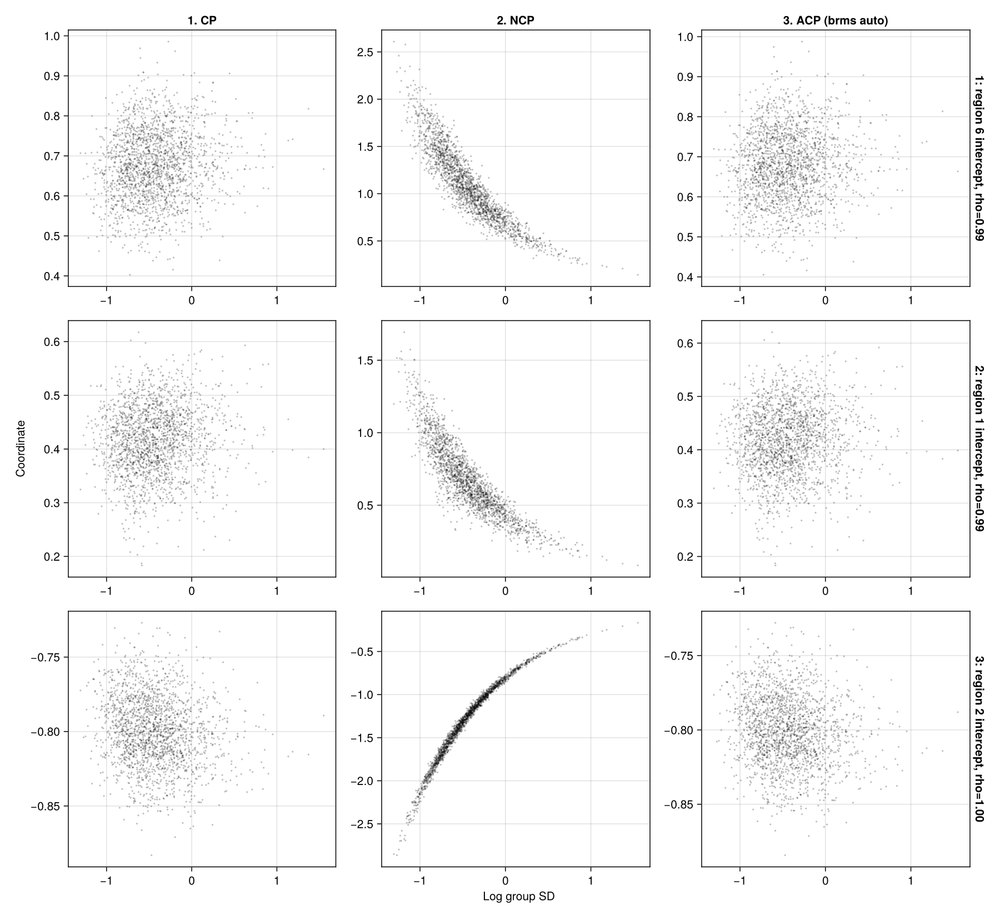
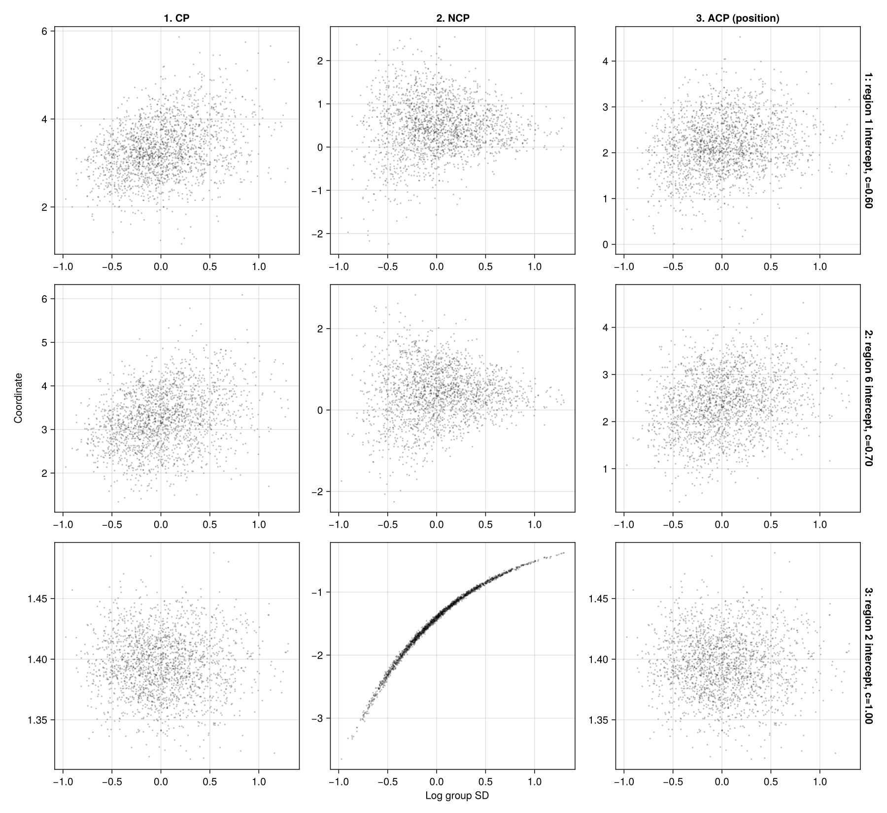
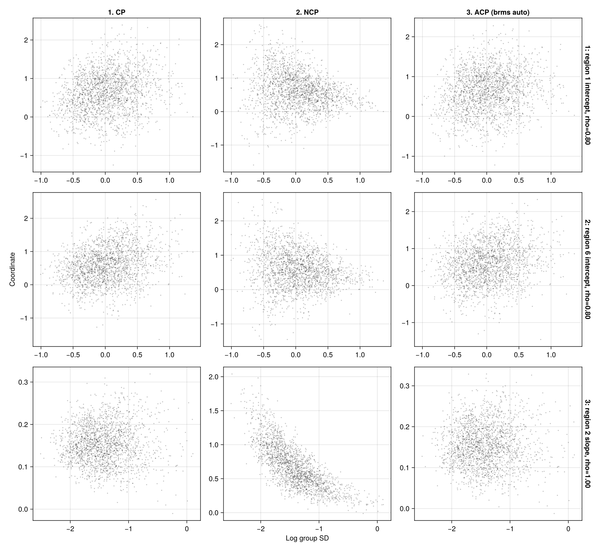

# Air pollution: regional effects and automatic totals

## Result

This study applies BRM's built-in total-coefficient construction to two supported versions of the AIR model from the [Stan S2Z discussion](https://discourse.mc-stan.org/t/help-testing-brms-pr-for-sum-to-zero-and-partial-centering/41542). It retains the population effects and their priors, and compares ordinary brms, brms sum-to-zero (S2Z), and BRM totals on the same scientific quantities within each model.

For **regional intercepts**, S2Z CP + WHMC gave 279× the native-NCP baseline's total-gradient efficiency; fixed BRM totals gave 166× and both online total variants 128×. With **independent intercepts and slopes**, fixed total CP gave 179×, online gradient 140× and S2Z CP + WHMC 95.5×. Thus fixed total CP was about 1.87× as efficient as S2Z CP + WHMC in the latter pilot, while S2Z CP was about 1.68× as efficient as total CP in the intercept-only pilot.

These are one-chain exploratory comparisons. They show that centering is important after marginalization and that pilot cost can dominate post-hoc adaptation. They do not establish one uniformly best parameterization or adaptation loss.

## Data and model variants

There are **6,003 observations** of log ground-level particulate concentration (`log_pm25`) and a log satellite predictor (`log_sat`). We preserve row order and use `cluster_region`, with six group sizes **27, 3,534, 1,696, 418, 315 and 13**. The uneven information per region makes a common centering choice potentially restrictive.

Both variants retain the population intercept and slope:

```r
# Regional intercepts
bf(log_pm25 ~ log_sat + (1 | region))

# Independent regional intercepts and slopes
bf(log_pm25 ~ log_sat + (1 + log_sat || region))
```

The second formula deliberately removes the correlation between random intercepts and slopes. The correlated source model is outside the current automatic-total planner's supported scope. Removing a covariance parameter changes the posterior; every comparison row here uses the same explicitly simplified model. No population effects are deleted.

Let `x` denote `log_sat`. The observation model is

```math
y_n\sim N(\mu_n,\sigma^2),\qquad
\mu_n=\beta_0+\beta_1(x_n-\bar x)+a_{j[n]}+b_{j[n]}x_n.
```

The intercept-only variant omits `b[j]`. The population intercept is defined at the observation-weighted mean predictor; random slopes use raw `x`. Priors match the generated brms models:

- Population intercept: Student-t(3, location 2.8, scale 2.5).
- Population slope: flat.
- Independent regional deviations: zero-mean Gaussian, with a separate SD for each included term.
- Group SDs and residual SD: half-Student-t(3, 0, 2.5).

The source captures also retain `cluster_log_region` and `super_region` specifications. The measurements on this page use `cluster_region` only.

## BRM models

The authoring panes below read the exact fitted declarations. The backend views are regenerated during the docs build. Sampling uses StanBlocks/BridgeStan and WHMC; the generated Turing pane is for inspection only.

### Regional intercepts

```@eval
Main.BRMDocsComparisons.comparison(@__MODULE__,
    Main.BRMCenteringExamples.authoring(:air_intercept),
    :air_intercept_brm_model;
    title="AIR with regional intercepts", require_stan=true)
```

BRM integrates the population intercept and samples `alpha[j] = beta0 + a[j]`. The likelihood is `alpha[j] + beta1*(x-xbar)`; the population slope remains explicit. For reporting, the regional intercept at raw `x=0` is `A[j] = alpha[j] - xbar*beta1`.

### Independent regional intercepts and slopes

```@eval
Main.BRMDocsComparisons.comparison(@__MODULE__,
    Main.BRMCenteringExamples.authoring(:air_independent),
    :air_independent_brm_model;
    title="AIR with independent regional intercepts and slopes", require_stan=true)
```

BRM integrates both population coefficients and samples

```math
A_j=\beta_0-\bar x\beta_1+a_j,\qquad B_j=\beta_1+b_j,
\qquad\mu_n=A_{j[n]}+B_{j[n]}x_n.
```

In both variants, a Gamma(3/2, rate=3/2) precision multiplier represents the Student-t intercept exactly as a conditional Gaussian. The resulting Gaussian integral is evaluated analytically in O(J) for fixed coefficient dimension. Original population parameters remain recoverable from their exact conditional distribution.

The intercept-only target has 10 sampled dimensions in ordinary brms, totals and S2Z: the one integrated population coefficient is replaced by a mixture variable. The intercept-and-slope target has 17 ordinary dimensions and 16 total/S2Z dimensions.

## Sampling and adaptation

```julia
using StanBlocks, BridgeStan, WarmupHMC, Enzyme, Random
using DifferentiationInterface: AutoEnzyme

sb = SBBRMI(air_independent_brm_model(); mod=@__MODULE__)
problem = StanBlocks.stan_instantiate(sb.model)
names = BridgeStan.param_unc_names(problem.model)
adaptive = adaptive_centering_problem(sb, problem, AutoEnzyme(); centeredness=0.0)
fit = adaptive_warmup_mcmc(Xoshiro(1), adaptive;
    n_draws=2000, monitor_ess=true, nonlinear_adapt=true)

draws = permutedims(fit.posterior_position)
recovered = recover_population_draws(sb, draws, names; rng=Xoshiro(404))
```

The centering family uses each regional total directly at CP and scales it about its prespecified reference location at NCP. The integrated prior remains coupled, so this NCP is not a whitening transformation. `centeredness=1.0` selects CP; either endpoint stays fixed with `nonlinear_adapt=false`.

Each post-hoc arm uses `select_total_centeredness` on the same 2,000-draw total-NCP pilot, followed by a fresh fit. Both position/Jacobian and position–gradient losses use the built-in grid `0:0.1:1`. Saved gradients are transported into the compiled model frame before gradient-based selection. Both losses are also tested online during WHMC warmup. The harness selects the existing position-loss weights locally; the default online loss uses position and gradient.

brms S2Z auto uses its branch's Pathfinder/Fisher precursor to choose fixed weights. Native Stan and WHMC receive the same resolved target and weights; the precursor is charged to both workflows. This is distinct from online adaptation.

Every arm retains 2,000 draws from one chain, seed 1. Native Stan uses 1,000 warmup iterations, target acceptance 0.8 and maximum tree depth 10. WHMC uses its adaptive warmup and Pathfinder initialization. All representations start at the same pooled physical coefficients, with SDs estimated from regional regressions and mixture precision one.

Gradient counts measure actual evaluations. The native harness adds a zero-contribution C++ counter to the model, leaving the NUTS sampler unchanged, checks retained increments against leapfrogs plus one, and records final counts for all sampling and precursor processes. WHMC counts density-and-gradient requests at its target wrapper. Gradient count is a work proxy; different targets need not take identical time per gradient.

## One scientific scope for each model

Each model has its own ordinary brms NCP + native Stan baseline. Both efficiency columns are relative to that baseline: minimum bulk ESS divided by sampling gradients, and minimum bulk ESS divided by total gradients. Total costs include initialization, warmup and required pilots. The different model posteriors are not pooled into one minimum.

### Regional intercepts: 10 quantities

The common quantities are the population intercept and slope, group SD, residual SD, and six regional total intercepts at raw predictor zero.

| Method | Total gradients | Sampling efficiency | Total efficiency |
|---|---:|---:|---:|
| brms NCP · Native Stan | 1,060,905 | 1× | 1× |
| brms NCP · WHMC | 110,573 | 1.52× | 1.94× |
| brms S2Z CP · Native Stan | 117,637 | 21.4× | 17.4× |
| brms S2Z CP · WHMC | 16,068 | 234× | 279× |
| brms S2Z NCP · Native Stan | 603,455 | 1.18× | 1.02× |
| brms S2Z NCP · WHMC | 33,426 | 4.53× | 5.15× |
| brms S2Z auto · Native Stan | 109,652 | 31.8× | 23.6× |
| brms S2Z auto · WHMC | 17,512 | 151× | 190× |
| BRM total NCP · WHMC | 62,909 | 3.51× | 4.03× |
| BRM total CP · WHMC | 16,013 | 139× | 166× |
| BRM total post-hoc position · WHMC | 78,922 | 139× | 33.7× |
| BRM total post-hoc gradient · WHMC | 78,922 | 139× | 33.7× |
| BRM total online position · WHMC | 16,286 | 107× | 128× |
| BRM total online gradient · WHMC | 16,286 | 107× | 128× |

[](assets/air-centering/cluster-intercept-efficiency.png)

Both post-hoc losses select full centering for all six totals. They therefore produce the same fit as fixed CP, with the additional pilot cost. Both online losses also select CP and produce identical results to each other. S2Z CP + WHMC has the largest observed efficiency in this pilot; totals do not dominate this comparison.

### Regional intercepts and slopes: 17 quantities

The common quantities are the two population coefficients, two group SDs, residual SD, six total intercepts and six total slopes.

| Method | Total gradients | Sampling efficiency | Total efficiency |
|---|---:|---:|---:|
| brms NCP · Native Stan | 2,459,692 | 1× | 1× |
| brms NCP · WHMC | 1,351,111 | 1.1× | 1.44× |
| brms S2Z CP · Native Stan | 851,478 | 1.79× | 1.61× |
| brms S2Z CP · WHMC | 30,584 | 82.3× | 95.5× |
| brms S2Z NCP · Native Stan | 1,681,113 | 0.976× | 0.912× |
| brms S2Z NCP · WHMC | 485,549 | 1.55× | 2× |
| brms S2Z auto · Native Stan | 883,701 | 1.85× | 1.64× |
| brms S2Z auto · WHMC | 157,936 | 5.46× | 7.07× |
| BRM total NCP · WHMC | 1,178,130 | 0.577× | 0.598× |
| BRM total CP · WHMC | 27,183 | 142× | 179× |
| BRM total post-hoc position · WHMC | 1,215,894 | 22.9× | 0.857× |
| BRM total post-hoc gradient · WHMC | 1,202,655 | 122× | 2.83× |
| BRM total online position · WHMC | 53,202 | 14.3× | 17.5× |
| BRM total online gradient · WHMC | 20,137 | 130× | 140× |

[](assets/air-centering/cluster-independent-efficiency.png)

The post-hoc workflows pay for a 1,178,130-gradient NCP pilot, so good retained-sampling efficiency can coexist with low total efficiency. Fixed CP and online adaptation avoid that separate pilot. Online position and gradient select different configurations here.

## Saved-draw geometry

Each figure reuses the **same 2,000 draws across its columns**, with CP as the visualization baseline. Rows select distinct coordinates with minimum inferred centeredness, closest to 0.5, and maximum. The total figures use post-hoc position fits; their ACP column is checked against saved sampler coordinates. The S2Z figures use auto-WHMC fits and include the weighted shift needed to reconstruct the region-labelled `Q*z` coordinates. Those J contrast values represent J−1 independent directions.

### Regional intercepts

[](assets/air-centering/cluster-intercept-total_pairs.png)

[](assets/air-centering/cluster-intercept-s2z_pairs.png)

### Regional intercepts and slopes

[](assets/air-centering/cluster-independent-total_pairs.png)

[](assets/air-centering/cluster-independent-s2z_pairs.png)

The first set shows total coefficients; the S2Z set shows zero-sum contrasts. These are coordinate views of saved posterior draws, not predictive intervals or separate posterior fits.

## Diagnostics, recovery and limits

The intercept-only ordinary NCP fits had 6 native and 68 WHMC divergences; S2Z NCP had 35 and 22, and total NCP had six. Other intercept-only arms had zero. Ordinary and S2Z NCP under WHMC also show the largest mean discrepancies from total CP: 4.52 and 5.89 combined estimated MCSEs for group SD. Their within-chain split R-hat maxima are 1.037 and 1.043. These weak arms need longer or replicated convergence checks.

For independent intercepts and slopes, ordinary NCP had 20 native and six WHMC divergences, S2Z NCP 37 and 60, total NCP eleven, and post-hoc gradient two. All other arms had zero. Native ordinary NCP hit maximum tree depth on 1,375 of 2,000 retained transitions. Mean differences from total CP are below three combined MCSEs except two S2Z-auto WHMC quantities, with a maximum of 3.56. These are descriptive checks across many quantities, not proof of convergence.

Removing the recovered population coefficients leaves nine invariant quantities for the intercept-only model and 15 for the independent model. The latter still gives 169× total efficiency for total CP, 132× for online gradient and 90.4× for S2Z CP + WHMC against that baseline scope. All twelve total-model minimum ESS values are unchanged across ten recovery seeds.

Population coefficients are recovered conditionally for both marginalized representations. Recovery adds genuine posterior variation and can increase ESS while also adding noise to a posterior-mean estimate. We retain per-quantity MCSE, compare the invariant quantities excluding stochastic recovery, and repeat total-model recovery with ten seeds. The same full scientific scope is used for every row in each main table.

Both automatic targets passed 25 independent density, gradient, coordinate and recovery checks. Ordinary brms and every S2Z setting passed their own density/gradient checks, including exact preservation of totals under generated-quantity recovery. BRM omits constant half-Student-t normalizers for bounded SD declarations; adding `(K+1)*log(2)` aligns the normalized densities without changing gradients or posteriors. Saved source-coordinate plots are audited against the retained fits.

The two rejected extreme Pathfinder trial points in the independent-total post-hoc fits were checked at higher precision: the conditional precision is mathematically positive definite, but its condition numbers exceed reliable double precision. The target adapter rejects those numerical proposals just as native Stan does. They do not change the target or the retained-draw scope.

This study does not establish a replicated ranking across chains/seeds, behavior of the original correlated-effects model, or controlled wall-time speedups.

## Inspect and reproduce

- [BRM models, priors and independent reference density](https://github.com/nsiccha/BayesianRegressionModels.jl/blob/ns/devibe/research/air_total_effects/model.jl).
- [Density, gradient and recovery audit](https://github.com/nsiccha/BayesianRegressionModels.jl/blob/ns/devibe/research/air_total_effects/audit.jl).
- [Six total fits and ordinary WHMC baseline](https://github.com/nsiccha/BayesianRegressionModels.jl/blob/ns/devibe/research/air_total_effects/run.jl).
- [Native Stan driver](https://github.com/nsiccha/BayesianRegressionModels.jl/blob/ns/devibe/research/air_total_effects/native.R).
- [S2Z WHMC and analysis](https://github.com/nsiccha/BayesianRegressionModels.jl/blob/ns/devibe/research/air_total_effects/brms_whmc.jl).
- [S2Z coordinate and generated-recovery audit](https://github.com/nsiccha/BayesianRegressionModels.jl/blob/ns/devibe/research/air_total_effects/s2z.jl).
- [Saved-draw validation](https://github.com/nsiccha/BayesianRegressionModels.jl/blob/ns/devibe/research/air_total_effects/validate_saved.jl).
- [Numerical proposal audit](https://github.com/nsiccha/BayesianRegressionModels.jl/blob/ns/devibe/research/air_total_effects/numerical_audit.jl).
- [Full raw-fit archive manifest](https://github.com/nsiccha/BayesianRegressionModels.jl/blob/ns/devibe/research/air_total_effects/results/fits/manifest.json).
- [Reproduction instructions](https://github.com/nsiccha/BayesianRegressionModels.jl/blob/ns/devibe/research/air_total_effects/README.md).
- [cluster-intercept: comparison table](https://github.com/nsiccha/BayesianRegressionModels.jl/blob/ns/devibe/research/air_total_effects/results/cluster-intercept/comparison.tsv).
- [cluster-intercept: per-quantity ESS and MCSE](https://github.com/nsiccha/BayesianRegressionModels.jl/blob/ns/devibe/research/air_total_effects/results/cluster-intercept/per_quantity_mcse.tsv).
- [cluster-intercept: recovery sensitivity](https://github.com/nsiccha/BayesianRegressionModels.jl/blob/ns/devibe/research/air_total_effects/results/cluster-intercept/recovery_seed_sensitivity.tsv).
- [cluster-intercept, ordinary_ncp: Stan](https://github.com/nsiccha/BayesianRegressionModels.jl/blob/ns/devibe/research/air_total_effects/reference/native/cluster-intercept/ordinary_ncp/clean.stan).
- [cluster-intercept, ordinary_ncp: data](https://github.com/nsiccha/BayesianRegressionModels.jl/blob/ns/devibe/research/air_total_effects/reference/native/cluster-intercept/ordinary_ncp/resolved-data.json).
- [cluster-intercept, ordinary_ncp: gradient counts](https://github.com/nsiccha/BayesianRegressionModels.jl/blob/ns/devibe/research/air_total_effects/reference/native/cluster-intercept/ordinary_ncp/gradient_counts.tsv).
- [cluster-intercept, s2z_cp: Stan](https://github.com/nsiccha/BayesianRegressionModels.jl/blob/ns/devibe/research/air_total_effects/reference/native/cluster-intercept/s2z_cp/clean.stan).
- [cluster-intercept, s2z_cp: data](https://github.com/nsiccha/BayesianRegressionModels.jl/blob/ns/devibe/research/air_total_effects/reference/native/cluster-intercept/s2z_cp/resolved-data.json).
- [cluster-intercept, s2z_cp: gradient counts](https://github.com/nsiccha/BayesianRegressionModels.jl/blob/ns/devibe/research/air_total_effects/reference/native/cluster-intercept/s2z_cp/gradient_counts.tsv).
- [cluster-intercept, s2z_ncp: Stan](https://github.com/nsiccha/BayesianRegressionModels.jl/blob/ns/devibe/research/air_total_effects/reference/native/cluster-intercept/s2z_ncp/clean.stan).
- [cluster-intercept, s2z_ncp: data](https://github.com/nsiccha/BayesianRegressionModels.jl/blob/ns/devibe/research/air_total_effects/reference/native/cluster-intercept/s2z_ncp/resolved-data.json).
- [cluster-intercept, s2z_ncp: gradient counts](https://github.com/nsiccha/BayesianRegressionModels.jl/blob/ns/devibe/research/air_total_effects/reference/native/cluster-intercept/s2z_ncp/gradient_counts.tsv).
- [cluster-intercept, s2z_auto: Stan](https://github.com/nsiccha/BayesianRegressionModels.jl/blob/ns/devibe/research/air_total_effects/reference/native/cluster-intercept/s2z_auto/clean.stan).
- [cluster-intercept, s2z_auto: data](https://github.com/nsiccha/BayesianRegressionModels.jl/blob/ns/devibe/research/air_total_effects/reference/native/cluster-intercept/s2z_auto/resolved-data.json).
- [cluster-intercept, s2z_auto: gradient counts](https://github.com/nsiccha/BayesianRegressionModels.jl/blob/ns/devibe/research/air_total_effects/reference/native/cluster-intercept/s2z_auto/gradient_counts.tsv).
- [cluster-independent: comparison table](https://github.com/nsiccha/BayesianRegressionModels.jl/blob/ns/devibe/research/air_total_effects/results/cluster-independent/comparison.tsv).
- [cluster-independent: per-quantity ESS and MCSE](https://github.com/nsiccha/BayesianRegressionModels.jl/blob/ns/devibe/research/air_total_effects/results/cluster-independent/per_quantity_mcse.tsv).
- [cluster-independent: recovery sensitivity](https://github.com/nsiccha/BayesianRegressionModels.jl/blob/ns/devibe/research/air_total_effects/results/cluster-independent/recovery_seed_sensitivity.tsv).
- [cluster-independent, ordinary_ncp: Stan](https://github.com/nsiccha/BayesianRegressionModels.jl/blob/ns/devibe/research/air_total_effects/reference/native/cluster-independent/ordinary_ncp/clean.stan).
- [cluster-independent, ordinary_ncp: data](https://github.com/nsiccha/BayesianRegressionModels.jl/blob/ns/devibe/research/air_total_effects/reference/native/cluster-independent/ordinary_ncp/resolved-data.json).
- [cluster-independent, ordinary_ncp: gradient counts](https://github.com/nsiccha/BayesianRegressionModels.jl/blob/ns/devibe/research/air_total_effects/reference/native/cluster-independent/ordinary_ncp/gradient_counts.tsv).
- [cluster-independent, s2z_cp: Stan](https://github.com/nsiccha/BayesianRegressionModels.jl/blob/ns/devibe/research/air_total_effects/reference/native/cluster-independent/s2z_cp/clean.stan).
- [cluster-independent, s2z_cp: data](https://github.com/nsiccha/BayesianRegressionModels.jl/blob/ns/devibe/research/air_total_effects/reference/native/cluster-independent/s2z_cp/resolved-data.json).
- [cluster-independent, s2z_cp: gradient counts](https://github.com/nsiccha/BayesianRegressionModels.jl/blob/ns/devibe/research/air_total_effects/reference/native/cluster-independent/s2z_cp/gradient_counts.tsv).
- [cluster-independent, s2z_ncp: Stan](https://github.com/nsiccha/BayesianRegressionModels.jl/blob/ns/devibe/research/air_total_effects/reference/native/cluster-independent/s2z_ncp/clean.stan).
- [cluster-independent, s2z_ncp: data](https://github.com/nsiccha/BayesianRegressionModels.jl/blob/ns/devibe/research/air_total_effects/reference/native/cluster-independent/s2z_ncp/resolved-data.json).
- [cluster-independent, s2z_ncp: gradient counts](https://github.com/nsiccha/BayesianRegressionModels.jl/blob/ns/devibe/research/air_total_effects/reference/native/cluster-independent/s2z_ncp/gradient_counts.tsv).
- [cluster-independent, s2z_auto: Stan](https://github.com/nsiccha/BayesianRegressionModels.jl/blob/ns/devibe/research/air_total_effects/reference/native/cluster-independent/s2z_auto/clean.stan).
- [cluster-independent, s2z_auto: data](https://github.com/nsiccha/BayesianRegressionModels.jl/blob/ns/devibe/research/air_total_effects/reference/native/cluster-independent/s2z_auto/resolved-data.json).
- [cluster-independent, s2z_auto: gradient counts](https://github.com/nsiccha/BayesianRegressionModels.jl/blob/ns/devibe/research/air_total_effects/reference/native/cluster-independent/s2z_auto/gradient_counts.tsv).
- [Automatic intercept_only: Stan](https://github.com/nsiccha/BayesianRegressionModels.jl/blob/ns/devibe/research/air_total_effects/reference/automatic_totals/intercept_only/automatic_totals.stan).
- [Automatic intercept_only: data](https://github.com/nsiccha/BayesianRegressionModels.jl/blob/ns/devibe/research/air_total_effects/reference/automatic_totals/intercept_only/automatic_totals.json).
- [Automatic independent: Stan](https://github.com/nsiccha/BayesianRegressionModels.jl/blob/ns/devibe/research/air_total_effects/reference/automatic_totals/independent/automatic_totals.stan).
- [Automatic independent: data](https://github.com/nsiccha/BayesianRegressionModels.jl/blob/ns/devibe/research/air_total_effects/reference/automatic_totals/independent/automatic_totals.json).

Data revision: `2afb605f81cf0bdadc6476df865e0337aaacf183`; brms PR #1919 revision: `73cf607889879cb2a55f50b88d8141d76ff43279`; repaired WHMC: `7aed40b18bd4cdabb75330f285d5c9b355575ab9`; Julia 1.10.11, CmdStan 2.39.0 and CmdStanR 0.9.0. BRM uses the built-in total planner with the retained-flat-prior correction. The source, raw fits, native CSVs, resolved weights and gradient counts are preserved in the linked manifests.
