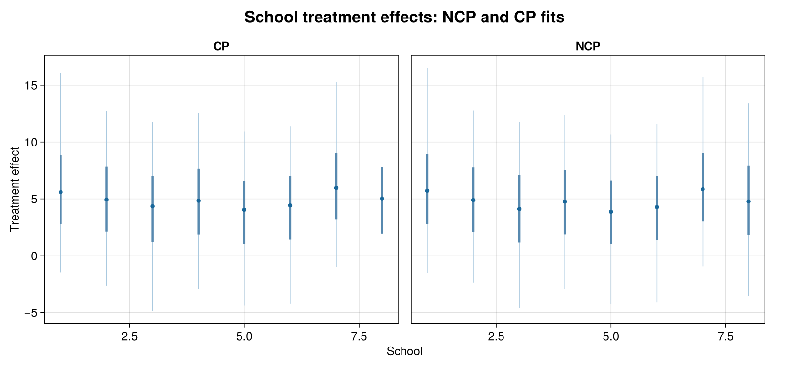
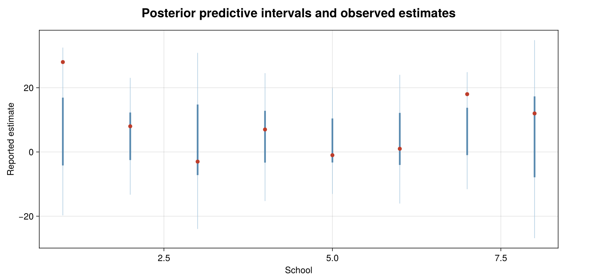
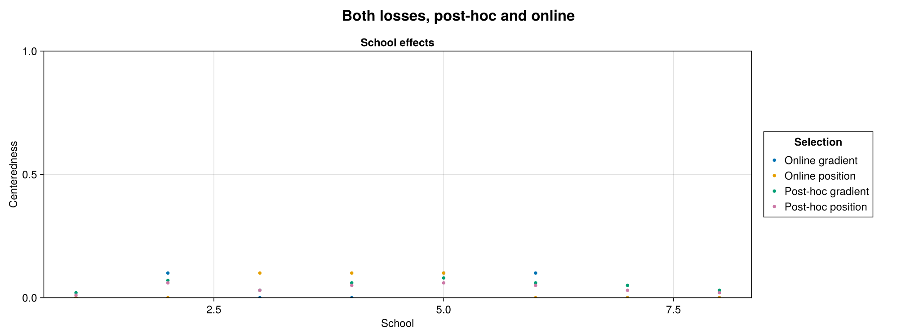
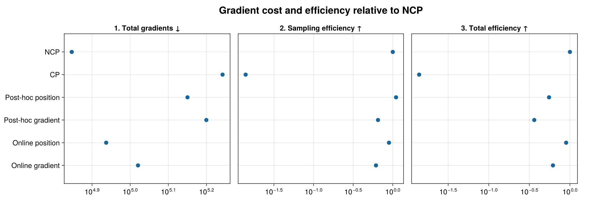
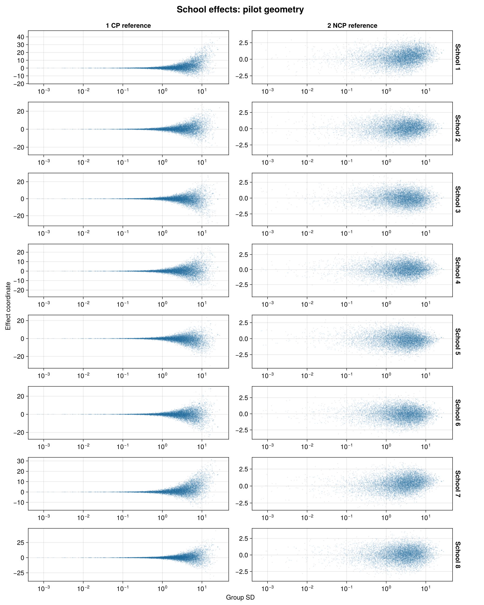
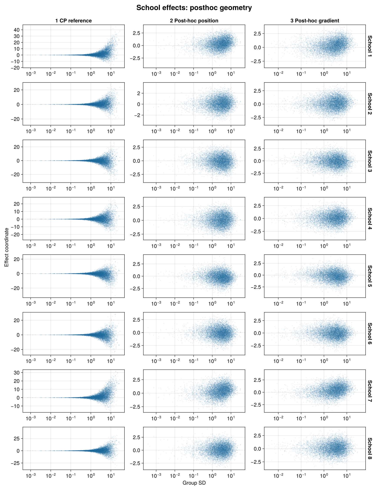
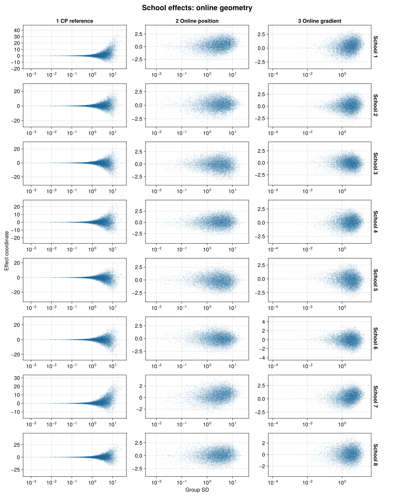
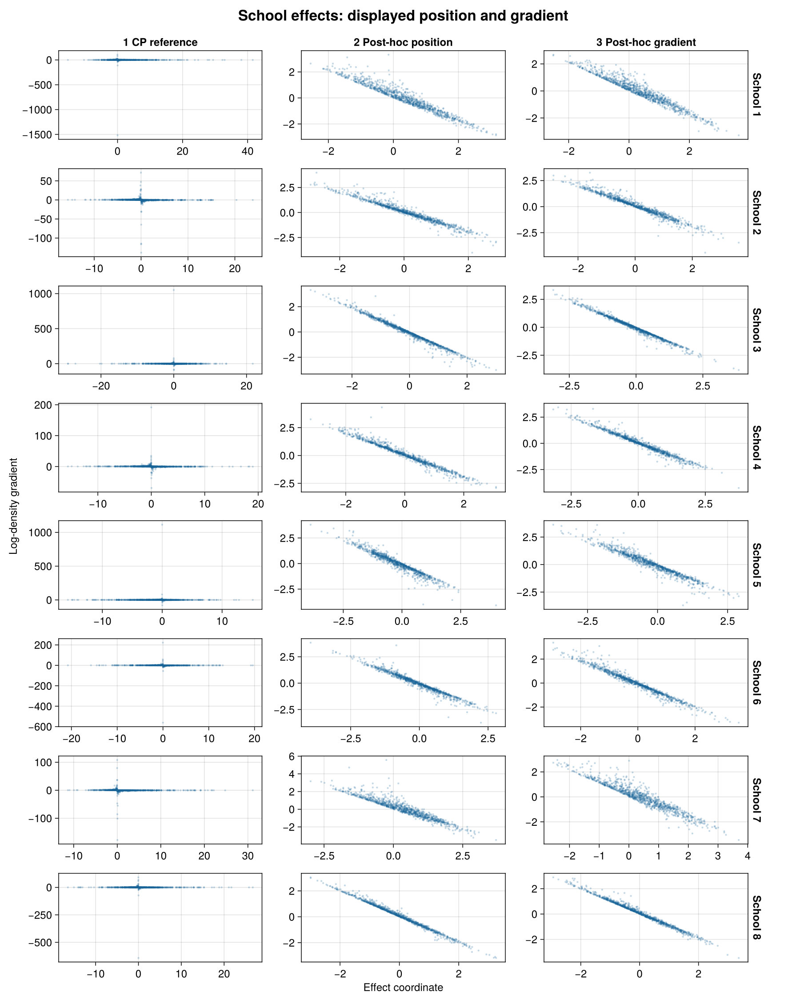
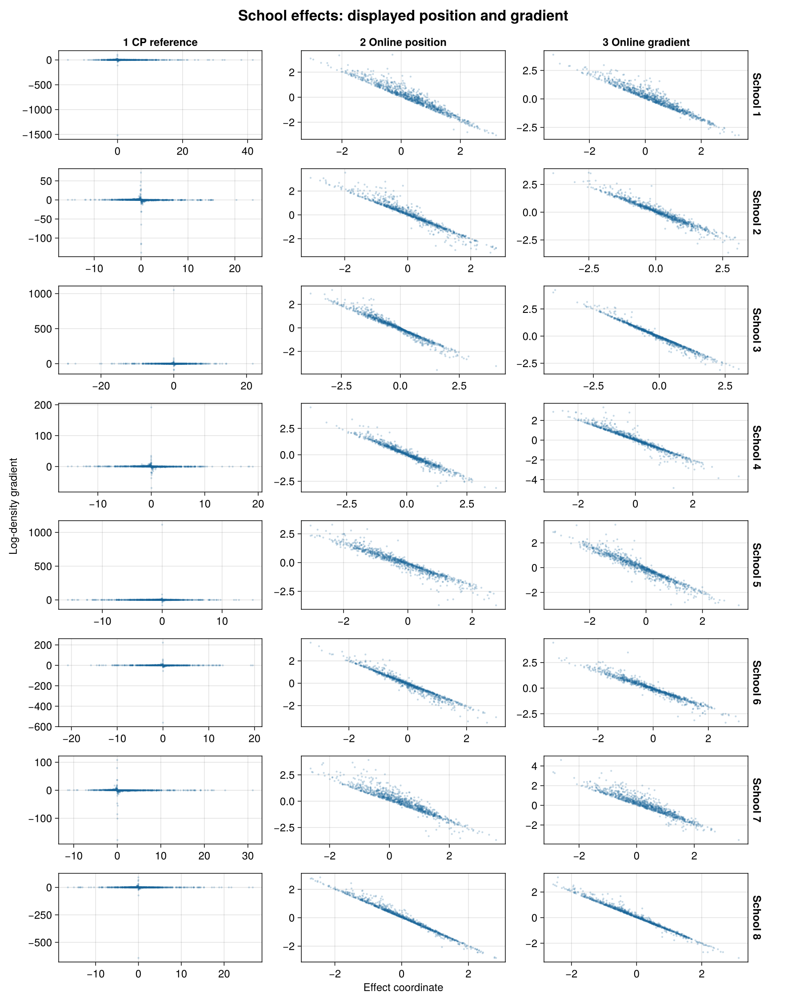

````@raw html
---
title: Eight schools and the choice of centering
description: "PosteriorDB eight schools in BRM: manually centered and noncentered fits, adaptive alternatives, posterior checks and measured costs."
---
````

# Eight schools and the choice of centering

Eight schools report treatment-effect estimates with substantial uncertainty.
A hierarchical model pools those estimates toward a common mean. When the
between-school standard deviation is small, centered school effects occupy a
narrow region around that mean. Noncentered coordinates separate the scale
from standardized school effects and can make this region easier to sample.

This example compares a **manually fully centered fit** with a noncentered fit,
then uses the same model to demonstrate offline and online centering selection.

## The PosteriorDB model

We reproduce PosteriorDB's
[eight-schools posterior](https://github.com/stan-dev/posteriordb/blob/5545a1dd07ae297c36edecbcd82aa49097b4c385/posterior_database/posteriors/eight_schools-eight_schools_noncentered.json),
including its data and priors:

```text
mu ~ Normal(0, 5)
tau ~ Cauchy(0, 5), restricted to positive values
z[j] ~ Normal(0, 1)
theta[j] = mu + tau*z[j]
y[j] ~ Normal(theta[j], sigma[j])
```

The positive restriction on `tau` makes its prior half-Cauchy. The sampling
statement and support match the
[reference Stan program](https://github.com/stan-dev/posteriordb/blob/5545a1dd07ae297c36edecbcd82aa49097b4c385/posterior_database/models/stan/eight_schools_noncentered.stan).
Here, `sigma` contains the known standard errors of the reported estimates.

```@eval
Main.BRMDocsComparisons.comparison(@__MODULE__, raw"""
using BayesianRegressionModels, Distributions, StanBlocks

function eight_schools_model()
    (@brm begin
        theta ~ 1 + (1 | eight_schools | school)
        effect(theta, Intercept) ~ Normal(0, 5)
        sd(:, eight_schools) ~ Cauchy(0, 5)
        y ~ Normal(theta, sigma)
    end)((; school=1:8,
             y=Float64[28, 8, -3, 7, -1, 1, 18, 12],
             sigma=Float64[15, 10, 16, 11, 9, 11, 10, 18]))
end
""", :eight_schools_model;
    title="Eight schools with PosteriorDB priors", require_stan=true, total_groups=())
```

The tabs show generated backends. The fits below use StanBlocks/BridgeStan
and WarmupHMC. Independent comparisons with PosteriorDB's centered Stan
program verify the density and all ten gradient components, including the
coordinate Jacobian. The independent audit is retained with the source model.

## Choose fully centered coordinates manually

The conventional BRM model (`total_groups=()`) samples standardized effects
`z[j]`. Full centering of the random effects instead samples `u[j] = tau*z[j]`, so
`u[j] ~ Normal(0, tau)` and `theta[j] = mu + u[j]`. Thus `u` is the school's
deviation from the population mean; `theta` is its treatment effect.

To select this parameterization when compiling the model, use the grouping
factor's name:

```julia
model = eight_schools_model()
centered_sb = SBBRMI(model;
    mod=@__MODULE__, centered_groups=[:school])
```

We can also choose the same endpoint through the centering controls. This
lets all six fits below share one compiled noncentered density:

```julia
using Random, Enzyme, WarmupHMC, BridgeStan
using DifferentiationInterface: AutoEnzyme

sb = SBBRMI(model; mod=@__MODULE__, total_groups=())
problem = StanBlocks.stan_instantiate(sb.model)
backend = AutoEnzyme(;
    mode=Enzyme.set_runtime_activity(Enzyme.Reverse),
    function_annotation=Enzyme.Const)

function fixed_centering(sb, problem, backend, coefficients)
    target = adaptive_centering_problem(sb, problem, backend)
    sources = WarmupHMC.reparam_sources(target)
    length(sources) == length(coefficients) || error("one coefficient per school is required")
    WarmupHMC.restore_reparam_sources!(target,
        [index => WarmupHMC.PartiallyCentered(Float64(c))
         for ((index, _), c) in zip(sources, coefficients)])
    target
end

fully_centered = fixed_centering(sb, problem, backend, ones(8))
centered_fit = WarmupHMC.adaptive_warmup_mcmc(
    Xoshiro(1), fully_centered;
    n_draws=10_000, monitor_ess=true, nonlinear_adapt=false)

noncentered_fit = WarmupHMC.adaptive_warmup_mcmc(
    Xoshiro(1), problem; n_draws=10_000, monitor_ess=true)
```

Every coefficient is `1.0`; `nonlinear_adapt=false` keeps that choice fixed.
At `0.0` the corresponding coordinate is fully noncentered. Intermediate
values sample `u[j] = tau^c[j]*z[j]`.

WarmupHMC returns **model coordinates** in `posterior_position`, including
when centering is fixed. Its checkpoints retain sampler coordinates. The
checkpoint-to-model mapping is checked independently before summarizing fits.


## Posterior effects and predictive checks

Thin intervals contain 90% of draws and thick intervals 50%. Each school is
a category with its own interval. Treatment effects are $\theta_j=\mu+\tau z_j$.

[](assets/centering-refresh-eight/posterior-effects.png)

The predictive check uses the NCP fit and includes the known standard error
of each reported estimate. Red points are the observations in their original
school order. There are no ribbons between categorical schools.

[](assets/centering-refresh-eight/ppc.png)
## Select centering from a pilot

An offline rule evaluates each school on a grid `c = 0:0.01:1`:

```math
L_j(c)=\log\operatorname{sd}(\tau^c z_j)-c\,\operatorname{mean}(\log\tau).
```

Compute it using the noncentered pilot's model coordinates, then hold the
selected coefficients fixed during a new fit:

```julia
blocks = adaptive_centering_blocks(sb, BridgeStan.param_unc_names(problem.model))
block = only(blocks)
q = noncentered_fit.posterior_position
z = permutedims(q[vec(block.effects), :])
logtau = vec(q[only(block.log_scales), :])
selection = select_ranef_centeredness(z, repeat(logtau, 1, 8);
    candidates=0:0.01:1)
selected_problem = fixed_centering(sb, problem, backend, selection.centeredness)
partial_fit = WarmupHMC.adaptive_warmup_mcmc(
    Xoshiro(1), selected_problem;
    n_draws=10_000, monitor_ess=true, nonlinear_adapt=false)
```


## Both losses, post-hoc and online

For a zero-mean random effect with log scale $\ell$, the centering family is
$u_c=\exp(c\ell)z$: $c=0$ is NCP and $c=1$ is CP. Its transformed effect
gradient is $g_c=\exp(-c\ell)g_z$. We compare two criteria, minimized separately
for each effect:

```math
L_{\mathrm{position}}(c)=\log\operatorname{sd}(u_c)-\operatorname{mean}(c\ell),
\qquad
L_{\mathrm{gradient}}(c)=\operatorname{cor}(u_c,g_c).
```

The second is a **signed** correlation: an independent Gaussian coordinate
has correlation $-1$ with its log-density gradient. The first uses positions
and the Jacobian, without a gradient term.

Both post-hoc arms use the same NCP pilot, select on `0:0.01:1`, then fit
afresh with the controls fixed. The gradient selector uses the pilot's saved
gradients. Both online arms select on the native `0:0.1:1` grid during warmup,
using the sampler's trajectory evidence and weights. They have no separate
pilot. Controls are frozen for the retained sampling phase.

The online gradient criterion is WarmupHMC's default. The research harness
selects the position criterion through the existing internal loss functions;
there is currently no public loss-selection keyword. The model, initialization
policy, seed and requested draw count are otherwise shared across the arms.

These runs use the active-position transport implementation published in
[WarmupHMC `6b377cb`](https://github.com/nsiccha/WarmupHMC.jl/commit/6b377cb23934022af5879d199a7c57abfac54c70).
When centering changes, the active position and the adaptation sample now
represent the same physical points before and after the change.

WarmupHMC returns **model coordinates** in `posterior_position`; checkpoints
retain sampler coordinates. Export checks their mapping, Jacobian-adjusted
density and saved gradients before making figures or scientific summaries.

[](assets/centering-refresh-eight/centeredness.png)

Both criteria favor coordinates close to noncentering in this weakly informed hierarchy.

## Sampling efficiency and full workflow cost

Each completed arm has one chain, seed 1 and 10,000 retained draws. Every row
uses the same scientific quantities: **population mean, group SD and eight school treatment effects (10 quantities)**. Standardized effects
are excluded from the minimum. Positive scales may be stored as logs;
rank-normalized bulk ESS is invariant under that monotone change.

| WHMC method | Total gradients | Sampling efficiency | Total efficiency |
|:--|--:|--:|--:|
| NCP | 70,276 | 1× | 1× |
| CP | 174,583 | 0.0139× | 0.0139× |
| Post-hoc position | 141,296 | 1.1× | 0.553× |
| Post-hoc gradient | 158,294 | 0.651× | 0.364× |
| Online position | 86,499 | 0.895× | 0.898× |
| Online gradient | 104,806 | 0.614× | 0.618× |


Both efficiency columns are relative to this study's **NCP + WarmupHMC**
baseline. Sampling efficiency is minimum bulk ESS divided by retained-sampling
gradient calls. Total efficiency divides that same minimum ESS by the full
workflow's gradient calls. The total includes initialization, all warmup and
adaptation, active-state reevaluations, and sampling. For each post-hoc row it
also includes the entire NCP pilot; the pilot's ESS is not added to the refit's.

Gradient counts measure target evaluations, a proxy for compute cost rather
than a wall-clock speed ratio. Compilation, plotting and independent audits
are outside the fitting counts. The complete numerical summaries, including
absolute ESS and both denominators, are in the linked result files.

Sampling divergences: **NCP: 1; CP: 39; Post-hoc position: 0; Post-hoc gradient: 0; Online position: 2; Online gradient: 0**. These are one-chain comparisons, so neither
the ranking nor a within-chain split R-hat establishes cross-chain convergence.

[](assets/centering-refresh-eight/efficiency.png)

The position-loss post-hoc refit modestly improves sampling efficiency here, but its pilot makes total efficiency lower than NCP. Full centering has 39 divergences and poor efficiency; its intervals require that qualification.

## Geometry of the fitted coordinates

The left column is always the **centered visualization baseline**, obtained
from the NCP pilot. The pilot comparison uses those same draws in CP and NCP.
The post-hoc and online panels each show their two newly fitted loss variants
in the coordinates actually used by the sampler. CP is the visual reference;
NCP remains the efficiency baseline. Axes are independent across panels.

[](assets/centering-refresh-eight/pairs-pilot-school-effects.png)

[](assets/centering-refresh-eight/pairs-posthoc-school-effects.png)

[](assets/centering-refresh-eight/pairs-online-school-effects.png)

## Position and gradient in the displayed coordinates

These panels pair each displayed effect coordinate with its own log-density
gradient, using 1,000 evenly spaced retained draws. The CP reference transforms
the pilot's positions and gradients together. The fitted panels use gradients
saved in their actual sampler frame; they do not attach an NCP gradient to a
centered position.

[](assets/centering-refresh-eight/gradients-posthoc-school-effects.png)

[](assets/centering-refresh-eight/gradients-online-school-effects.png)

## Reproduce and inspect

The [refresh harness](https://github.com/nsiccha/BayesianRegressionModels.jl/tree/ns/devibe/research/centering_refresh)
contains the driver, both loss selectors, saved-frame audits, export and AoV
plotting code. Its [results for this study](https://github.com/nsiccha/BayesianRegressionModels.jl/tree/ns/devibe/research/centering_refresh/results/eight)
contain the full efficiency denominators, per-quantity ESS and selected controls.
The original model directory retains the source specification and independent
density/gradient audit. The refresh uses those same model definitions.

Run `run.jl eight ncp OUTPUT` first, then request
`cp,posthoc_position,posthoc_gradient,online_position,online_gradient` with the
same output root. Completed arm directories are immutable. See the harness
README for the environment and full commands.
