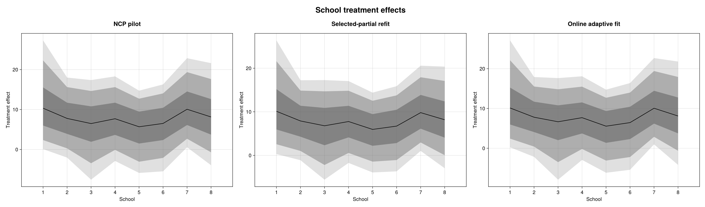
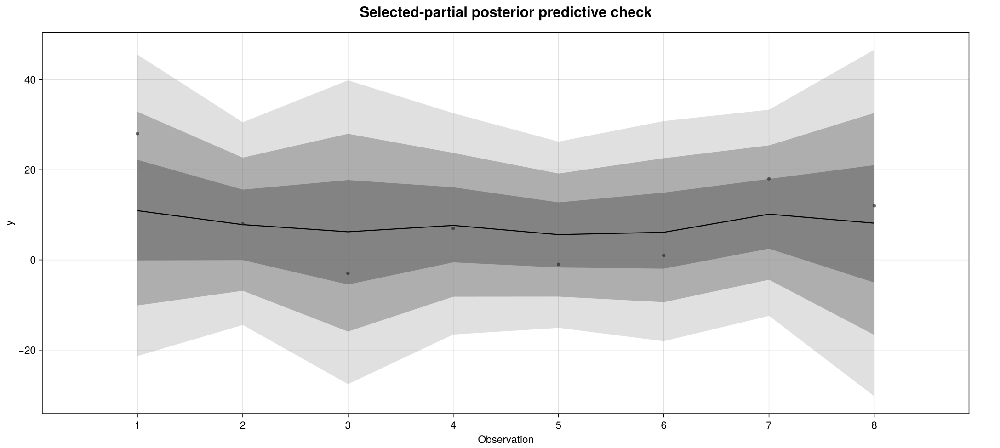
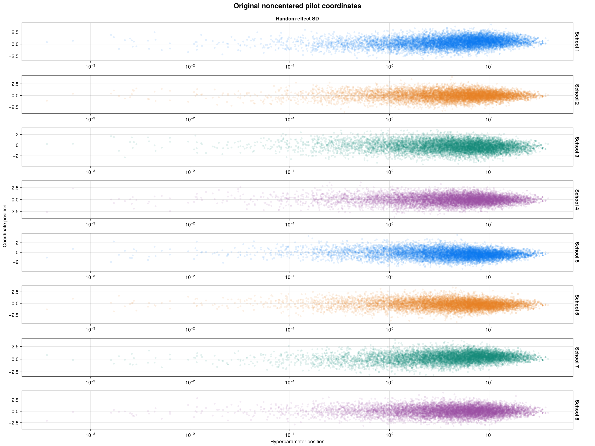
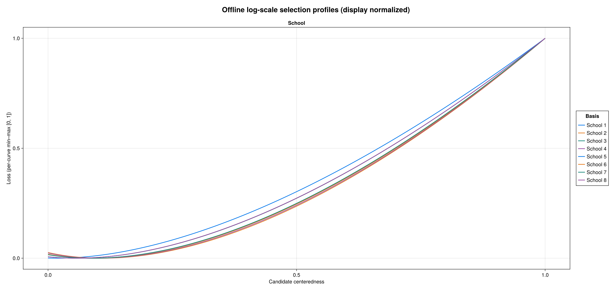
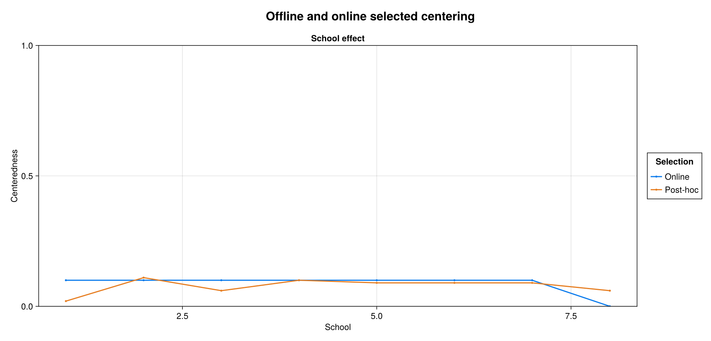
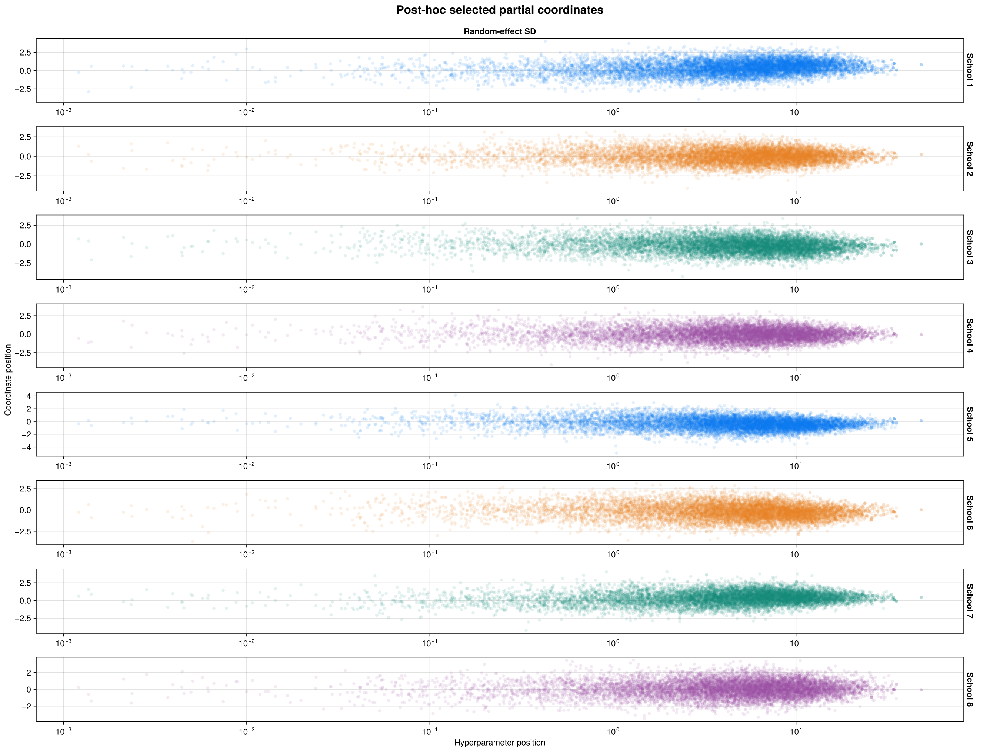
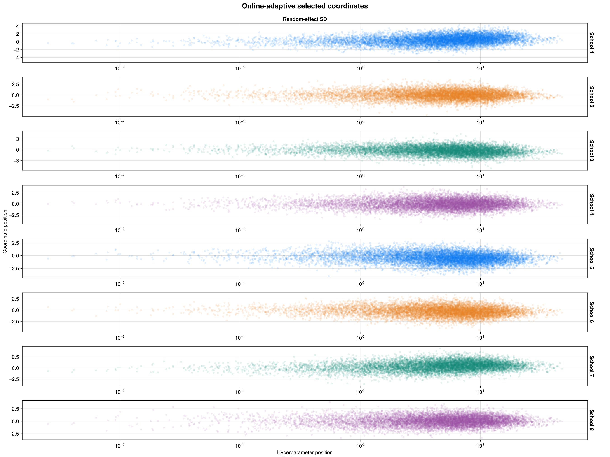
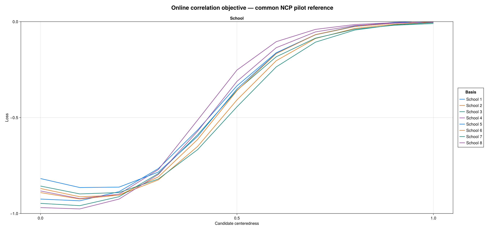
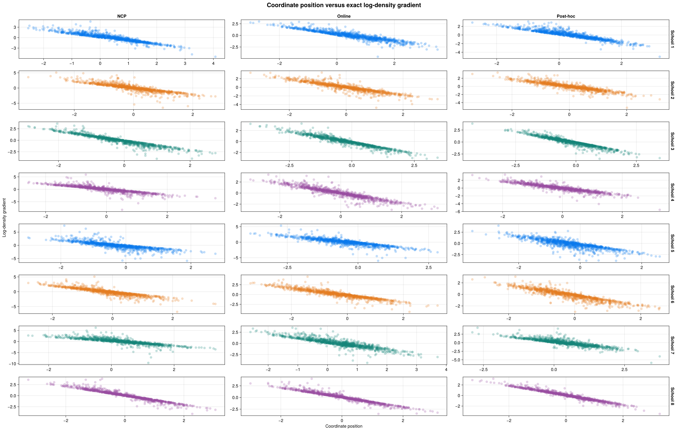

````@raw html
---
title: Adaptive eight-schools centering
description: "The standard eight-schools meta-analysis through BRM: a noncentered pilot, per-school partial centering, and online adaptation, with exact sampling costs."
---
````

# Adaptive eight-schools centering

Eight schools ran SAT-coaching experiments and reported one estimated
treatment effect with one standard error each. The estimates are noisy and
the schools differ, so the model partially pools them toward a common mean.
The pooling strength is learned, and that learning has a funnel geometry:
when the between-school standard deviation `tau` is small, the eight school
effects must sit almost exactly on the population mean. This case study fits
that funnel three ways and compares what each way costs: a noncentered
pilot, a per-school partially centered refit chosen from the pilot, and an
online run that learns its own coordinates during warmup.

This comparison uses a noncentered pilot and a selected-partial refit,
then extends them with online adaptation during warmup. (The cited source
defines the model and data, not a fitting workflow.)

## The model

The eight estimated effects and their standard errors are used as reported:

```text
school   1   2   3   4   5   6   7   8
y       28   8  -3   7  -1   1  18  12
sigma   15  10  16  11   9  11  10  18
```

The reference is Stan's public `example-models` eight-schools program:
[eight_schools.stan](https://github.com/stan-dev/example-models/blob/a42b3da85b7dc38f2745dde4fca197425f18c516/misc/eight_schools/eight_schools.stan)
at revision `a42b3da85b7dc38f2745dde4fca197425f18c516`, with data
[eight_schools.data.R](https://github.com/stan-dev/example-models/blob/93b8b05cb7978952606f2043bec64d3b958b360c/misc/eight_schools/eight_schools.data.R)
at revision `93b8b05cb7978952606f2043bec64d3b958b360c`:

```text
data {
  int<lower=0> J;
  array[J] real y;
  array[J] real<lower=0> sigma;
}
parameters {
  real mu;
  array[J] real theta;
  real<lower=0> tau;
}
model {
  theta ~ normal(mu, tau);
  y ~ normal(theta, sigma);
}
```

The source puts no priors on `mu` or `tau`: both are improper flat on
their support. BRM expresses exactly that with self-contained flat-prior
families, one of them restricted to the positive half-line for the shared
random-effect scale. Nothing is replaced with a convenient proper prior.

### Source equivalence

`research/eight_schools_centering/audit_source.jl` compiles the immutable
original Stan program and compares it with the actual BRM-generated Stan
model. A second audit replays the comparison at 16 saved pilot draws. The
two targets differ by the coordinate transform they sample in
(`theta = mu + tau*z` has an 8-dimensional Jacobian of `tau^8`), which the
audit makes explicit rather than absorbing silently. Across the 16 draws
the largest absolute density difference is `1.07e-14` and the largest
gradient-component difference is `7.64e-14`. These are comparisons of the
actual generated targets, including support and Jacobians, not just
algebraic prior identities.

### One BRM formula and its generated backends

This executable example uses the same eight observations and the same flat
priors as the sampling runs. The tabs expose its generated backends. All
fits on this page use StanBlocks/BridgeStan; the Turing tab shows generated
code.

```@eval
Main.BRMDocsComparisons.comparison(@__MODULE__, raw"""
using BayesianRegressionModels, Distributions, StanBlocks
import BayesianRegressionModels as BRM
import Random

struct EightSchoolsFlat <: ContinuousUnivariateDistribution end
struct EightSchoolsFlatPositive <: ContinuousUnivariateDistribution end
Distributions.logpdf(::EightSchoolsFlat, ::Real) = 0.0
Distributions.loglikelihood(::EightSchoolsFlat, ::AbstractVector{<:Real}) = 0.0
Base.minimum(::EightSchoolsFlat) = -Inf
Base.maximum(::EightSchoolsFlat) = Inf
Distributions.rand(rng::Random.AbstractRNG, ::EightSchoolsFlat) = randn(rng)
Distributions.logpdf(::EightSchoolsFlatPositive, x::Real) = x >= 0 ? 0.0 : -Inf
Distributions.loglikelihood(d::EightSchoolsFlatPositive, x::AbstractVector{<:Real}) =
    sum(Distributions.logpdf(d, x))
Base.minimum(::EightSchoolsFlatPositive) = 0.0
Base.maximum(::EightSchoolsFlatPositive) = Inf
Distributions.rand(rng::Random.AbstractRNG, ::EightSchoolsFlatPositive) = abs(randn(rng))
eight_schools_flat() = EightSchoolsFlat()
eight_schools_flat_positive() = EightSchoolsFlatPositive()
BRM.brm_distribution_type(::typeof(eight_schools_flat)) = EightSchoolsFlat
BRM.brm_distribution_type(::typeof(eight_schools_flat_positive)) = EightSchoolsFlatPositive
BRM._sb_stan_dist_name(::typeof(eight_schools_flat)) = :brm_eight_schools_flat
BRM._sb_stan_dist_name(::typeof(eight_schools_flat_positive)) = :brm_eight_schools_flat_positive
BRM._sb_stan_dist_name(::Type{EightSchoolsFlat}) = :brm_eight_schools_flat
BRM._sb_stan_dist_name(::Type{EightSchoolsFlatPositive}) = :brm_eight_schools_flat_positive
StanBlocks.@deffun begin
    @lpxf brm_eight_schools_flat_lpdf(y::real)::real = 0.0
    brm_eight_schools_flat_rng()::real = normal_rng(0.0, 1.0)
    @lpxf brm_eight_schools_flat_positive_lpdf(y::real)::real = 0.0
    brm_eight_schools_flat_positive_rng()::real = abs(normal_rng(0.0, 1.0))
end

function eight_schools_model()
    (@brm begin
        theta ~ 1 + (1 | eight_schools | school)
        effect(theta, Intercept) ~ eight_schools_flat()
        sd(:, eight_schools) ~ eight_schools_flat_positive()
        y ~ Normal(theta, sigma)
    end)((; school=1:8,
           y=[28.0, 8.0, -3.0, 7.0, -1.0, 1.0, 18.0, 12.0],
           sigma=[15.0, 10.0, 16.0, 11.0, 9.0, 11.0, 10.0, 18.0]))
end
""", :eight_schools_model;
    title="The eight-schools model", require_stan=true)
```

## 1. Fit the noncentered model

One chain, `Xoshiro(1)`, 10,000 requested draws, and ordinary WarmupHMC
defaults with `monitor_ess=true`. The draw count is a floor, so the actual
retained count is reported below. The sampler works in noncentered
coordinates `theta = mu + tau*z`; the plots below show the physical school
effects `theta`.

```julia
pilot = WarmupHMC.adaptive_warmup_mcmc(
    Xoshiro(1), noncentered_problem; n_draws=10_000, monitor_ess=true)
```



The three panels show the eight physical school effects, not a
posterior-predictive interval. Shading gives 90%, 80% and 50% central
credible intervals. The aggressive estimates (28 for school 1, 18 for
school 7) shrink strongly toward the population mean; the three
parameterizations agree with each other.



The predictive ribbons come from BRM's native `:predict` operation through
the selected-partial fit, with the eight observed estimates overlaid as
dots. The intervals are wide because each observation carries its own
reported standard error on top of the pooled effect uncertainty.

## 2. Inspect the geometry in different coordinates

For school scale `tau` and noncentered effect `z`, the physical effect is
`theta = mu + tau*z`. In partial coordinates,

```text
u = tau^c * z
u ~ Normal(0, tau^c)
theta = mu + tau^(1-c) * u
```

`c=0` is noncentered and `c=1` is centered. The physical prior and
likelihood stay the same; the sampler's coordinates and their matching
Jacobian change.



Each row shows one school's noncentered coordinate against the
random-effect scale on a logarithmic axis. These panels contain the full
pilot draw set, not a small illustrative selection. The clouds are nearly
horizontal: conditional on `tau`, the noncentered coordinates barely depend
on it, which is the geometry noncentering is designed to produce.

## 3. Select one centering per school

For each school, the selection searches `0:0.01:1` using

```text
loss(c) = log(std(z .* exp.(c .* log(tau)))) - mean(c .* log(tau))
```



Each curve is rescaled to `[0,1]` for display. Only its minimum matters;
losses from different schools are not compared by their plotted heights.
Every school minimizes near zero: the selected values are `0.02`, `0.11`,
`0.06`, `0.10`, `0.09`, `0.09`, `0.09` and `0.06`. An independent check
applied the literal loss formula to every pilot coordinate: all 8 selected
values agree exactly.



The online run (next section) learns `0.1` for schools 1–7 and `0.0` for
school 8 on its own coarser grid. That is not the offline answer rounded
to the grid — school 1 selects `0.02` offline but learns `0.1` online,
school 8 selects `0.06` but learns `0.0`. Both selectors favor
nearly noncentered coordinates; neither wants the funnel centered.

## 4. Fit the selected partial model from scratch

The second fit starts fresh, again with `Xoshiro(1)`, 10,000 requested
draws, and ordinary WarmupHMC defaults. The pilot determines the
coordinates, not the posterior sample retained from the second fit.

```julia
refit = WarmupHMC.adaptive_warmup_mcmc(
    Xoshiro(1), selected_partial_problem; n_draws=10_000, monitor_ess=true,
    nonlinear_adapt=false)
```

Nonlinear coordinate adaptation is frozen here: the coordinates are already
chosen, so the refit must not re-adapt them. Ordinary metric and step-size
adaptation remains enabled. Saved draws keep both frames: `partial.jls`
holds the source draws `u`, `partial_target.jls` the same draws
back-transformed to model coordinates. The refit diagnostics below are
computed in model coordinates, like the other two fits.



These are the refit run's own 10,000 draws in the selected partial
coordinates — not the pilot re-expressed. Each row shows one school's
partial coordinate against the random-effect scale on a logarithmic axis.

Both fits retained 10,000 draws with the configuration above:

| fit | max split R-hat | min bulk ESS | min tail ESS | divergences |
| --- | ---: | ---: | ---: | ---: |
| Noncentered pilot | 1.0008 | 2,762 | 2,713 | 4 (0.04%) |
| Selected-partial refit | 1.0004 | 3,036 | 2,657 | 6 (0.06%) |

The posterior curves agree visually and the ESS values barely move — as
they should, since the selected coordinates (`c ≈ 0.1`) are nearly the
pilot's own. Partial centering did not buy much here because noncentering
was already close to right. The cost accounting below charges the pilot
that found this out; the coordinates alone do not guarantee a cheaper fit.

Rank-normalized split R-hat, bulk ESS and tail ESS are computed with
MCMCDiagnosticTools over all 10 unconstrained model coordinates (`mu`,
`log(tau)`, and the eight noncentered school coordinates `z`) — not the
physical effects. Each fit has one chain:
split R-hat is a within-chain diagnostic, not evidence that independent
chains agree.

ESS alone does not measure computational cost. The [cost comparison below](#compute-cost-and-ess-per-gradient)
reports measured runtime and exact total and retained-sampling gradient
counts for all three fits.

## Online adaptive centering

Online centering learns per-school coordinates inside warmup instead of
using a separate pilot:

```julia
online = adaptive_centering_problem(sb, stan_problem, enzyme_backend)
fit = WarmupHMC.adaptive_warmup_mcmc(
    Xoshiro(1), online; n_draws=10_000, monitor_ess=true)
learned = WarmupHMC.reparam_sources(online)
```

Returned draws are already back in the original model coordinates: do not
apply a second sampler-to-model back-transform. The online run extends this
comparison; the cited source defines the model and data, not a fitting
workflow.



These are the online run's own 10,000 draws, shown in the learned
coordinates. The full online run retained 10,000 draws, with 1 divergence (0.01%),
maximum split R-hat `1.0006`, minimum bulk ESS `3,597`, and minimum tail
ESS `3,131`. This is encouraging evidence from one run, not a guarantee
for other data, seeds or models.

### Which loss is online centering minimizing?

The two selectors use different criteria. The post-hoc selector above uses
the KL-derived log-scale proxy. WarmupHMC's online selector uses
**weighted position–gradient correlation** at its default `w₁=0`: for an
independent Gaussian coordinate the log-density gradient is a decreasing
affine function of position, giving correlation `-1`. The optional
Jacobian/log-variance part of WarmupHMC's criterion has zero weight under
these defaults.



This plot evaluates WarmupHMC's native `candidate_scoring_losses` on the
**same 10,000 pilot draws** used by the offline diagnostic, with unit
weights. These are **raw, interpretable correlations**, with fixed
y-limits `[-1,0]` and no min–max scaling. Values near `-1` indicate a
nearly linear decreasing position–score relationship. All 88 candidate
comparisons (8 schools × 11 candidates) are available; none was
inadmissible.

This is a **retrospective objective diagnostic**, not a reconstruction of
the online run's warmup history. Actual online selection accumulates
warmup trajectory evidence and resets between adaptation windows. Saved
posterior draws do not retain that leaf stream, its weights, or those
group boundaries, so a posterior replay need not choose the exact
centeredness learned online.

### Position versus gradient, without hyperparameter axes



Here the columns genuinely change the displayed coordinates, left to
right: NCP pilot, online fit in its learned geometry, and post-hoc partial
refit. Each facet shows **1,000 evenly selected draws from its own fit** —
pilot, refit, or online run — with transparent points. The plotted
gradients are evaluated on all 10,000 draws of each fit against its own
target; the candidate-loss replay is a separate common-pilot calculation
(plotted above), not a per-fit loss. The points are plotted directly,
without smoothing or aggregation. Gradient axes are independent between
facets, because reparameterization changes their units as well as the
coordinate units.

Provenance per column: NCP gradients are differentiated directly from the
BRM-generated Stan target at the pilot draws; refit gradients are
differentiated directly from the fixed selected-partial problem at the
source draws `u` (no transport — the draws already live in the displayed
geometry); online gradients are differentiated from the Stan target at the
online draws and transported once into the learned geometry with
`g_c = tau^(-c)*g_z`. The
change-of-coordinate Jacobian is constant with respect to this school
coordinate; its hyperparameter derivatives are not being plotted here.
Seventy-two independent finite-difference checks of the displayed
gradients passed, with maximum relative error `7.86e-11`. These scatter
plots visualize a component of the correlation criterion; their appearance
alone is not an ESS or convergence guarantee.

## Compute cost and ESS per gradient

Each fit records both exact counters with the model, priors, seed and
sampling options specified above. The saved fits' counters were verified
against their final checkpoints; cumulative counters across windows are
never summed.

- **Total NUTS gradients** include step-size adaptation and all discarded
  restart epochs, as well as retained sampling. They count DynamicHMC
  integration steps, **not** Pathfinder initialization or other setup
  gradient calls.
- **Sampling gradients** count only appended transitions corresponding to
  the final retained draws. They exclude adaptation and discarded epochs.
- Each ESS numerator is the **minimum over all 10 sampled model
  coordinates**, in that fit's reported parameterization, not a sum of ESS
  across parameters.

| Fit | Total NUTS gradients | Min bulk ESS / total | Sampling gradients | Min bulk ESS / sampling | Fit time |
| --- | ---: | ---: | ---: | ---: | ---: |
| Noncentered pilot | 78,252 | 0.03530 | 76,692 | 0.03602 | 24.9 s |
| Selected-partial refit | 71,081 | 0.04272 | 69,622 | 0.04361 | 25.4 s |
| Online adaptive centering | 112,114 | 0.03208 | 110,410 | 0.03257 | 1.5 s |

The refit alone has about **1.21×** the pilot's minimum bulk ESS per
sampling gradient. But its coordinates required the pilot: together they
cost **149,333** total NUTS evaluations, giving **0.02033** refit minimum
bulk ESS per total gradient — about **0.58×** the pilot alone. The refit's
numerator is used here; the two runs' ESS values are not added. When the
right coordinates are nearly the starting ones, the pilot-then-refit
workflow spends more than it saves.

Online adaptation avoids the separate pilot and obtains about **0.91×**
the pilot's minimum bulk ESS per total NUTS evaluation (**0.90×** on
sampling-only cost), with 1 observed divergence. Against the charged
pilot-plus-refit workflow it is about **1.58×** per total gradient. The
corresponding minimum tail-ESS ratios, in table order, are `0.03467`,
`0.03738`, `0.02793` per total gradient and `0.03537`, `0.03817`,
`0.02836` per sampling gradient.

**Gradient efficiency is not wall-clock speed.** Timings surround each
sampler call, including initialization, first-use Julia/AD compilation and
checkpoint I/O, but excluding preceding Stan compilation, post-fit
extraction, plotting and offline centering selection. The calls ran
sequentially on a shared host with one BLAS thread
(`BLAS.set_num_threads(1)`); no CPU affinity was set, so single-core
execution is not claimed. They are not warmed or replicated timing
benchmarks. The pilot and refit calls
together took **50.4 s**, before their intervening selection/processing
cost. A direct per-gradient microbenchmark of both evaluation paths gives
about 2 μs per evaluation either way, so the pilot/refit wall time sits
in non-gradient sampler overhead outside the gradient-counter scope; its
mechanism is not attributed here. The divergences and single-chain
limitations still qualify every ESS comparison; these numbers do not
establish universal superiority.

## Native BRM diagnostics, rendered with AlgebraOfVega

The fits use BRM models and WarmupHMC sampling. The research scripts
assemble the comparison panels and retain the scientific provenance. All
figures on this page are rendered in Julia with AlgebraOfVega.

Plotting is optional: `using BayesianRegressionModels, AlgebraOfVega`
loads BRM's plotting extension without adding plotting dependencies to
fitting-only workflows. Given a descriptor and matching saved draws, the
reusable calls are:

```julia
using BayesianRegressionModels, AlgebraOfVega

# Constrained matrices have draws in rows and matching names in columns.
brm_posteriorplot(draws_matrix; x=1:8, probs=[0.9, 0.8, 0.5])

# This simulates replicated observations through BRM's native :predict operation.
brm_ppcplot(descriptor, draws_by_rows; problem=stan_problem,
    response=:y, seed=1, x=["1", "2", "3", "4", "5", "6", "7", "8"])

brm_pairplot(pair_rows)
brm_centerednessplot(centering_rows; compare=true)
brm_centering_lossplot(online_loss_rows; ylimits=(-1, 0))
brm_centering_lossplot(offline_loss_rows; normalization=:minmax)
brm_gradientplot(gradient_rows; opacity=0.25, markersize=12)
```

WarmupHMC matrices use coordinates in rows: transpose them when calling
these BRM draw-table helpers. Conversely, `candidate_scoring_losses`
expects coordinates-by-draws matrices in their current source frame. The
reproduction scripts handle these boundaries explicitly.

## Reproduce and inspect the evidence

The script, plotting program, data and source audits are in
`research/eight_schools_centering/`. The README documents the full
commands. The small evidence tables behind every number on this page —
the source audit, diagnostics, both cost counters, centeredness, loss
profiles, `provenance.toml` and `packages.tsv` — are committed under
`research/eight_schools_centering/results/` with their own provenance
note. Full posterior draws and per-draw coordinate tables stay in scratch.
Raw model-frame draws are saved before plotting, and
existing completed fits are never silently overwritten.

Primary source boundaries:

- Stan `example-models` model at [`a42b3da`](https://github.com/stan-dev/example-models/blob/a42b3da85b7dc38f2745dde4fca197425f18c516/misc/eight_schools/eight_schools.stan).
- Stan `example-models` data at [`93b8b05`](https://github.com/stan-dev/example-models/blob/93b8b05cb7978952606f2043bec64d3b958b360c/misc/eight_schools/eight_schools.data.R).

Different library versions and parameter orderings can produce different
trajectories at the same seed. The recorded environment and source audits
identify the computation behind these results.
