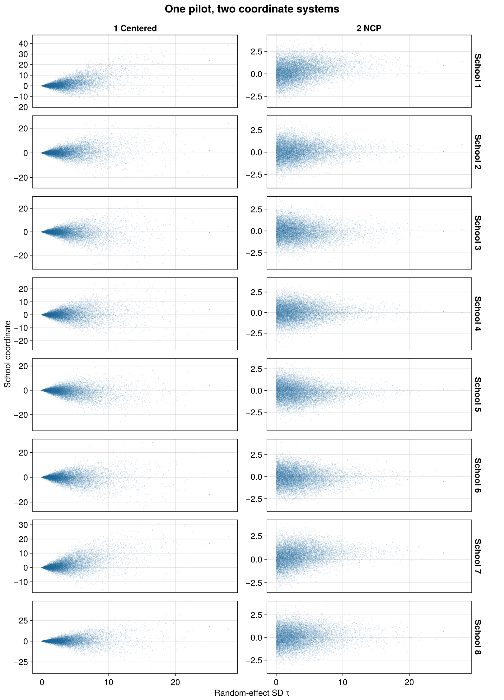
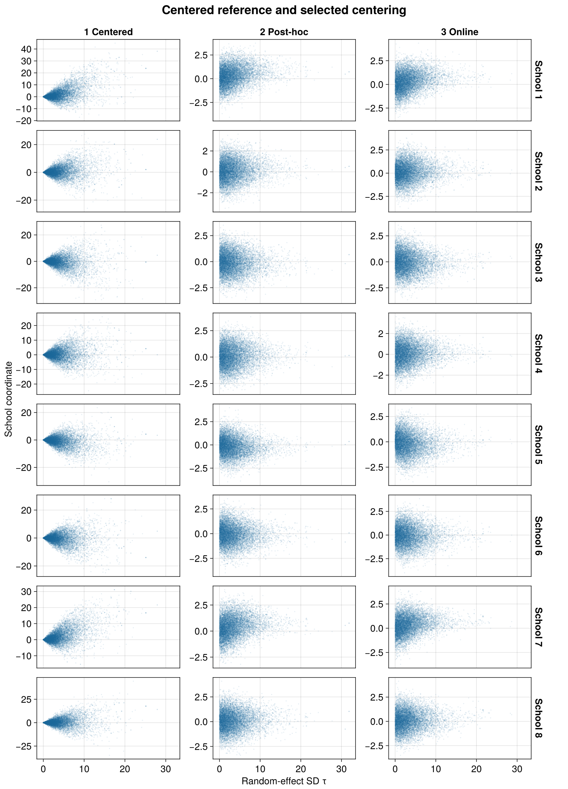
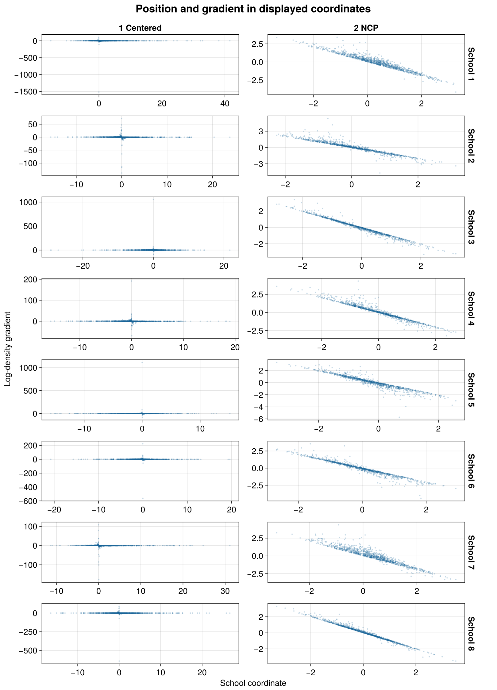
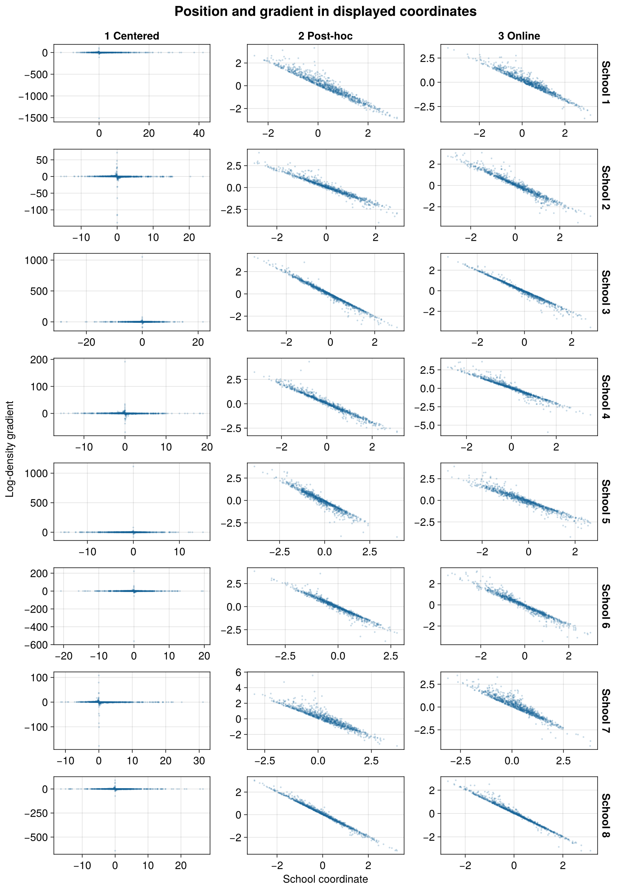

````@raw html
---
title: Eight schools and the choice of centering
description: "PosteriorDB eight schools in BRM: manually centered and noncentered fits, adaptive alternatives, posterior checks and measured costs."
---
````

# Eight schools and the choice of centering

Eight schools report treatment-effect estimates with substantial uncertainty.
A hierarchical model pools those estimates toward a common mean. When the
between-school standard deviation is small, centered school effects occupy a
narrow region around that mean. Noncentered coordinates separate the scale
from standardized school effects and can make this region easier to sample.

This example compares a **manually fully centered fit** with a noncentered fit,
then uses the same model to demonstrate offline and online centering selection.

## The PosteriorDB model

We reproduce PosteriorDB's
[eight-schools posterior](https://github.com/stan-dev/posteriordb/blob/5545a1dd07ae297c36edecbcd82aa49097b4c385/posterior_database/posteriors/eight_schools-eight_schools_noncentered.json),
including its data and priors:

```text
mu ~ Normal(0, 5)
tau ~ Cauchy(0, 5), restricted to positive values
z[j] ~ Normal(0, 1)
theta[j] = mu + tau*z[j]
y[j] ~ Normal(theta[j], sigma[j])
```

The positive restriction on `tau` makes its prior half-Cauchy. The sampling
statement and support match the
[reference Stan program](https://github.com/stan-dev/posteriordb/blob/5545a1dd07ae297c36edecbcd82aa49097b4c385/posterior_database/models/stan/eight_schools_noncentered.stan).
Here, `sigma` contains the known standard errors of the reported estimates.

```@eval
Main.BRMDocsComparisons.comparison(@__MODULE__, raw"""
using BayesianRegressionModels, Distributions, StanBlocks

function eight_schools_model()
    (@brm begin
        theta ~ 1 + (1 | eight_schools | school)
        effect(theta, Intercept) ~ Normal(0, 5)
        sd(:, eight_schools) ~ Cauchy(0, 5)
        y ~ Normal(theta, sigma)
    end)((; school=1:8,
             y=Float64[28, 8, -3, 7, -1, 1, 18, 12],
             sigma=Float64[15, 10, 16, 11, 9, 11, 10, 18]))
end
""", :eight_schools_model;
    title="Eight schools with PosteriorDB priors", require_stan=true)
```

The tabs show generated backends. The fits below use StanBlocks/BridgeStan
and WarmupHMC. Independent comparisons with PosteriorDB's centered Stan
program verify the density and all ten gradient components, including the
coordinate Jacobian. At 16 retained noncentered draws, the maximum absolute
errors are `7.11e-15` in density and `1.78e-14` in a gradient component.

## Choose fully centered coordinates manually

The default BRM model samples standardized effects `z[j]`. Full centering of
the random effects instead samples `u[j] = tau*z[j]`, so
`u[j] ~ Normal(0, tau)` and `theta[j] = mu + u[j]`. Thus `u` is the school's
deviation from the population mean; `theta` is its treatment effect.

To select this parameterization when compiling the model, use the grouping
factor's name:

```julia
model = eight_schools_model()
centered_sb = SBBRMI(model;
    mod=@__MODULE__, centered_groups=[:school])
```

We can also choose the same endpoint through the centering controls. This
lets all four fits below share one compiled noncentered density:

```julia
using Random, Enzyme, WarmupHMC, BridgeStan
using DifferentiationInterface: AutoEnzyme

sb = SBBRMI(model; mod=@__MODULE__)
problem = StanBlocks.stan_instantiate(sb.model)
backend = AutoEnzyme(;
    mode=Enzyme.set_runtime_activity(Enzyme.Reverse),
    function_annotation=Enzyme.Const)

function fixed_centering(sb, problem, backend, coefficients)
    target = adaptive_centering_problem(sb, problem, backend)
    sources = WarmupHMC.reparam_sources(target)
    length(sources) == length(coefficients) || error("one coefficient per school is required")
    WarmupHMC.restore_reparam_sources!(target,
        [index => WarmupHMC.PartiallyCentered(Float64(c))
         for ((index, _), c) in zip(sources, coefficients)])
    target
end

fully_centered = fixed_centering(sb, problem, backend, ones(8))
centered_fit = WarmupHMC.adaptive_warmup_mcmc(
    Xoshiro(1), fully_centered;
    n_draws=10_000, monitor_ess=true, nonlinear_adapt=false)

noncentered_fit = WarmupHMC.adaptive_warmup_mcmc(
    Xoshiro(1), problem; n_draws=10_000, monitor_ess=true)
```

Every coefficient is `1.0`; `nonlinear_adapt=false` keeps that choice fixed.
At `0.0` the corresponding coordinate is fully noncentered. Intermediate
values sample `u[j] = tau^c[j]*z[j]`.

WarmupHMC returns **model coordinates** in `posterior_position`, including
when centering is fixed. Its checkpoints retain sampler coordinates. The
checkpoint-to-model mapping is checked independently before summarizing fits.

[](assets/adaptive-eight-schools/centered_vs_noncentered.png)

Both columns use the noncentered pilot's 10,000 retained draws. The left
column transforms them to `u = tau*z`; the right shows `z`. This isolates
the change of coordinates. The centered column reveals the narrowing as
`tau` approaches zero. Vertical scales are independent; horizontal scales
are shared. Centered coordinates remain the visual reference in the later
scatter plots. The sampling and cost baseline remains the noncentered fit.

## Posterior effects and predictive checks

[](assets/adaptive-eight-schools/posterior_theta.png)

Thin intervals contain 90% of the posterior draws and thick intervals contain
50%. Schools are categories, so each has a separate interval. These are
summaries of `theta = mu + tau*z`, in treatment-effect units.

[](assets/adaptive-eight-schools/posterior_predictive_check.png)

This check uses the noncentered fit. Blue intervals summarize replicated
reported estimates, including their known standard errors; red points are
the observed estimates. The school order is the original data order.

## Select centering from a pilot

An offline rule evaluates each school on a grid `c = 0:0.01:1`:

```math
L_j(c)=\log\operatorname{sd}(\tau^c z_j)-c\,\operatorname{mean}(\log\tau).
```

Compute it using the noncentered pilot's model coordinates, then hold the
selected coefficients fixed during a new fit:

```julia
blocks = adaptive_centering_blocks(sb, BridgeStan.param_unc_names(problem.model))
block = only(blocks)
q = noncentered_fit.posterior_position
z = permutedims(q[vec(block.effects), :])
logtau = vec(q[only(block.log_scales), :])
selection = select_ranef_centeredness(z, repeat(logtau, 1, 8);
    candidates=0:0.01:1)
selected_problem = fixed_centering(sb, problem, backend, selection.centeredness)
partial_fit = WarmupHMC.adaptive_warmup_mcmc(
    Xoshiro(1), selected_problem;
    n_draws=10_000, monitor_ess=true, nonlinear_adapt=false)
```

[](assets/adaptive-eight-schools/offline_loss_profiles.png)

Each curve is rescaled to `[0,1]` for display. Selection uses the unscaled
objective. The selected values are `0.01, 0.06, 0.03, 0.05, 0.06, 0.05, 0.03, 0.02`:
all are close to noncentering, as expected with weak information per school.

## Adapt centering during warmup

Online adaptation chooses the coordinates during a single fit:

```julia
adaptive = adaptive_centering_problem(sb, problem, backend)
online_fit = WarmupHMC.adaptive_warmup_mcmc(
    Xoshiro(1), adaptive; n_draws=10_000, monitor_ess=true)
learned = [last(pair).c for pair in WarmupHMC.reparam_sources(adaptive)]
```

[](assets/adaptive-eight-schools/selected_centeredness.png)

Online adaptation selected `0.1` for Schools 2, 5 and 6, and `0.0` for the
others. The following curves evaluate its position–gradient correlation
objective retrospectively on the same 10,000 pilot draws, with unit weights.
They describe that common reference sample, rather than a recorded warmup
trajectory.

[](assets/adaptive-eight-schools/online_loss.png)

[](assets/adaptive-eight-schools/selected_vs_online.png)

The centered column reuses the transformed pilot. The other columns show the
fresh offline-selected and online fits in their respective sampling coordinates.

## Sampling diagnostics and cost

Each fit uses one chain, `Xoshiro(1)`, 10,000 retained draws, ordinary
WarmupHMC initialization and adaptation defaults, one Julia thread and one
BLAS thread. The fully centered and offline-selected fits freeze centering;
the online fit adapts it.

| Fit | Min bulk ESS | Min tail ESS | Max split R-hat | Divergences |
|:--|--:|--:|--:|--:|
| Noncentered | 4,839 | 3,565 | 1.0011 | 1 (0.01%) |
| Fully centered | 167 | 85 | 1.0022 | 39 (0.39%) |
| Selected partial | 5,380 | 3,518 | 1.0010 | 0 (0.00%) |
| Online | 6,437 | 4,518 | 1.0010 | 5 (0.05%) |

The ESS minima and maximum rank-normalized split R-hat cover all ten
unconstrained **model coordinates**: `mu`, `log(tau)` and `z[1:8]`.
A split R-hat from one chain checks agreement between parts of that chain;
it cannot establish convergence across independent chains. Divergences
indicate numerical problems that the ESS values alone do not describe.

| Fit | Total gradients | Sampling gradients | Bulk ESS / total gradient | Bulk ESS / sampling gradient | Time: median (range) |
|:--|--:|--:|--:|--:|:--|
| Noncentered | 70,220 | 68,688 | 0.06892 | 0.07045 | 0.325 s (0.283–0.325) |
| Fully centered | 174,269 | 170,284 | 0.00096 | 0.00098 | 0.749 s (0.747–0.787) |
| Selected partial | 70,980 | 69,476 | 0.07580 | 0.07744 | 0.354 s (0.344–0.401) |
| Online | 70,854 | 69,328 | 0.09085 | 0.09285 | 0.833 s (0.811–0.849) |

**Timing protocol.** Complete priming fits exercise the plain, fixed-centering
and adaptive call paths before measurement. The table reports the median and
range of three complete fits per method, reversing their order in the second
repetition. Every measured fit recorded zero Julia compilation time and the
same gradient counts across repetitions. The sampler call includes
initialization, warmup, retained sampling and checkpoint I/O; Stan compilation,
model setup, offline selection and plotting are outside it.

The priming calls took 23.32 s for noncentering and 25.34 s for fixed centering,
of which Julia compilation accounted for 23.01 s and 24.55 s respectively.
The online priming call took 0.96 s, including 0.06 s of compilation.
These startup costs are recorded separately from repeated-fit times.

Total gradient counts cover NUTS warmup and discarded epochs as well as the
retained sample; they exclude Pathfinder and other initialization work.
Sampling counts cover transitions contributing retained draws. ESS per
sampling gradient measures the retained phase; ESS per total gradient charges
for NUTS adaptation too.

The offline workflow must pay for its pilot: **141,200 total gradients**
(70,220 + 70,980). Its retained refit's ESS divided by that total is
**0.03810 bulk ESS per gradient**. The noncentered baseline is already efficient here; a selected
refit's per-fit improvement does not by itself justify the pilot cost.
Online adaptation uses a similar number of gradients to the baseline, but
its wrapper and adaptation add wall time. Full centering is less efficient
for this weakly informed model.

## Gradients in the displayed coordinates

[](assets/adaptive-eight-schools/gradient_centered_vs_noncentered.png)

[](assets/adaptive-eight-schools/gradient_selected_vs_online.png)

The centered and noncentered panels use the same 1,000 evenly spaced pilot
draws. Selected and online panels use 1,000 draws from their respective refits.
The gradient is taken with respect to the displayed coordinate. All displayed values
are checked against an independent Gaussian likelihood/prior derivative;
finite differences additionally check three draws per school and method.

## Reproduce the study

The model, immutable reference files, full-run driver, checkpoint extraction,
validation and native AlgebraOfVega plotting code live in
[`research/eight_schools_centering`](https://github.com/nsiccha/BayesianRegressionModels.jl/tree/ns/devibe/research/eight_schools_centering).
Its README gives the commands. The committed result tables record source and
dependency hashes, diagnostics, centering choices, exact costs, timing
repetitions and coordinate checks. All figures are generated from the saved
full fits.
