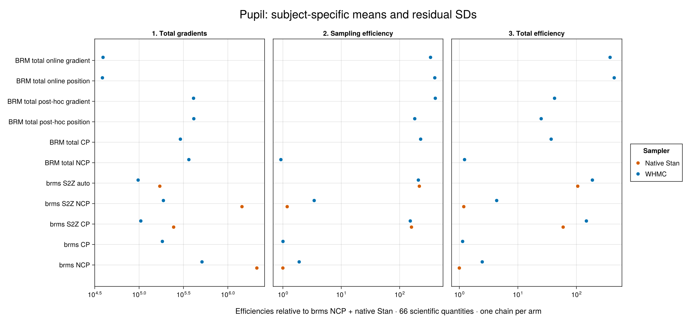
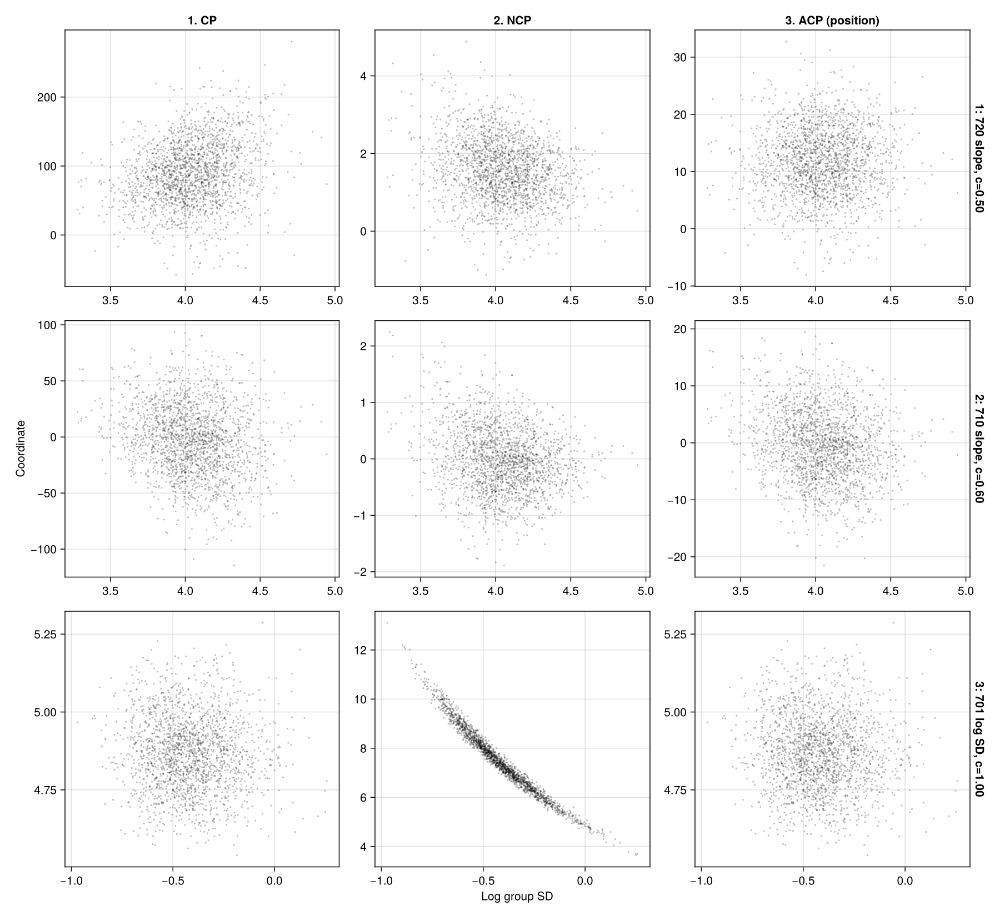
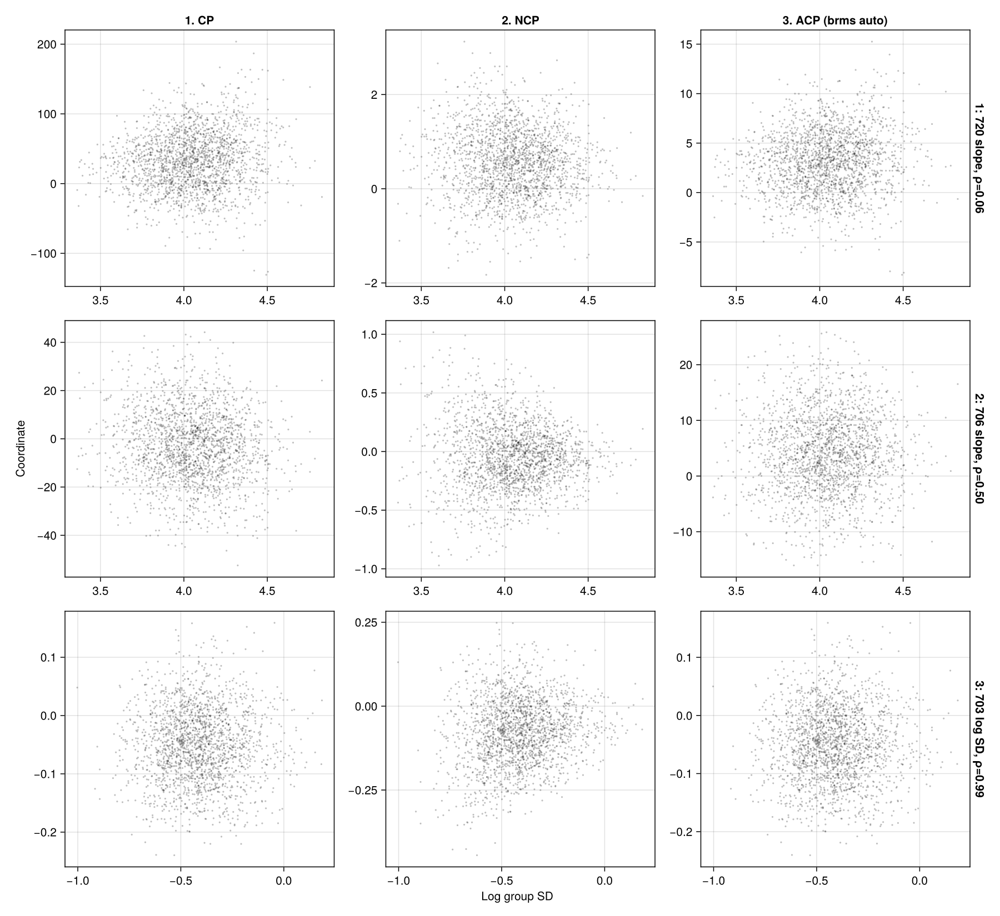

# Pupil: hierarchical residual SD

## Result

**Automatic BRM totals work for both the mean and residual-scale predictors in this pupil model.** All 15 matched arms completed. With WHMC held fixed, online position adaptation of BRM totals gives **2.36× the total-cost efficiency of brms S2Z auto** in this pilot. Against ordinary brms NCP with native Stan, the gain is **400× per sampling gradient and 442× per total gradient**.

The results support combining marginalization with centering adaptation. Fixed NCP is weak for both totals and S2Z here. These are single-chain exploratory results; the precise ranking needs replication.

## Model and data

This follows [Aki's post-4 pupil model](https://discourse.mc-stan.org/t/help-testing-brms-pr-for-sum-to-zero-and-partial-centering/41542/4), with the requested simplification to independent mean random effects:

```r
bf(p_size ~ load + (load || subj), sigma ~ (1 | subj))
```

There are **2,228 observations and 20 subjects**, with numeric load 0–5. Observation order is preserved. Residual SD has a subject-specific hierarchical intercept, unlike the numeric-subject scale regression in the previous pupil example.

Writing x̄ for average load:

```text
y[n] ~ Normal(beta0 + beta1*(load[n]-x̄) + a[j] + b[j]*load[n],
              exp(gamma0 + v[j]))
```

The deviations a, b and v are independent zero-mean Gaussians with SDs tau_a, tau_b and tau_v. Priors are taken from the generated brms target:

- beta0: Student-t(3, 5651.9, 2026.1), at average load;
- beta1: flat, as in the source model;
- gamma0: Student-t(3, 0, 2.5);
- all three group SDs: half-Student-t(3, 0, 2026.1).

The broad prior on tau_v is present in brms's generated code and is retained across every arm. Independent mean random effects are an explicit simplification of the forum model. **Every row targets this same simplified posterior.**

## What BRM does automatically

BRM lowers the ordinary formula and prior declarations into subject totals:

```text
A[j] = beta0 − x̄*beta1 + a[j]
B[j] = beta1 + b[j]
C[j] = gamma0 + v[j]
y[n] ~ Normal(A[j] + B[j]*load[n], exp(C[j]))
```

It integrates out the three population coefficients. Each Student-t population prior is represented exactly by a Gaussian conditional on a Gamma(3/2, rate=3/2) precision multiplier. There are two such multipliers. Ordinary brms samples 66 parameters; totals and S2Z each sample 65.

For each total block T, the prior evaluated during sampling is the Gaussian integral over its population coefficient beta. Conditional precision is `Q = prior_precision + J*A' * diag(1/tau²) * A`; conditional mean is `Q \ (prior_precision*prior_location + A' * diag(1/tau²) * sum(T))`. The small design-basis matrix A accounts for centering the population load predictor. Conditional recovery uses this same distribution. Evaluation is linear in the number of subjects for a fixed number of coefficients.

BRM discovers the two total blocks, scales and centering controls and connects them to WHMC. The formula and priors determine the compiled posterior and centering map. The linked harness uses the public `adaptive_centering_problem`, `select_total_centeredness` and `recover_population_draws` interfaces.

CP uses model-scale totals. NCP scales each total about its prespecified location by its group SD; the resulting marginal prior remains correlated. Post-hoc adaptation chooses one fixed centering control per total from an NCP pilot. Online adaptation changes those controls during WHMC warmup. Both position-only and position–gradient losses are included. For this experiment the loss switch is selected locally in the driver; package files are unchanged.

brms S2Z uses orthonormal contrast coordinates and integrates out population means with the corresponding exact prior adjustment. Its auto row uses the pinned branch's Pathfinder precursor to select fixed centering weights; WHMC reuses those weights and is charged the precursor's cost. S2Z auto here is not online WHMC adaptation.

## BRM model and sampling interface

The authoring pane below reads the exact declarations used by the sampling harness. The backend panes are regenerated during the docs build. The measurements use the StanBlocks/BridgeStan backend and WHMC; the Turing pane is a generated-model comparison only.

```@eval
Main.BRMDocsComparisons.comparison(@__MODULE__,
    Main.BRMCenteringExamples.authoring(:pupil_hierarchical),
    :pupil_hierarchical_brm_model;
    title="Pupil means and hierarchical residual SD", require_stan=true)
```

```julia
using StanBlocks, BridgeStan, WarmupHMC, Enzyme, Random
using DifferentiationInterface: AutoEnzyme

sb = SBBRMI(pupil_hierarchical_brm_model(); mod=@__MODULE__)
problem = StanBlocks.stan_instantiate(sb.model)
names = BridgeStan.param_unc_names(problem.model)
adaptive = adaptive_centering_problem(sb, problem, AutoEnzyme(); centeredness=0.0)
fit = adaptive_warmup_mcmc(Xoshiro(1), adaptive;
    n_draws=2000, monitor_ess=true, nonlinear_adapt=true)

# Returned positions are in the compiled model frame.
draws = permutedims(fit.posterior_position)
recovered = recover_population_draws(sb, draws, names; rng=Xoshiro(404))
```

For a fixed endpoint, set `centeredness=1.0` (CP) or `0.0` (NCP), and set `nonlinear_adapt=false`. For a post-hoc position choice, call `select_total_centeredness(sb, pilot_draws, names; criterion=:position)` and pass its `centeredness` to a fresh problem and fit. The gradient criterion additionally needs the pilot's gradients in the compiled model frame. The harness transports saved checkpoint gradients into that frame before selection.

## One scientific-QOI comparison

Every row measures the same **66 quantities**: beta0, beta1, gamma0; the three group SDs; and each subject's total intercept A, total slope B, and residual SD exp(C). Marginalized methods recover the population coefficients conditionally. Standardized deviations, raw sampler coordinates and mixture variables are excluded.

Efficiencies are **minimum bulk ESS divided by the indicated gradient count, relative to ordinary brms NCP + native Stan**. Total gradients include initialization, warmup and centering pilots. Post-hoc totals include their 363,592-gradient NCP pilot in each standalone workflow; S2Z auto includes its 1,786-gradient precursor. The reused native S2Z fit itself is not charged to WHMC.

| Method | Total gradients | Sampling efficiency | Total efficiency |
|---|---:|---:|---:|
| brms NCP · Native Stan | 2,122,482 | 1× | 1× |
| brms NCP · WHMC | 511,283 | 1.9× | 2.46× |
| brms CP · WHMC | 182,890 | 1× | 1.14× |
| brms S2Z CP · Native Stan | 245,020 | 160× | 59.4× |
| brms S2Z CP · WHMC | 104,514 | 152× | 148× |
| brms S2Z NCP · Native Stan | 1,442,653 | 1.19× | 1.19× |
| brms S2Z NCP · WHMC | 187,780 | 3.44× | 4.35× |
| brms S2Z auto · Native Stan | 171,127 | 218× | 105× |
| brms S2Z auto · WHMC | 97,516 | 209× | 188× |
| BRM total NCP · WHMC | 363,592 | 0.924× | 1.23× |
| BRM total CP · WHMC | 291,873 | 229× | 37× |
| BRM total post-hoc position · WHMC | 413,396 | 182× | 25× |
| BRM total post-hoc gradient · WHMC | 410,621 | 408× | 42.3× |
| BRM total online position · WHMC | 38,606 | 400× | 442× |
| BRM total online gradient · WHMC | 39,224 | 338× | 376× |

[](assets/pupil-scale-centering/efficiency.png)

Choosing the centering matters greatly. Fixed total CP and the two post-hoc choices have good sampling efficiency, but their adaptation/pilot costs reduce total efficiency. Online selection obtains useful geometry without first paying for the expensive NCP pilot. Ordinary brms CP still mixes the shared population intercept slowly, despite improved mixing of subject totals.

## Saved-draw geometry

Both figures reuse **the same 2,000 draws across their three columns**. CP is the visualization baseline, followed by NCP and the chosen partial coordinates. Rows select the smallest centering weight, the distinct weight closest to 0.5, and the largest remaining weight. Plotting never refits a model.

### BRM totals

These are saved post-hoc position-loss draws. The rows select subjects 720 and 710's load slopes and subject 701's log residual SD. The partial column was checked against the actual stored sampler coordinates; maximum error is 7.2e-15. In particular, scaling the log residual-SD total by its group SD creates the strong curve in the bottom-middle panel.

[](assets/pupil-scale-centering/total_pairs.png)

### brms S2Z

These are saved S2Z-auto WHMC draws. Rows select subject 720's slope, subject 706's slope and subject 703's log residual-SD contrast. The J subject-labelled contrast values represent J−1 independent directions. The auto column includes the required weighted shift before scaling; it reproduces the actual Qz coordinates to 1.4e-12. S2Z panels show contrasts, while the figure above shows totals.

[](assets/pupil-scale-centering/s2z_pairs.png)

## Recovery sensitivity, validation and limits

The gain is not solely a conditional-recovery effect. Excluding all three recovered population coefficients leaves 63 invariant quantities. Online position still gives **238× sampling efficiency and 263× total efficiency** against that baseline set. Its total-efficiency advantage over S2Z-auto WHMC remains 2.36×. Ten fresh recovery seeds leave the minimum ESS of both online arms unchanged. Some other rows' minima change when a recovered population coefficient becomes the limiter; the linked sensitivity file records this.

All arms have one chain and 2,000 retained draws, seed 1, with zero sampling divergences. Native NCP hits maximum tree depth on 534 retained transitions. Total NCP has maximum within-chain split R-hat 1.034; the two online arms are about 1.003. Posterior-mean differences from the online-position fit are below three combined estimated MCSEs except one S2Z-NCP WHMC quantity at 3.27. This comparison is a consistency check across 66 quantities, not a proof of convergence.

Native Stan uses 1,000 warmup iterations, adapt_delta 0.8 and maximum tree depth 10. WHMC uses adaptive warmup with Pathfinder initialization. All arms start at the same pooled physical coefficients, with group SDs estimated from subject regressions and both mixture precisions equal to one. Different warmup policies remain part of the sampler comparison. Gradient cost is a computational proxy, not an assertion that every target's gradient has identical wall cost.

The BRM target passed 29 density, gradient, coordinate and recovery checks against an independent Gaussian-integration reference. Ordinary brms and all three S2Z settings also passed density/gradient audits. BRM omits three constant half-Student-t normalizers; adding 3*log(2) aligns its density with the normalized reference without changing gradients or the posterior. Exporting the automatic BRM target and data preserves its density and gradient exactly.

For native Stan, a C++ helper is included when compiling the generated model. A zero-contribution target call counts reverse-mode gradient evaluations, including initialization and warmup. Every retained iteration's count increment was checked against its leapfrog count plus one; final per-process counts include the auto precursor. WHMC counts calls at its target wrapper. Validation-only evaluations are excluded from all fitting costs.

## Inspectable model, harness and results

The study uses brms revision `73cf607889879cb2a55f50b88d8141d76ff43279`, BRM implementation `54cbe3f` (the same tree landed as `5f30e53`), the repaired WHMC checkout `7aed40b`, CmdStan 2.39.0 and CmdStanR 0.9.0. The data revision is `d90fc01e6f6fcdced7ee64c9d2ed607d212ec77c`.

- [BRM model and priors](https://github.com/nsiccha/BayesianRegressionModels.jl/blob/ns/devibe/research/pupil_scale_totals/common.jl).
- [Density, gradient and recovery checks](https://github.com/nsiccha/BayesianRegressionModels.jl/blob/ns/devibe/research/pupil_scale_totals/audit.jl).
- [Six total-coefficient fits](https://github.com/nsiccha/BayesianRegressionModels.jl/blob/ns/devibe/research/pupil_scale_totals/total_whmc.jl).
- [Native sampling and counting](https://github.com/nsiccha/BayesianRegressionModels.jl/blob/ns/devibe/research/pupil_scale_totals/native.R).
- [Ordinary and S2Z WHMC fits](https://github.com/nsiccha/BayesianRegressionModels.jl/blob/ns/devibe/research/pupil_scale_totals/brms_whmc.jl).
- [Generated automatic Stan target](https://github.com/nsiccha/BayesianRegressionModels.jl/blob/ns/devibe/research/pupil_scale_totals/reference/automatic_totals/automatic_totals.stan).
- [Exact automatic-target data](https://github.com/nsiccha/BayesianRegressionModels.jl/blob/ns/devibe/research/pupil_scale_totals/reference/automatic_totals/automatic_totals.json).
- [Single comparison table](https://github.com/nsiccha/BayesianRegressionModels.jl/blob/ns/devibe/research/pupil_scale_totals/results/comparison.tsv).
- [Per-quantity ESS and MCSE](https://github.com/nsiccha/BayesianRegressionModels.jl/blob/ns/devibe/research/pupil_scale_totals/results/per_quantity_mcse.tsv).
- [Recovery sensitivity](https://github.com/nsiccha/BayesianRegressionModels.jl/blob/ns/devibe/research/pupil_scale_totals/results/recovery_seed_sensitivity.tsv).
- [Saved-fit hashes and reproduction instructions](https://github.com/nsiccha/BayesianRegressionModels.jl/blob/ns/devibe/research/pupil_scale_totals/README.md).
