````@raw html
---
title: Adaptive radon centering
description: "PosteriorDB radon with explicit hierarchical priors, county predictive checks, offline and online centering, and measured sampling costs."
---
````

# Adaptive radon centering

Counties with many observations can benefit from different random-effect
coordinates than counties with few. This example fits a county intercept and
floor slope to all **12,573 observations in 386 counties**, then compares
noncentering, offline selection and online adaptation.

## The PosteriorDB model

We reproduce
[`radon_all-radon_variable_intercept_slope_noncentered`](https://github.com/stan-dev/posteriordb/blob/5545a1dd07ae297c36edecbcd82aa49097b4c385/posterior_database/posteriors/radon_all-radon_variable_intercept_slope_noncentered.json)
at revision `5545a1dd07ae297c36edecbcd82aa49097b4c385`. The model has
772 hierarchical effect cells and 777 scalar parameters, tied with its
centered twin for the largest radon model in this PosteriorDB inventory.

```text
log_radon[i] ~ Normal(mu_alpha + alpha[county[i]]
                     + (mu_beta + beta[county[i]]) * floor[i], sigma_y)
mu_alpha, mu_beta ~ Normal(0, 10)
sigma_alpha, sigma_beta, sigma_y ~ Normal(0, 1), restricted to positive values
alpha[j] = sigma_alpha * alpha_raw[j]
beta[j] = sigma_beta * beta_raw[j]
alpha_raw[j], beta_raw[j] ~ Normal(0, 1)
```

The BRM formula uses two named random-effect blocks. Their separate identities
keep the county intercept and slope independent and let us specify each
half-normal scale prior explicitly.

```@eval
Main.BRMDocsComparisons.comparison(@__MODULE__, raw"""
using BayesianRegressionModels, Distributions, StanBlocks, JSON, ZipFile

function adaptive_radon_model()
    zip_path = joinpath(dirname(pathof(BayesianRegressionModels)), "..",
                        "research", "radon_centering", "reference", "radon_all.json.zip")
    reader = ZipFile.Reader(zip_path)
    raw = try
        length(reader.files) == 1 || error("radon_all archive must contain one JSON file")
        read(reader.files[1], String)
    finally
        close(reader)
    end
    parsed = JSON.parse(raw)
    N = parsed["N"]
    J = parsed["J"]
    N == 12_573 && J == 386 || error("unexpected radon_all dimensions")
    floor_measure = Float64.(parsed["floor_measure"])
    log_radon = Float64.(parsed["log_radon"])
    county_idx = Int.(parsed["county_idx"])
    (@brm begin
        sigma_y ~ Normal(0, 1; lower=0)
        mu ~ 1 + floor_measure +
              (1 | county_intercept | county_idx) +
              (0 + floor_measure | county_slope | county_idx)
        effect(mu, Intercept) ~ Normal(0, 10)
        effect(mu, floor_measure) ~ Normal(0, 10)
        sd(:, county_intercept) ~ Normal(0, 1)
        sd(:, county_slope) ~ Normal(0, 1)
        log_radon ~ Normal(mu, sigma_y)
    end)((; floor_measure, county_idx, log_radon))
end
""", :adaptive_radon_model;
    title="The full radon model", require_stan=true)
```

The tabs show the generated backends. Sampling uses StanBlocks/BridgeStan.
An independent audit compares the normalized density and all 777 gradient
components with the
[reference Stan program](https://github.com/stan-dev/posteriordb/blob/5545a1dd07ae297c36edecbcd82aa49097b4c385/posterior_database/models/stan/radon_variable_intercept_slope_noncentered.stan)
at six points spanning small and large scales. The maximum absolute density
and gradient errors are `1.42e-10` and `8.55e-11`.

## Fit and check the noncentered model

```julia
using Random, WarmupHMC

sb = SBBRMI(adaptive_radon_model(); mod=@__MODULE__)
stan_problem = StanBlocks.stan_instantiate(sb.model)
pilot = WarmupHMC.adaptive_warmup_mcmc(
    Xoshiro(1), stan_problem; n_draws=10_000, monitor_ess=true)
```

Every fit uses one chain and 10,000 retained draws, with ordinary WarmupHMC
initialization and adaptation defaults. The same seed and model are used for
the selected-partial and online fits.

[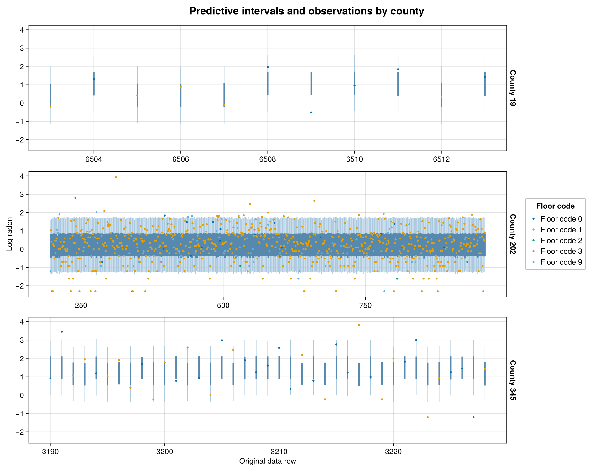](assets/centering-refresh-radon/ppc.png)

Each vertical interval predicts one observation: the thin interval contains
90% of replicated values and the thick interval 50%. Observed values are
overlaid as points coloured by their recorded floor code. The horizontal
position is the **original data-row index**; observations are not reordered
by floor or response, and adjacent intervals are not connected.

The panels show County 19 (11 observations), County 345 (39 observations), County 202 (765 observations). They span the minimum, median and maximum
sample sizes among counties with at least five observations at both floor
codes 0 and 1. All observations in those counties are shown. The model and
the complete predictive table use all 12,573 rows.

The supplied floor covariate contains codes `0`, `1`, `2`, `3` and `9`
(with counts 8,299, 3,949, 22, 19 and 284). The formula uses those numeric
values as supplied by PosteriorDB; plot labels identify them as codes.


## Select one centering per county effect

Each county deviation has coordinates $u=s^c z$. Its population coefficient
remains separate. The following position-loss selection freezes an independent
control for every county intercept and slope:

```julia
using Enzyme, BridgeStan
using DifferentiationInterface: AutoEnzyme
backend = AutoEnzyme(;
    mode=Enzyme.set_runtime_activity(Enzyme.Reverse),
    function_annotation=Enzyme.Const)
blocks = adaptive_centering_blocks(sb, BridgeStan.param_unc_names(stan_problem.model))
selected = Dict{Int,Float64}()
for block in blocks
    q = pilot.posterior_position
    z = permutedims(q[vec(block.effects), :])
    logscale = vec(q[only(block.log_scales), :])
    choice = select_ranef_centeredness(z, repeat(logscale, 1, size(z, 2));
        candidates=0:0.01:1)
    for (index, c) in zip(vec(block.effects), choice.centeredness)
        selected[index] = c
    end
end
selected_problem = adaptive_centering_problem(sb, stan_problem, backend)
WarmupHMC.restore_reparam_sources!(selected_problem,
    [index => WarmupHMC.PartiallyCentered(selected[index])
     for (index, _) in WarmupHMC.reparam_sources(selected_problem)])
refit = WarmupHMC.adaptive_warmup_mcmc(
    Xoshiro(1), selected_problem;
    n_draws=10_000, monitor_ess=true, nonlinear_adapt=false)
```

## Both losses, post-hoc and online

For a zero-mean random effect with log scale $\ell$, the centering family is
$u_c=\exp(c\ell)z$: $c=0$ is NCP and $c=1$ is CP. Its transformed effect
gradient is $g_c=\exp(-c\ell)g_z$. We compare two criteria, minimized separately
for each effect:

```math
L_{\mathrm{position}}(c)=\log\operatorname{sd}(u_c)-\operatorname{mean}(c\ell),
\qquad
L_{\mathrm{gradient}}(c)=\operatorname{cor}(u_c,g_c).
```

The second is a **signed** correlation: an independent Gaussian coordinate
has correlation $-1$ with its log-density gradient. The first uses positions
and the Jacobian, without a gradient term.

Both post-hoc arms use the same NCP pilot, select on `0:0.01:1`, then fit
afresh with the controls fixed. The gradient selector uses the pilot's saved
gradients. Both online arms select on the native `0:0.1:1` grid during warmup,
using the sampler's trajectory evidence and weights. They have no separate
pilot. Controls are frozen for the retained sampling phase.

The online gradient criterion is WarmupHMC's default. The research harness
selects the position criterion through the existing internal loss functions;
there is currently no public loss-selection keyword. The model, initialization
policy, seed and requested draw count are otherwise shared across the arms.

These runs use the active-position transport implementation published in
[WarmupHMC `6b377cb`](https://github.com/nsiccha/WarmupHMC.jl/commit/6b377cb23934022af5879d199a7c57abfac54c70).
When centering changes, the active position and the adaptation sample now
represent the same physical points before and after the change.

WarmupHMC returns **model coordinates** in `posterior_position`; checkpoints
retain sampler coordinates. Export checks their mapping, Jacobian-adjusted
density and saved gradients before making figures or scientific summaries.

[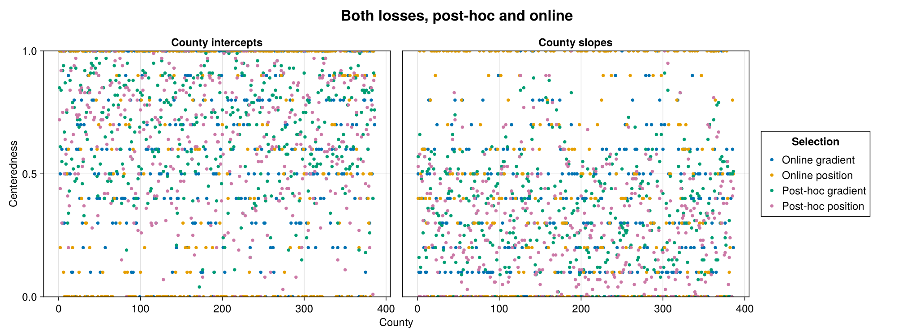](assets/centering-refresh-radon/centeredness.png)

## Sampling efficiency and full workflow cost

Each completed arm has one chain, seed 1 and 10,000 retained draws. Every row
uses the same scientific quantities: **two population coefficients, two group SDs, residual SD, and all 386 county intercept totals and 386 slope totals (777 quantities)**. Standardized effects
are excluded from the minimum. Positive scales may be stored as logs;
rank-normalized bulk ESS is invariant under that monotone change.

| WHMC method | Total gradients | Sampling efficiency | Total efficiency |
|:--|--:|--:|--:|
| NCP | 164,917 | 1× | 1× |
| CP | 152,546 | 0.64× | 0.647× |
| Post-hoc position | 317,186 | 1.07× | 0.52× |
| Post-hoc gradient | 319,385 | 1.35× | 0.651× |
| Online position | 154,539 | 0.843× | 0.841× |
| Online gradient | 154,448 | 0.743× | 0.742× |


Both efficiency columns are relative to this study's **NCP + WarmupHMC**
baseline. Sampling efficiency is minimum bulk ESS divided by retained-sampling
gradient calls. Total efficiency divides that same minimum ESS by the full
workflow's gradient calls. The total includes initialization, all warmup and
adaptation, active-state reevaluations, and sampling. For each post-hoc row it
also includes the entire NCP pilot; the pilot's ESS is not added to the refit's.

Gradient counts measure target evaluations, a proxy for compute cost rather
than a wall-clock speed ratio. Compilation, plotting and independent audits
are outside the fitting counts. The complete numerical summaries, including
absolute ESS and both denominators, are in the linked result files.

Sampling divergences: **NCP: 0; CP: 0; Post-hoc position: 0; Post-hoc gradient: 0; Online position: 0; Online gradient: 0**. These are one-chain comparisons, so neither
the ranking nor a within-chain split R-hat establishes cross-chain convergence.

[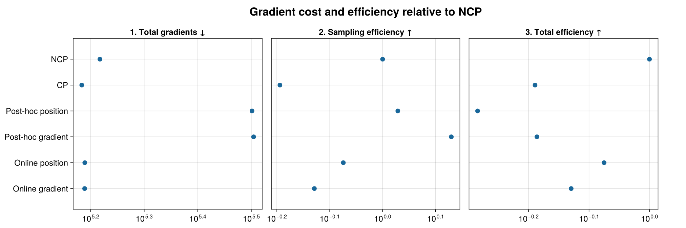](assets/centering-refresh-radon/efficiency.png)

The population floor slope limits minimum ESS in every arm. A more favorable local effect geometry does not necessarily improve this global bottleneck. In this run, neither online loss beats NCP in total efficiency.

For each random-effect role, the scatter rows select the minimum post-hoc
position-loss centeredness, the value nearest `0.5`, and the maximum. Ties use
the lowest county index, with distinct counties in the three rows. These same
coordinates are used throughout. The selection and full fits include all
386 counties; the selected county labels appear in the figures and exported
coordinate table.

## Geometry of the fitted coordinates

The left column is always the **centered visualization baseline**, obtained
from the NCP pilot. The pilot comparison uses those same draws in CP and NCP.
The post-hoc and online panels each show their two newly fitted loss variants
in the coordinates actually used by the sampler. CP is the visual reference;
NCP remains the efficiency baseline. Axes are independent across panels.

[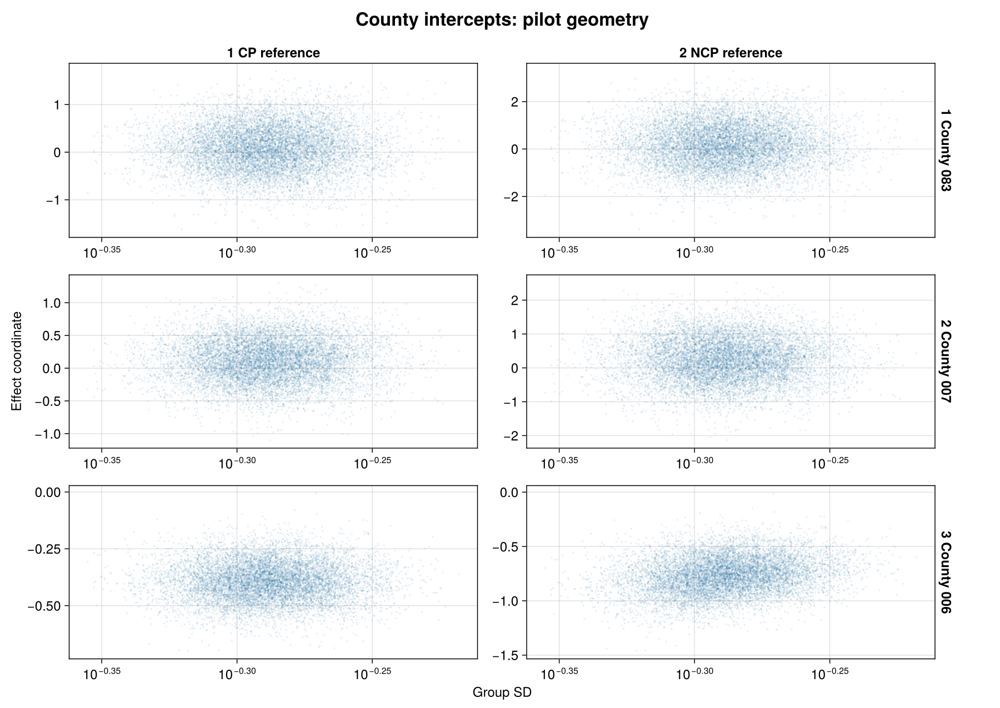](assets/centering-refresh-radon/pairs-pilot-county-intercepts.png)

[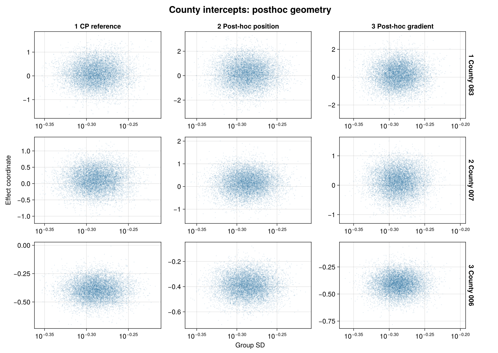](assets/centering-refresh-radon/pairs-posthoc-county-intercepts.png)

[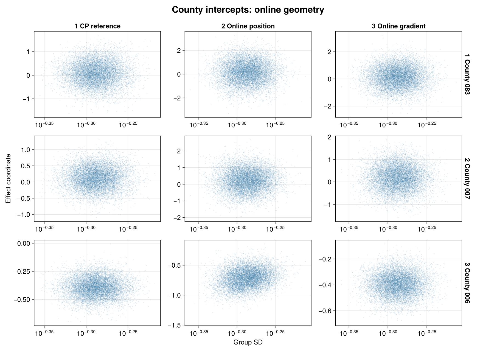](assets/centering-refresh-radon/pairs-online-county-intercepts.png)

[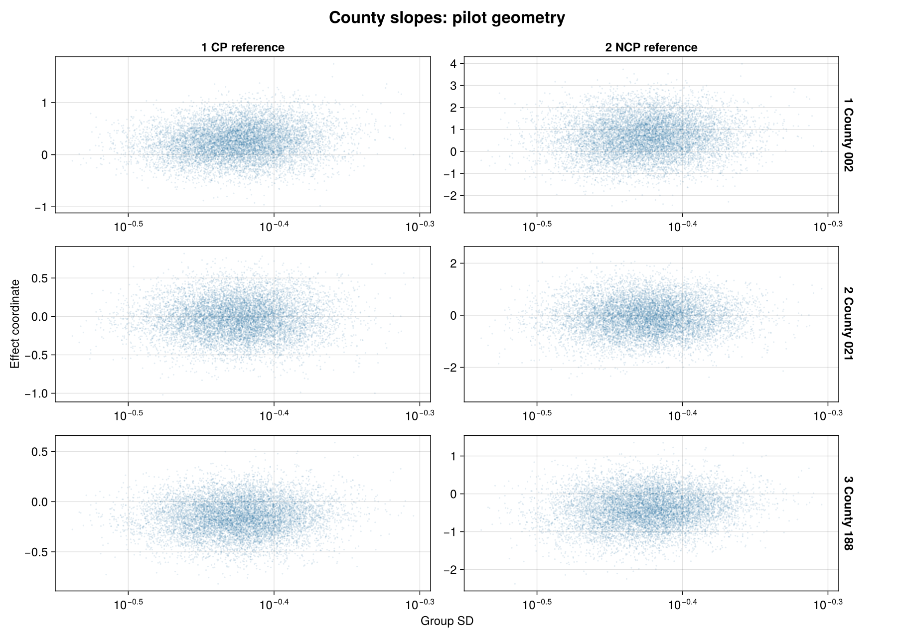](assets/centering-refresh-radon/pairs-pilot-county-slopes.png)

[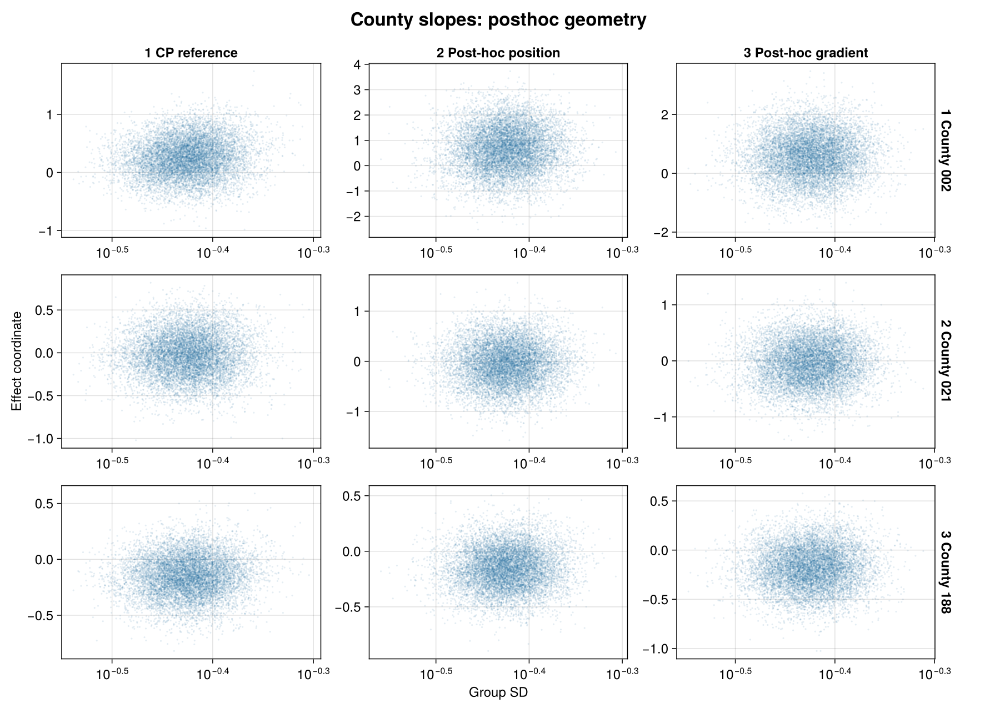](assets/centering-refresh-radon/pairs-posthoc-county-slopes.png)

[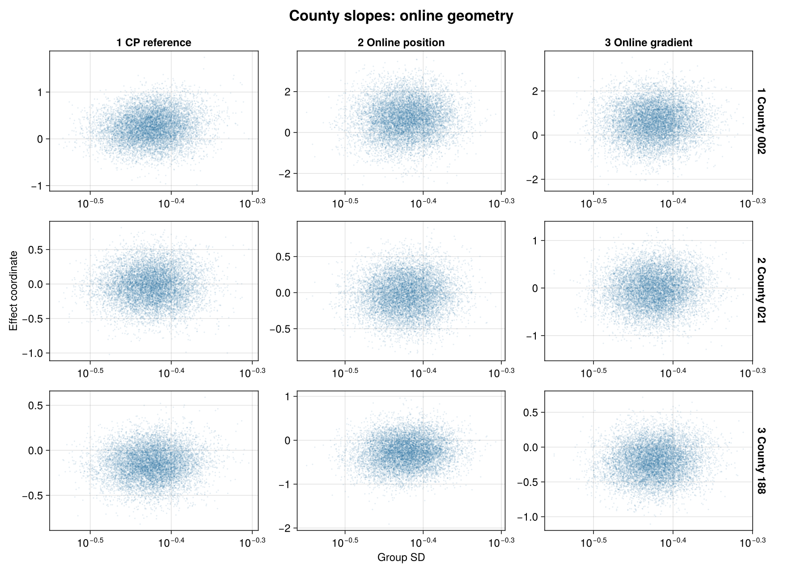](assets/centering-refresh-radon/pairs-online-county-slopes.png)

## Position and gradient in the displayed coordinates

These panels pair each displayed effect coordinate with its own log-density
gradient, using 1,000 evenly spaced retained draws. The CP reference transforms
the pilot's positions and gradients together. The fitted panels use gradients
saved in their actual sampler frame; they do not attach an NCP gradient to a
centered position.

[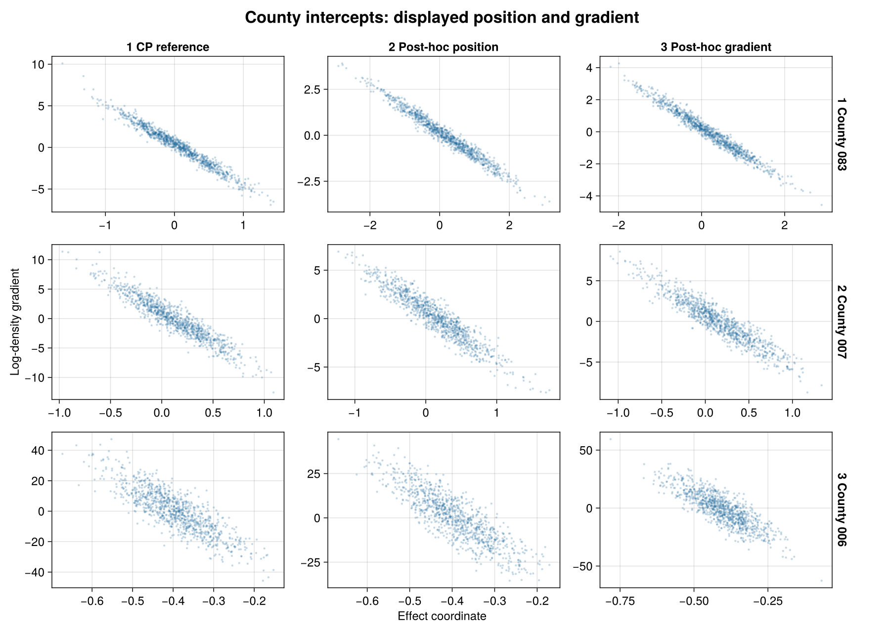](assets/centering-refresh-radon/gradients-posthoc-county-intercepts.png)

[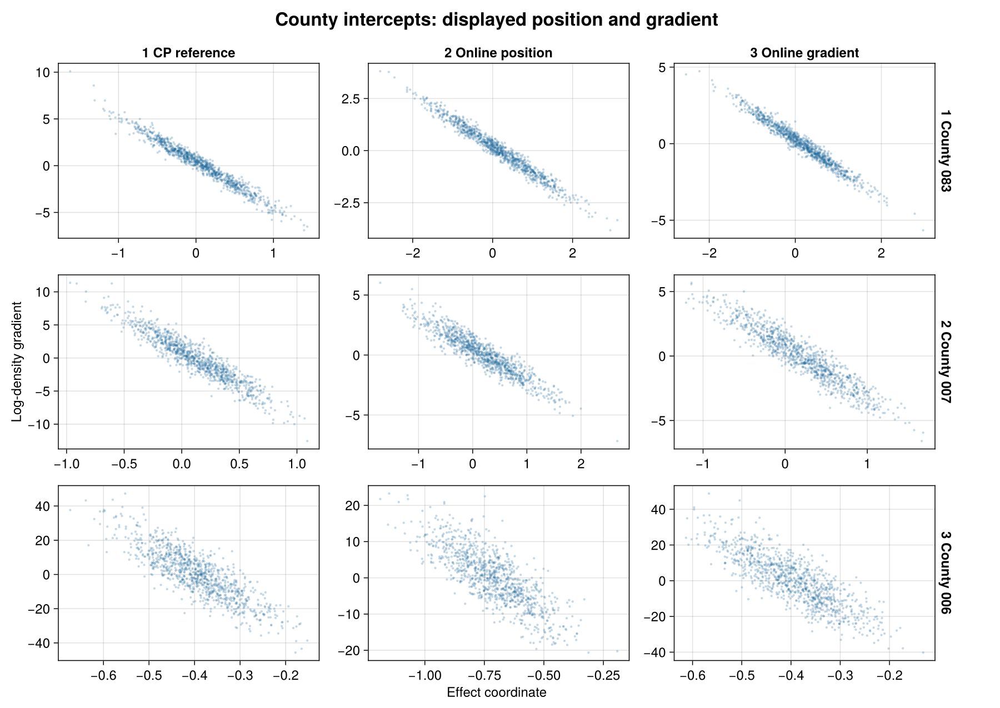](assets/centering-refresh-radon/gradients-online-county-intercepts.png)

[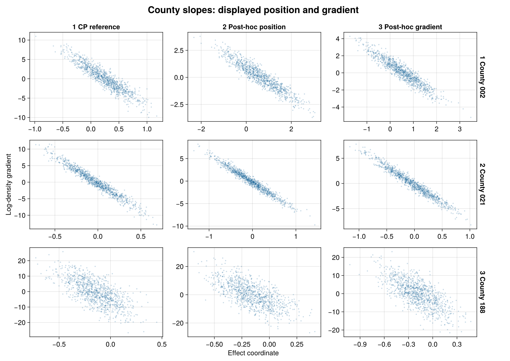](assets/centering-refresh-radon/gradients-posthoc-county-slopes.png)

[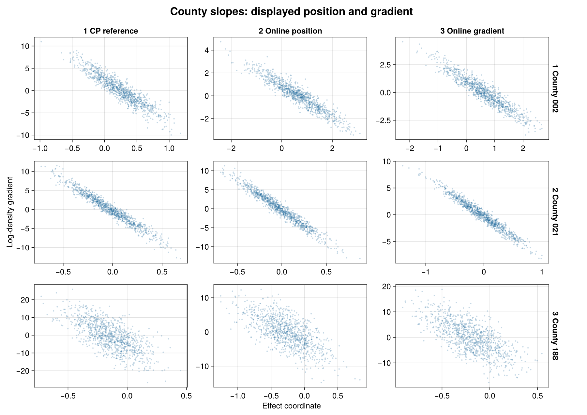](assets/centering-refresh-radon/gradients-online-county-slopes.png)

## Reproduce and inspect

The [refresh harness](https://github.com/nsiccha/BayesianRegressionModels.jl/tree/ns/devibe/research/centering_refresh)
contains the driver, both loss selectors, saved-frame audits, export and AoV
plotting code. Its [results for this study](https://github.com/nsiccha/BayesianRegressionModels.jl/tree/ns/devibe/research/centering_refresh/results/radon)
contain the full efficiency denominators, per-quantity ESS and selected controls.
The original model directory retains the source specification and independent
density/gradient audit. The refresh uses those same model definitions.

Run `run.jl radon ncp OUTPUT` first, then request
`cp,posthoc_position,posthoc_gradient,online_position,online_gradient` with the
same output root. Completed arm directories are immutable. See the harness
README for the environment and full commands.
