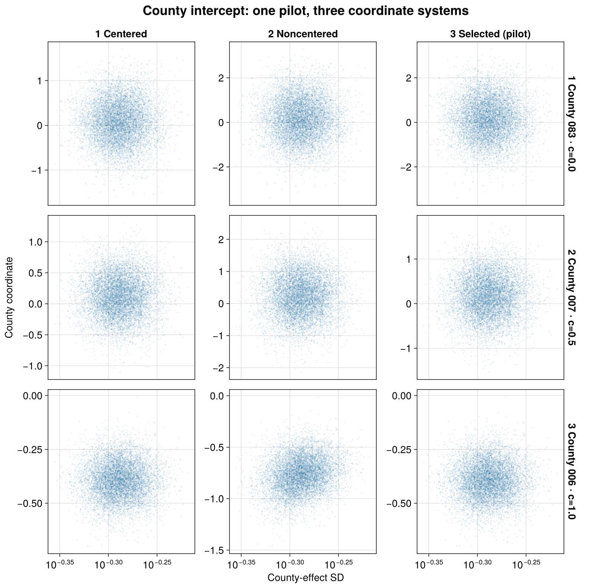
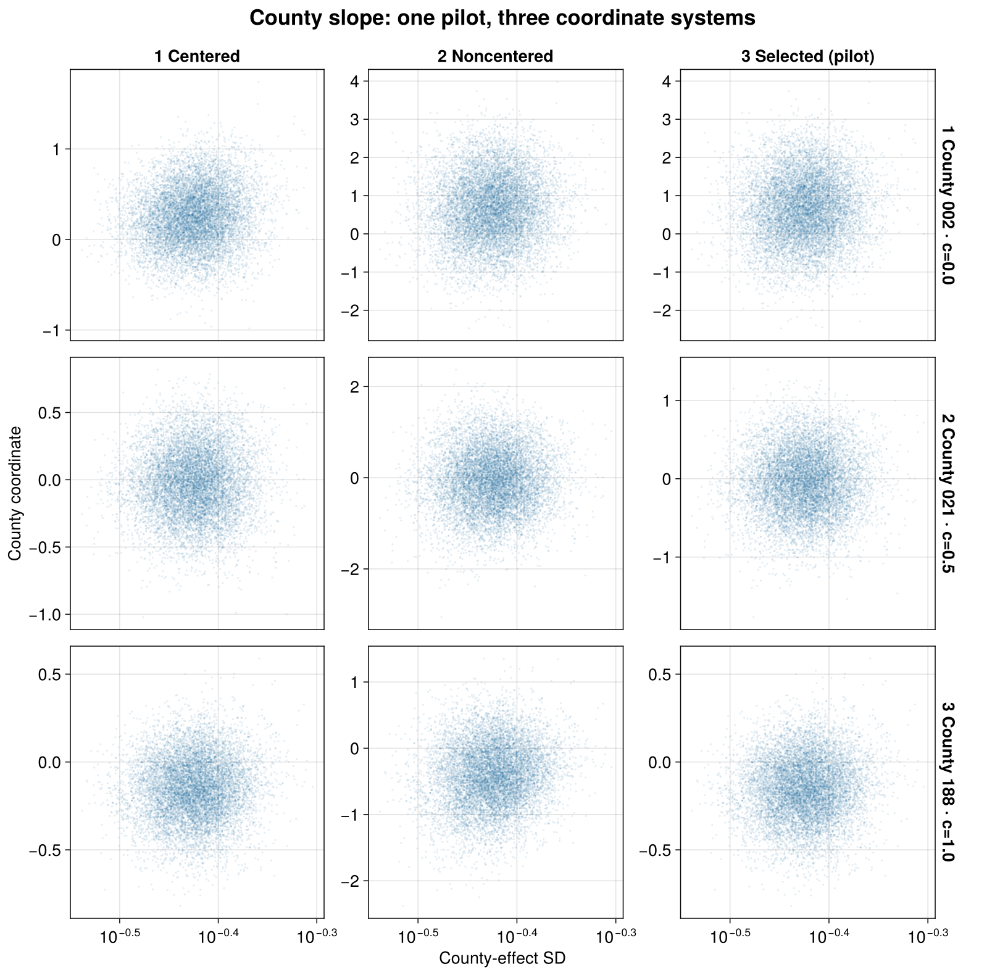
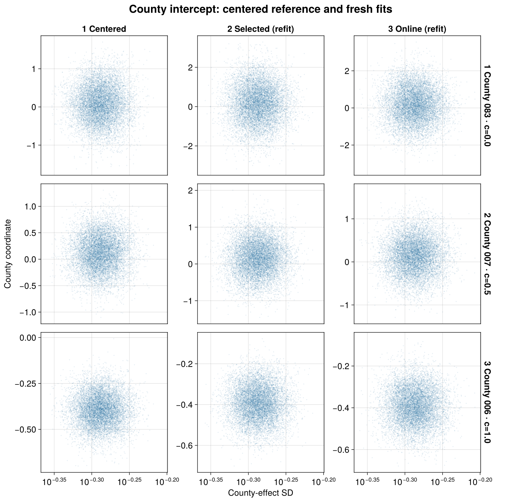
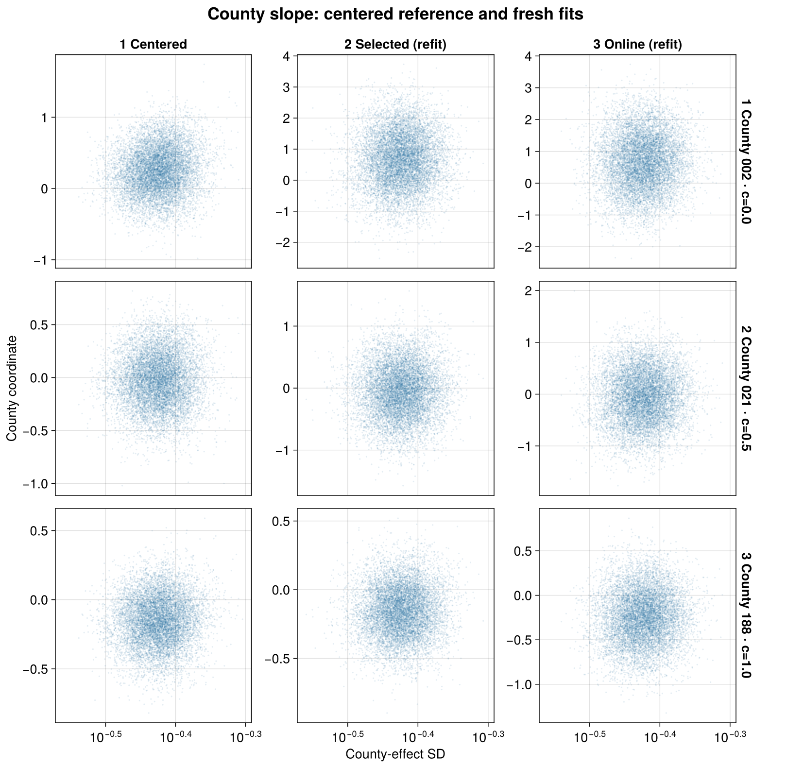

````@raw html
---
title: Adaptive radon centering
description: "PosteriorDB radon with explicit hierarchical priors, county predictive checks, offline and online centering, and measured sampling costs."
---
````

# Adaptive radon centering

Counties with many observations can benefit from different random-effect
coordinates than counties with few. This example fits a county intercept and
floor slope to all **12,573 observations in 386 counties**, then compares
noncentering, offline selection and online adaptation.

## The PosteriorDB model

We reproduce
[`radon_all-radon_variable_intercept_slope_noncentered`](https://github.com/stan-dev/posteriordb/blob/5545a1dd07ae297c36edecbcd82aa49097b4c385/posterior_database/posteriors/radon_all-radon_variable_intercept_slope_noncentered.json)
at revision `5545a1dd07ae297c36edecbcd82aa49097b4c385`. The model has
772 hierarchical effect cells and 777 scalar parameters, tied with its
centered twin for the largest radon model in this PosteriorDB inventory.

```text
log_radon[i] ~ Normal(mu_alpha + alpha[county[i]]
                     + (mu_beta + beta[county[i]]) * floor[i], sigma_y)
mu_alpha, mu_beta ~ Normal(0, 10)
sigma_alpha, sigma_beta, sigma_y ~ Normal(0, 1), restricted to positive values
alpha[j] = sigma_alpha * alpha_raw[j]
beta[j] = sigma_beta * beta_raw[j]
alpha_raw[j], beta_raw[j] ~ Normal(0, 1)
```

The BRM formula uses two named random-effect blocks. Their separate identities
keep the county intercept and slope independent and let us specify each
half-normal scale prior explicitly.

```@eval
Main.BRMDocsComparisons.comparison(@__MODULE__, raw"""
using BayesianRegressionModels, Distributions, StanBlocks, JSON, ZipFile

function adaptive_radon_model()
    zip_path = joinpath(dirname(pathof(BayesianRegressionModels)), "..",
                        "research", "radon_centering", "reference", "radon_all.json.zip")
    reader = ZipFile.Reader(zip_path)
    raw = try
        length(reader.files) == 1 || error("radon_all archive must contain one JSON file")
        read(reader.files[1], String)
    finally
        close(reader)
    end
    parsed = JSON.parse(raw)
    N = parsed["N"]
    J = parsed["J"]
    N == 12_573 && J == 386 || error("unexpected radon_all dimensions")
    floor_measure = Float64.(parsed["floor_measure"])
    log_radon = Float64.(parsed["log_radon"])
    county_idx = Int.(parsed["county_idx"])
    (@brm begin
        sigma_y ~ Normal(0, 1; lower=0)
        mu ~ 1 + floor_measure +
              (1 | county_intercept | county_idx) +
              (0 + floor_measure | county_slope | county_idx)
        effect(mu, Intercept) ~ Normal(0, 10)
        effect(mu, floor_measure) ~ Normal(0, 10)
        sd(:, county_intercept) ~ Normal(0, 1)
        sd(:, county_slope) ~ Normal(0, 1)
        log_radon ~ Normal(mu, sigma_y)
    end)((; floor_measure, county_idx, log_radon))
end
""", :adaptive_radon_model;
    title="The full radon model", require_stan=true)
```

The tabs show the generated backends. Sampling uses StanBlocks/BridgeStan.
An independent audit compares the normalized density and all 777 gradient
components with the
[reference Stan program](https://github.com/stan-dev/posteriordb/blob/5545a1dd07ae297c36edecbcd82aa49097b4c385/posterior_database/models/stan/radon_variable_intercept_slope_noncentered.stan)
at six points spanning small and large scales. The maximum absolute density
and gradient errors are `1.42e-10` and `8.55e-11`.

## Fit and check the noncentered model

```julia
using Random, WarmupHMC

sb = SBBRMI(adaptive_radon_model(); mod=@__MODULE__)
stan_problem = StanBlocks.stan_instantiate(sb.model)
pilot = WarmupHMC.adaptive_warmup_mcmc(
    Xoshiro(1), stan_problem; n_draws=10_000, monitor_ess=true)
```

Every fit uses one chain and 10,000 retained draws, with ordinary WarmupHMC
initialization and adaptation defaults. The same seed and model are used for
the selected-partial and online fits.

[](assets/adaptive-radon/data-ppc.png)

Each vertical interval predicts one observation: the thin interval contains
90% of replicated values and the thick interval 50%. Observed values are
overlaid as points coloured by their recorded floor code. The horizontal
position is the **original data-row index**; observations are not reordered
by floor or response, and adjacent intervals are not connected.

The panels show County 19 (11 observations), County 345 (39 observations), County 202 (765 observations). They span the minimum, median and maximum
sample sizes among counties with at least five observations at both floor
codes 0 and 1. All observations in those counties are shown. The model and
the complete predictive table use all 12,573 rows.

The supplied floor covariate contains codes `0`, `1`, `2`, `3` and `9`
(with counts 8,299, 3,949, 22, 19 and 284). The formula uses those numeric
values as supplied by PosteriorDB; plot labels identify them as codes.

## Compare centered and noncentered geometry

A county effect can be written as `u = s^c*z`: `c=0` samples a standardized
innovation and `c=1` samples the model-scale deviation. The population
intercept and floor coefficient remain separate from those county deviations.

[](assets/adaptive-radon/pair-pilot-intercept.png)

[](assets/adaptive-radon/pair-pilot-slope.png)

Each column displays the same 10,000 pilot draws. Centered coordinates are
shown first, followed by noncentered and offline-selected coordinates. The
scale axes are logarithmic. Centered coordinates remain the visual reference
in the subsequent scatters; the noncentered fit remains the sampling and cost
baseline.

For each role, the rows select the minimum inferred offline centeredness,
the value nearest `0.5`, and the maximum. Ties use the lowest county index.
The same coordinates appear throughout the geometry and gradient comparisons:

| Selection | Intercept county | Slope county | Inferred `c` |
|:--|--:|--:|--:|
| Minimum | 83 | 2 | 0.0 |
| Nearest 0.5 | 7 | 21 | 0.5 |
| Maximum | 6 | 188 | 1.0 |

The complete fit and selection include all 386 counties.

## Select one centering per county effect

The offline selector uses the pilot to evaluate `c = 0:0.01:1` for each of the
772 effect cells:

```text
loss(c) = log(std(z .* exp.(c .* log(s)))) - mean(c .* log(s))
```

BRM exposes the rule through `select_ranef_centeredness`. The following code
selects and freezes every scalar control:

```julia
using Enzyme, BridgeStan
using DifferentiationInterface: AutoEnzyme
backend = AutoEnzyme(;
    mode=Enzyme.set_runtime_activity(Enzyme.Reverse),
    function_annotation=Enzyme.Const)
blocks = adaptive_centering_blocks(sb, BridgeStan.param_unc_names(stan_problem.model))
selected = Dict{Int,Float64}()
for block in blocks
    q = pilot.posterior_position
    z = permutedims(q[vec(block.effects), :])
    logscale = vec(q[only(block.log_scales), :])
    choice = select_ranef_centeredness(z, repeat(logscale, 1, size(z, 2));
        candidates=0:0.01:1)
    for (index, c) in zip(vec(block.effects), choice.centeredness)
        selected[index] = c
    end
end
selected_problem = adaptive_centering_problem(sb, stan_problem, backend)
WarmupHMC.restore_reparam_sources!(selected_problem,
    [index => WarmupHMC.PartiallyCentered(selected[index])
     for (index, _) in WarmupHMC.reparam_sources(selected_problem)])
refit = WarmupHMC.adaptive_warmup_mcmc(
    Xoshiro(1), selected_problem;
    n_draws=10_000, monitor_ess=true, nonlinear_adapt=false)
```

[](assets/adaptive-radon/offline-loss-profiles.png)

The displayed curves are individually rescaled to `[0,1]`. Selection uses
their unscaled minima. Every cell has its own 101-point profile in the
saved tables.

[](assets/adaptive-radon/selected-centeredness.png)

The selected column above transforms the pilot using the inferred controls.
The refit uses those controls for a separate sampling run; its retained draws
appear alongside the online fit below.

## Adapt centering during warmup

Online selection adapts the coordinates within one run:

```julia
online = adaptive_centering_problem(sb, stan_problem, backend)
online_fit = WarmupHMC.adaptive_warmup_mcmc(
    Xoshiro(1), online; n_draws=10_000, monitor_ess=true)
learned = WarmupHMC.reparam_sources(online)
```

WarmupHMC returns model coordinates for all three fits, including the
fixed-centering refit. Checkpoints retain sampler coordinates. Extraction
checks the scalar checkpoint-to-model map against the returned draws before
computing summaries or changing coordinates for display.

[](assets/adaptive-radon/pair-fits-intercept.png)

[](assets/adaptive-radon/pair-fits-slope.png)

The left column repeats the centered pilot reference. The middle and right
columns use the fresh offline-selected and online fits, each displayed in
its own sampling coordinates.

The online objective is weighted position–gradient correlation, with the
default `w₁=0`, evaluated over `c = 0:0.1:1`. For an independent Gaussian
coordinate, its log-density gradient is an affine decreasing function of
position and this correlation is `-1`.

[](assets/adaptive-radon/online-loss-profiles.png)

These curves evaluate the online objective retrospectively on the same
10,000 pilot draws used for the offline profiles, with unit weights.
All 8,492 cell–candidate combinations are retained. The vertical scale shows
raw correlations in `[-1,0]`. Online selection itself uses warmup trajectory
evidence, whose samples and weights differ from this common pilot reference.

## Diagnostics and compute cost

| Fit | Max split R-hat | Min bulk ESS | Min tail ESS | Divergences |
|:--|--:|--:|--:|--:|
| Noncentered pilot | 1.0045 | 356 | 827 | 0 (0.00%) |
| Selected-partial refit | 1.0026 | 476 | 876 | 0 (0.00%) |
| Online | 1.0013 | 365 | 640 | 0 (0.00%) |

R-hat and ESS use all 777 unconstrained model coordinates. The R-hat values
are rank-normalized split-chain diagnostics from a single chain; they cannot
establish agreement between independent chains.

| Fit | Total gradients | Sampling gradients | Bulk ESS / total | Bulk ESS / sampling | Elapsed (Julia compilation) |
|:--|--:|--:|--:|--:|:--|
| Noncentered pilot | 164,766 | 160,352 | 0.002162 | 0.002221 | 89.1 s (23.62 s) |
| Selected-partial refit | 152,152 | 150,000 | 0.003127 | 0.003172 | 92.6 s (23.93 s) |
| Online | 154,427 | 150,000 | 0.002362 | 0.002432 | 175.8 s (0.08 s) |

Both exact NUTS counters agree with the final checkpoints. Total gradients
include NUTS adaptation and discarded epochs; sampling gradients count
transitions contributing retained draws. Neither count includes Pathfinder
or other initialization work. ESS ratios use the minimum bulk ESS across
parameters, not a sum of parameter ESS values.

The selected-partial refit obtains more effective draws per gradient than the
pilot when considered alone. Its full workflow costs **316,918 total gradients**
for pilot plus refit, giving **0.001501 minimum bulk ESS per total gradient**.
That is lower than the noncentered baseline's 0.002162; the pilot cost outweighs
the refit's improvement in this run. Online adaptation gives
1.09 times the baseline's minimum bulk ESS per total gradient, while taking
more elapsed time. This dataset does not show a clear overall advantage for
adaptive centering under this protocol.

Times cover each complete sampler call, including initialization, Julia
compilation, adaptation, sampling and checkpoint I/O. Stan compilation,
model setup, offline selection and plotting are outside the timed region.
The three fits ran sequentially with one BLAS thread on a shared host.
These elapsed times describe the recorded runs; the
[eight-schools example](eight-schools-centering.md#sampling-diagnostics-and-cost)
also demonstrates a warmed, repeated timing protocol.

## Position and gradient in the selected coordinates

[](assets/adaptive-radon/position-gradient-intercept.png)

[](assets/adaptive-radon/position-gradient-slope.png)

Columns show the pilot in centered coordinates, the offline-selected refit
and the online-selected fit. Rows use the same centeredness-based selections
as the pair plots.
Each facet uses 1,000 evenly spaced retained draws from its named fit, with
the derivative taken in its displayed coordinate. All displayed gradients
are checked against an independent Gaussian derivative computed from the
original data. Further checks cover the transformed density, Jacobian,
physical linear predictor and checkpoint-to-return map.

## Reproduce the study

The immutable source and data, executable driver, saved-result validation,
centering diagnostics and native AlgebraOfVega plotting code are in
[`research/radon_centering`](https://github.com/nsiccha/BayesianRegressionModels.jl/tree/ns/devibe/research/radon_centering).
Its README gives the commands. Committed tables record source and dependency
identities, diagnostics, selected controls and both gradient costs. Full
returns, checkpoints and per-draw tables remain in the recorded run directories.
