````@raw html
---
title: Adaptive radon centering
description: "Reproducing the most complex PosteriorDB radon case study: a noncentered pilot, per-county partial centering, and a fresh posterior fit."
---
````

# Adaptive radon centering

The difficult geometry of a hierarchical regression is not necessarily resolved by
choosing one centered or noncentered parameterization for every group effect.
Counties with many observations can need different coordinates than counties with
few. This case study follows PosteriorDB posterior
`radon_all-radon_variable_intercept_slope_noncentered` at revision
`5545a1dd07ae297c36edecbcd82aa49097b4c385`:
fit the noncentered model, inspect its geometry, choose one centering per county
effect, and fit the reparameterized model from scratch.

The source workflow has two fits: a noncentered pilot and a selected-partial
refit. The centered plots transform the pilot draws. A third fit extends the
comparison with online adaptation during warmup.

## The model

All 12,573 `radon_all` observations are used. Log radon in county `j` follows

```text
mu[i]  = mu_alpha + mu_beta * floor[i] + alpha[j[i]] + beta[j[i]] * floor[i]
y[i] ~ Normal(mu[i], sigma_y)
```

with 386 county intercepts `alpha` and 386 county slopes `beta`:

```text
mu_alpha, mu_beta ~ Normal(0, 10)
sigma_alpha, sigma_beta ~ Normal(0, 1; lower=0)
sigma_y ~ Normal(0, 1; lower=0)
alpha_raw[j], beta_raw[j] ~ Normal(0, 1)
alpha[j] = sigma_alpha * alpha_raw[j]
beta[j]  = sigma_beta * beta_raw[j]
```

The positive `Normal(0,1)` priors are half-normal on the three scales. The
selected posterior is the most complex radon variant in the PosteriorDB
inventory at this revision: 772 hierarchical effect cells (386 intercepts plus
386 slopes) and 777 scalar parameters, more than every other radon posterior on
both structural criteria. Parameterization is not part of that criterion; the
noncentered implementation above is the adaptive-centering starting point.

### Hyperpriors and source equivalence

The BRM spelling uses fixed population intercept/slope coefficients for the
source model's `mu_alpha`/`mu_beta`, and two scalar zerocorr county blocks for
its independent `alpha`/`beta` vectors. The fixed coefficients and standardized
effects give exactly the source linear predictor. There is no rescaling,
centering, covariate editing, or prior substitution.

`research/radon_centering/audit_source.jl` compiles the immutable original Stan
program and compares it with the actual BRM-generated Stan model. Its 21
noncentered-model checks cover the coordinate mapping, the normalized target
including the Jacobian, and all 777 gradient components. Across six tested
points the largest absolute density and gradient differences were `1.42e-10`
and `8.55e-11`. These are comparisons of the actual generated targets,
including the source hyperpriors, not just algebraic prior identities.

### One BRM formula and its generated backends

This executable example reads the full dataset and uses the same
variable-intercept-slope model as the sampling runs. The tabs expose its
generated backends. All fits on this page use StanBlocks/BridgeStan.

```@eval
Main.BRMDocsComparisons.comparison(@__MODULE__, raw"""
using JSON, ZipFile

function adaptive_radon_model()
    zip_path = joinpath(dirname(pathof(BayesianRegressionModels)), "..",
                        "research", "radon_centering", "reference", "radon_all.json.zip")
    reader = ZipFile.Reader(zip_path)
    raw = try
        length(reader.files) == 1 || error("radon_all archive must contain one JSON file")
        read(reader.files[1], String)
    finally
        close(reader)
    end
    parsed = JSON.parse(raw)
    N = parsed["N"]
    J = parsed["J"]
    N == 12_573 && J == 386 || error("unexpected radon_all dimensions")
    floor_measure = Float64.(parsed["floor_measure"])
    log_radon = Float64.(parsed["log_radon"])
    county_idx = Int.(parsed["county_idx"])
    (@brm begin
        sigma_y ~ Normal(0, 1; lower=0)
        mu ~ 1 + floor_measure +
              (0 + intercept + floor_measure || county_idx)
        effect(mu, Intercept) ~ Normal(0, 10)
        effect(mu, floor_measure) ~ Normal(0, 10)
        log_radon ~ Normal(mu, sigma_y)
    end)((; floor_measure, county_idx, log_radon,
           intercept=fill(1.0, N)))
end
""", :adaptive_radon_model;
    title="The full radon model", require_stan=true)
```

## 1. Fit the noncentered model

The source configuration is retained: one chain, `Xoshiro(1)`, 10,000 requested
draws, and ordinary WarmupHMC defaults including Pathfinder initialization.
The draw count is a floor, so the actual retained count is reported below.
Evaluation windows, target acceptance, tree depth and transformation settings
use their defaults.

```julia
pilot = WarmupHMC.adaptive_warmup_mcmc(
    Xoshiro(1), noncentered_problem; n_draws=10_000, monitor_ess=true)
```

`monitor_ess=true` preserves diagnostic monitoring; it does not retune the
sampler.

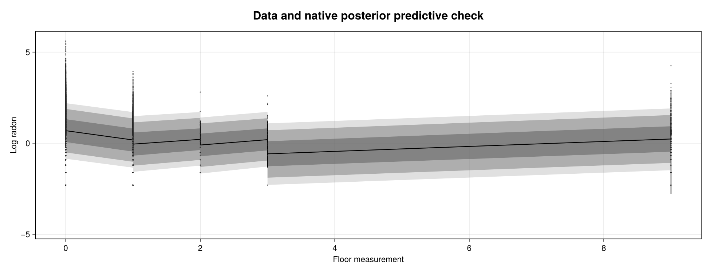

The bands give 90%, 80% and 50% central posterior-predictive intervals over all
12,573 observations, simulated through BRM's native `:predict` operation; the
points are the observed log-radon values. Both use the source's log-radon
units.

## 2. Inspect the geometry in different coordinates

For county scale `s` and noncentered effect `z`, the physical county effect is
`w = s*z`. In partial coordinates,

```text
u = s^c * z
u ~ Normal(0, s^c)
w = s^(1-c) * u
```

`c=0` is noncentered and `c=1` is centered. The physical prior and likelihood
stay the same; the sampler's coordinates and their matching Jacobian change.

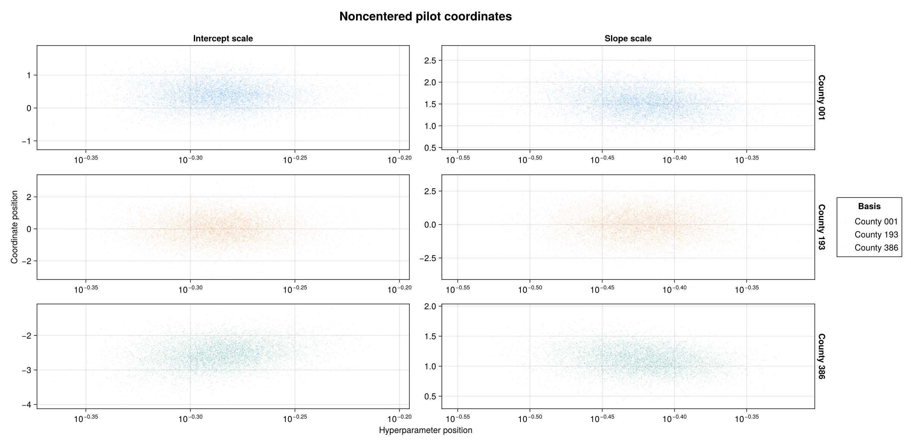

Rows show counties 1, 193 and 386: the first, middle and last county indices.
Columns show the intercept scale, then the slope scale. The hyperparameter axes
are logarithmic. These panels contain the full pilot draw set, not a small
illustrative selection.

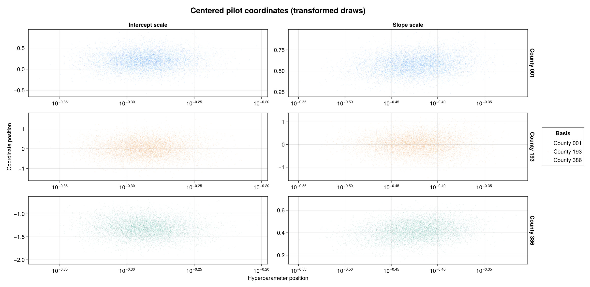

This is the **same pilot**, transformed to `w=s*z`. It reveals the centered
geometry without running another chain. A change that helps data-rich counties
can make data-poor counties much worse, which motivates choosing their
centeredness separately.

## 3. Select one centering per county effect

For each of the 772 county effects, the pilot-based selector searches
`0:0.01:1` using

```text
loss(c) = log(std(z .* exp.(c .* log(s)))) - mean(c .* log(s))
```

BRM's `select_ranef_centeredness` exposes this selection. It reports candidates
whose partial-coordinate scales would underflow as inadmissible. The
noncentered endpoint remains available.

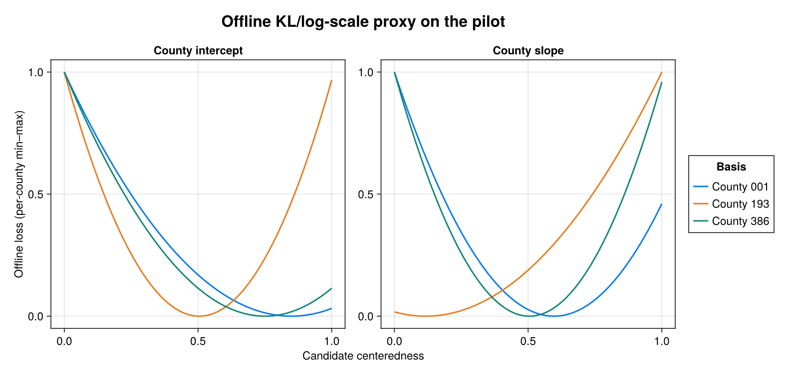

Each curve is rescaled to `[0,1]` for display. Only its minimum matters;
losses from different counties are not compared by their plotted heights. The
three curves are the representative counties 1, 193 and 386; every one of the
772 cells has its own 101-point profile in the saved tables.

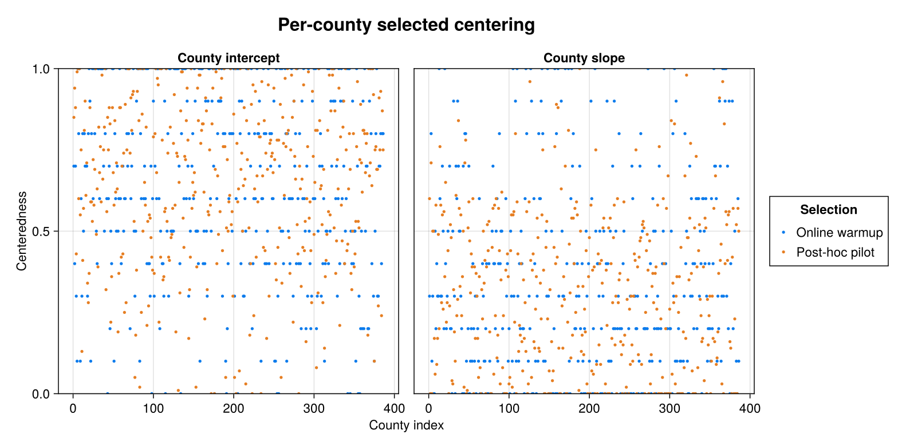

The orange points are the post-hoc pilot selection on the fine `0:0.01:1`
grid; the blue points are the independently learned online values on warmup's
coarser `0:0.1:1` grid (hence the horizontal striations). They are not expected
to select identical values from different finite trajectories and different
objectives. Counties are unordered, so no connecting lines are drawn.

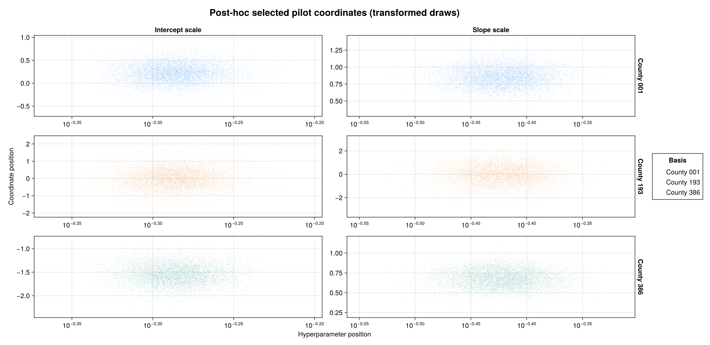

These panels apply the selected coordinates to the same pilot draws, so their
geometry can be compared directly with the noncentered and centered panels.
They are not the fresh refit's samples shown next.

## 4. Fit the selected partial model from scratch

The second fit starts fresh, again with `Xoshiro(1)`, 10,000 requested draws,
and ordinary WarmupHMC defaults, with the fixed partial transform held
constant (`nonlinear_adapt=false`). The pilot determines the coordinates, not
the posterior sample retained from the second fit.

```julia
refit = WarmupHMC.adaptive_warmup_mcmc(
    Xoshiro(1), selected_partial_problem; n_draws=10_000, monitor_ess=true)
```

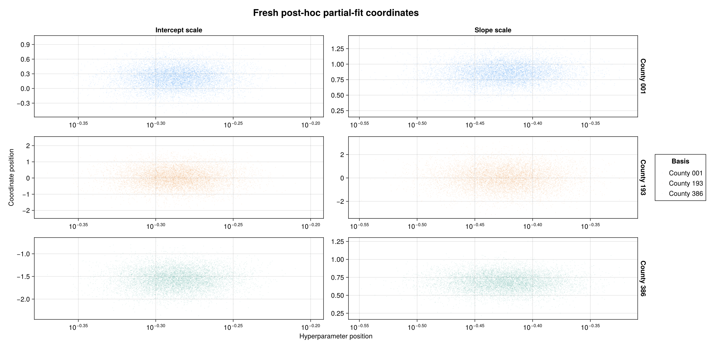

All three fits retained 10,000 draws with the configuration above:

| fit | max split R-hat | min bulk ESS | min tail ESS | divergences |
| --- | ---: | ---: | ---: | ---: |
| Noncentered pilot | 1.0024 | 418 | 958 | 0 (0.00%) |
| Selected-partial refit | 1.0028 | 1,114 | 2,497 | 0 (0.00%) |
| Online adaptive centering | 1.0075 | 642 | 1,147 | 0 (0.00%) |

The worst-coordinate ESS more than doubles in the refit, but obtaining its
coordinates also required the pilot. The cost accounting below includes that
distinction; partial centering does not guarantee a clean fit.

Rank-normalized split R-hat, bulk ESS and tail ESS are computed with
MCMCDiagnosticTools. Each fit has one chain: split R-hat is a within-chain
diagnostic, not evidence that independent chains agree. Every ESS minimum is
taken over all 777 unconstrained model coordinates in that fit's reported
parameterization.

ESS alone does not measure computational cost. The [cost comparison below](#compute-cost-and-ess-per-gradient)
reports measured runtime and exact total and retained-sampling gradient counts
for all three fits.

## Online adaptive centering

Online centering learns per-effect coordinates inside warmup instead of using
a separate pilot. BRM discovers the county cells and constructs their transform:

```julia
online = adaptive_centering_problem(sb, stan_problem, enzyme_backend)
fit = WarmupHMC.adaptive_warmup_mcmc(
    Xoshiro(1), online; n_draws=10_000, monitor_ess=true)
learned = WarmupHMC.reparam_sources(online)
```

Returned draws are already back in the original model coordinates: do not
apply a second sampler-to-model back-transform. An explicit transformation
for a diagnostic plot is a separate operation, as shown below. The online run
is an extension with the same full model and ordinary sampler defaults, not
one of the source's two fits.

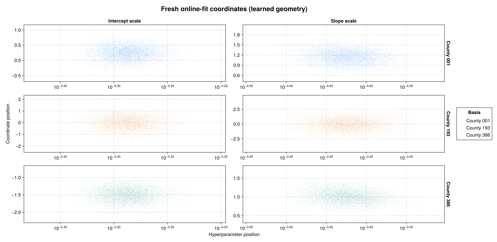

These pair diagnostics use all 10,000 online draws. BRM transforms each
returned NCP effect into its learned coordinate `u = s^c*z` exactly once for
display. Scale axes are logarithmic; each panel has its own coordinate scale.
This transformation neither samples a new posterior nor changes the physical
effects represented by the saved draws.

The full online run retained 10,000 draws, with **zero divergences**,
maximum split R-hat `1.0075`, minimum bulk ESS `642`, and minimum tail ESS
`1,147`. This is encouraging evidence from one run, not a guarantee for other
data, seeds or models.

### Which loss is online centering minimizing?

The two selectors use different criteria. The post-hoc selector above uses the
KL-derived log-scale proxy,

```text
L_offline(c) = log(std(s^c*z)) - mean(c*log(s)).
```

WarmupHMC's online selector uses **weighted position–gradient correlation**
at its default `w₁=0`:

```text
u_c = s^c*z
g_c = ∂ log p_c / ∂u_c
L_online(c) = Cor_weighted(u_c, g_c).
```

It minimizes that signed correlation on `0:0.1:1`; it is not minimizing an
absolute correlation or reusing the offline loss. For an independent Gaussian
coordinate, the log-density gradient is a decreasing affine function of
position, giving correlation `-1`. The optional Jacobian/log-variance part of
WarmupHMC's criterion has zero weight under these defaults.

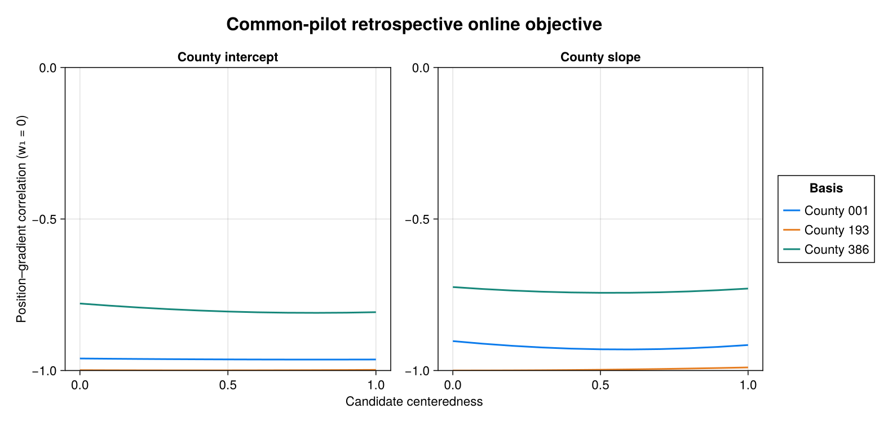

This plot evaluates WarmupHMC's native `candidate_scoring_losses` on the
**same 10,000 pilot draws** used by the offline diagnostic, with unit weights,
for all 8,492 cell–candidate combinations. The curves sit near `-1` and barely
move with `c`: on the common pilot the retrospective objective hardly
distinguishes candidates. Unlike the offline proxy plot, these are **raw,
interpretable correlations**, with fixed y-limits `[-1,0]` and no min–max
scaling.

This is a **retrospective objective diagnostic**, not a reconstruction of
the online run's warmup history. Actual online selection accumulates warmup
trajectory evidence and resets between adaptation windows. Saved posterior
draws do not retain that leaf stream, its weights, or those group boundaries,
so a posterior replay need not choose the exact centeredness learned online —
and indeed the learned values above differ from these retrospective minima.

### Position versus gradient, without scale axes

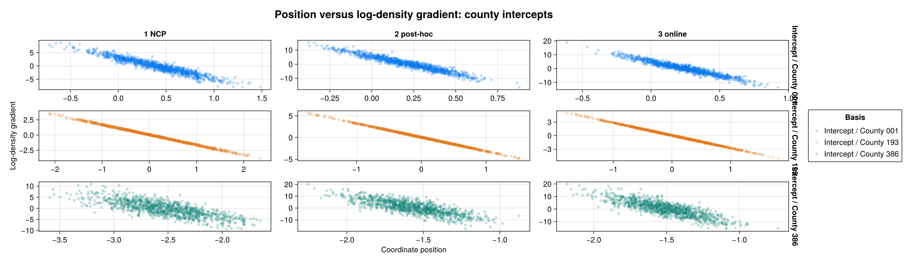

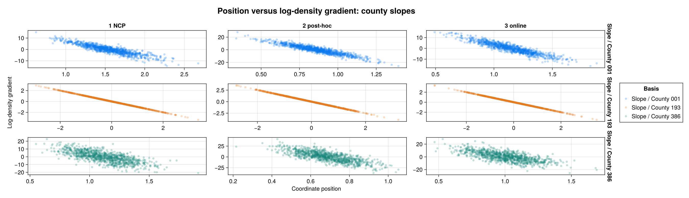

Here the columns genuinely change the displayed coordinates: NCP pilot,
post-hoc partial refit, and online fit in its learned geometry. Each facet
shows **1,000 evenly selected saved draws**, with transparent points; the
underlying gradient evaluations and loss calculations use all 10,000
draws per fit. The points are plotted directly, without smoothing or aggregation.
Gradient axes are independent between facets, because reparameterization
changes their units as well as the coordinate units.

The gradients come from the actual BRM-generated Stan target. Six independent
checks of the displayed coordinates passed: transformed density/Jacobian
agreement to `1.82e-12`, target-gradient agreement to `1.02e-14`, and
source-frame round-trips to `4.44e-16`.
These scatter plots visualize a component of the correlation criterion;
their appearance alone is not an ESS or convergence guarantee.

## Compute cost and ESS per gradient

Each fit records both exact counters using WarmupHMC `deeea1d` and Julia
1.10.11, with the model, priors, seed and sampling options specified above.
`report_costs.jl` verifies each saved fit's counters
against its final checkpoint; it never sums cumulative counters across windows.

- **Total NUTS gradients** include step-size adaptation and all discarded
  restart epochs, as well as retained sampling. They count DynamicHMC integration
  steps, **not** Pathfinder initialization or other setup gradient calls.
- **Sampling gradients** count only appended transitions corresponding to the
  final retained draws. They exclude adaptation and discarded epochs.
- Each ESS numerator is the **minimum over all 777 sampled model
  coordinates**, in that fit's reported parameterization, not a sum of ESS
  across parameters.

| Fit | Total NUTS gradients | Min bulk ESS / total | Sampling gradients | Min bulk ESS / sampling | Fit time |
| --- | ---: | ---: | ---: | ---: | ---: |
| Noncentered pilot | 154,531 | 0.002703 | 150,000 | 0.002785 | 120.5 s |
| Selected-partial refit | 154,707 | 0.007200 | 150,000 | 0.007426 | 158.0 s |
| Online adaptive centering | 154,396 | 0.004156 | 150,000 | 0.004277 | 270.1 s |

The two denominators answer different questions. Outside retained sampling,
the pilot spent **4,531** NUTS evaluations, the partial refit **4,707**,
and online adaptation **4,396**. All three fits show the same adaptation
footprint: two early metric/step-size restarts followed by the final
step-size adaptation.

The refit alone has about **2.67×** the pilot's
minimum bulk ESS per sampling gradient. But its coordinates required the pilot:
together they cost **309,238** total NUTS evaluations, giving **0.003602**
refit minimum bulk ESS per total gradient — about **1.33×** the pilot alone.
The refit's numerator is used here; the two runs' ESS values are not added.

Online adaptation avoids the separate pilot and obtains about **1.54×** the
pilot's minimum bulk ESS per total NUTS evaluation (**1.54×** on sampling-only
cost). Its total-gradient efficiency is about **1.15×** the pilot-plus-refit
workflow. The corresponding minimum tail-ESS ratios, in table order, are
`0.006202`, `0.016139`, `0.007427` per total
gradient and `0.006389`, `0.016645`, `0.007645` per sampling gradient.

**Gradient efficiency is not wall-clock speed.** The online wrapper also
performs coordinate transport and adaptation work, and its measured fit time
here is longer. Timings surround each sampler call, including initialization,
first-use Julia/AD compilation and checkpoint I/O, but excluding preceding
Stan compilation, post-fit extraction, plotting and offline centering selection.
The calls ran sequentially on one CPU core with one BLAS thread on a shared
host; they are not warmed or replicated timing benchmarks. The pilot and refit
calls together took **278.5 s**, before their intervening selection/processing
cost. The single-chain limitation still qualifies every ESS comparison; these
numbers do not establish universal superiority.

## Native BRM diagnostics, rendered with AlgebraOfVega

The fits use BRM models and WarmupHMC sampling. BRM owns logical-output
extraction, posterior-predictive execution, county coordinate transport, and
gradient transport; WarmupHMC owns the online candidate scores. The research
scripts assemble the comparison panels and retain the scientific provenance.
All figures on this page are rendered in Julia with AlgebraOfVega.

Plotting is optional: `using BayesianRegressionModels, AlgebraOfVega` loads
BRM's plotting extension without adding plotting dependencies to fitting-only
workflows. The reusable calls behind these figures are:

```julia
using BayesianRegressionModels, AlgebraOfVega

brm_posteriorplot(rows; x=:floor, xlabel="Floor measurement",
    ylabel="Log radon", observations, observed_y=:response)
brm_pairplot(rows)
# counties are unordered cells, not basis frequencies, so the county panel
# composes the AoV algebra natively instead of the frequency-shaped helper:
data(rows) * mapping(:county => "County index",
    :centeredness => "Centeredness";
    col=:predictor, color=:configuration => "Selection") *
    visual(Scatter; markersize=5)
brm_centering_lossplot(rows; normalization=:minmax)
brm_centering_lossplot(rows; normalization=:none, ylimits=(-1, 0))
brm_gradientplot(rows; opacity=0.25, markersize=8)
```

`prepare_diagnostics.jl` builds the row tables from saved fits through
`brm_descriptor` and native `brm_predictive_draws` (12,573 observations by
10,000 pilot draws), and checks every saved Stan source against its producer.
WarmupHMC matrices use coordinates in rows: transpose them when calling these
BRM draw-table helpers. Conversely, `candidate_scoring_losses` expects
coordinates-by-draws matrices in its current source frame. The reproduction
scripts handle these boundaries explicitly.

## Reproduce and inspect the evidence

The script, plotting program, data and source audit are in
`research/radon_centering/`. The README documents the full commands, the
plotting bootstrap (`plots/setup_plots_env.sh` with exact source pins), and
every output table.
`provenance.toml` and `packages.tsv` record the source/data hashes, exact code
and dependencies, seed, county count and sampler configuration. Raw model-frame
draws are saved before plotting, and existing completed fits are never
silently overwritten.

Primary source boundaries:

- PosteriorDB at `5545a1dd07ae297c36edecbcd82aa49097b4c385`: model
  `radon_variable_intercept_slope_noncentered`, data `radon_all`.
- Data archive SHA-256:
  `3f30c7909d530be01e70ab9e98f9f5d5e83371bb15c6dd168696aefd805b5672`;
  JSON SHA-256:
  `05cac39913090df5430e3f769d8eb8d2ee4e6f0a3c5286c9e767f37926d51ffd`;
  reference Stan SHA-256:
  `b37c4aebfe629591a306bbd630e74528ae9c9c1b23d00726c6633247927f34cb`.

Different library versions and parameter orderings can produce different
trajectories at the same seed. The recorded environment and source audits
identify the computation behind these results.
