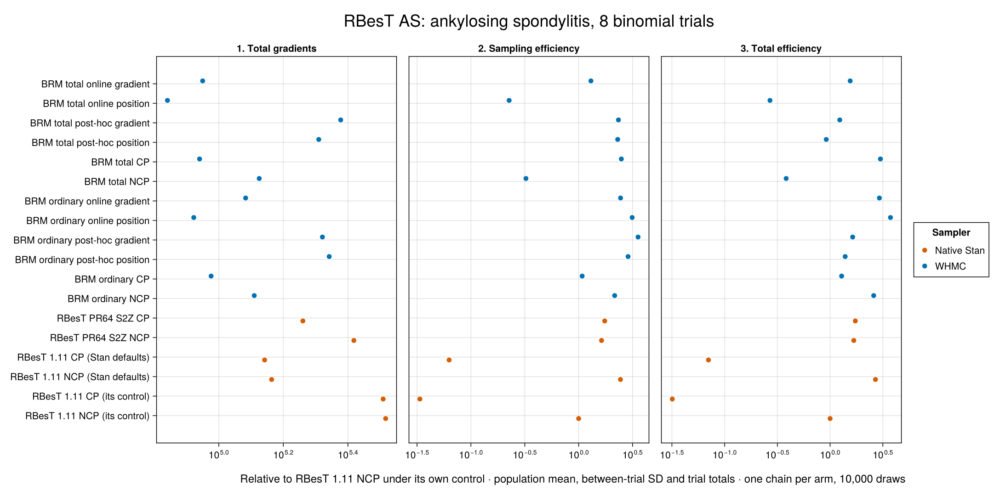
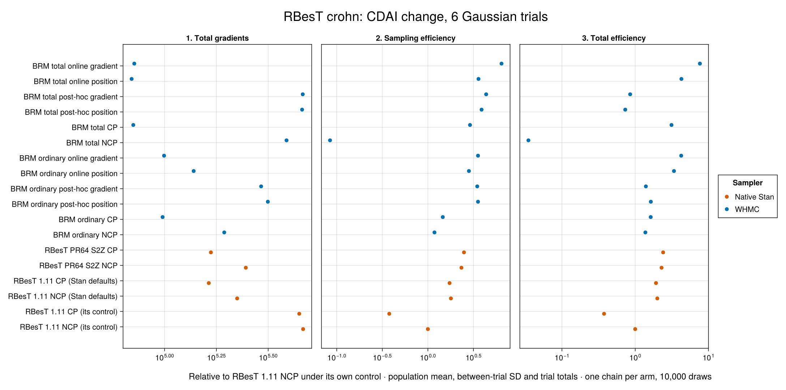
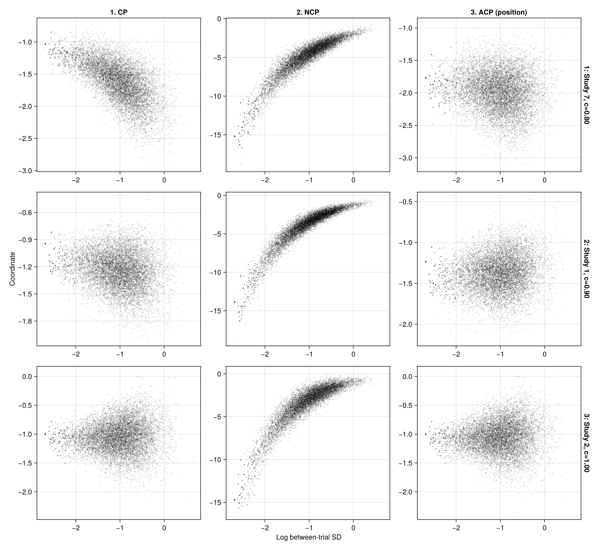
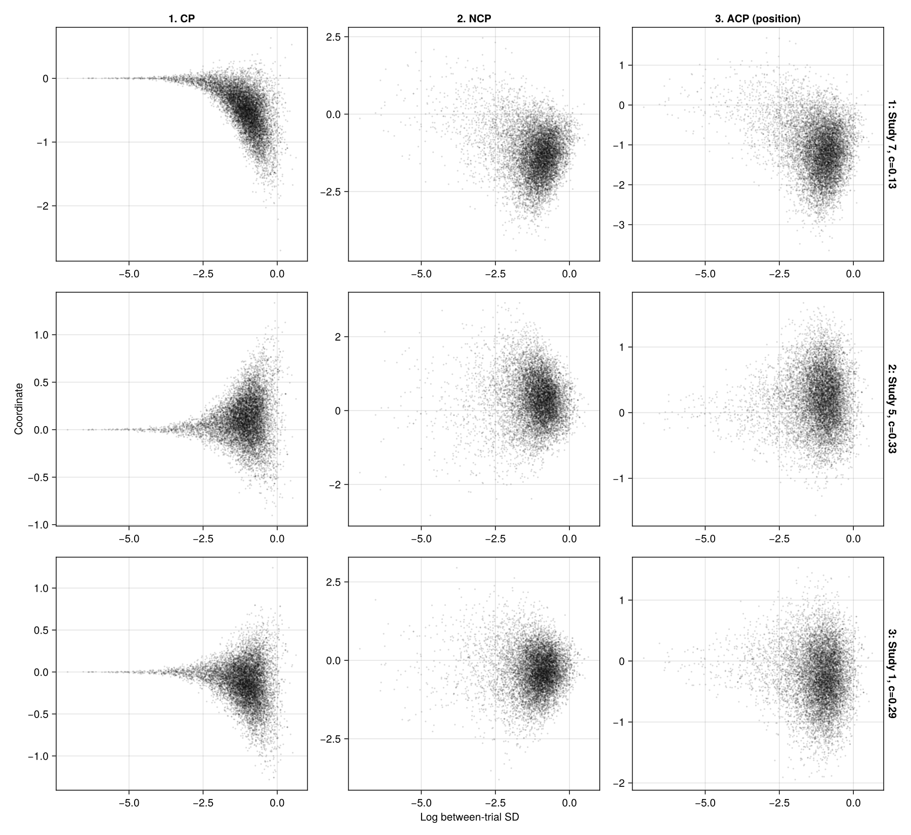
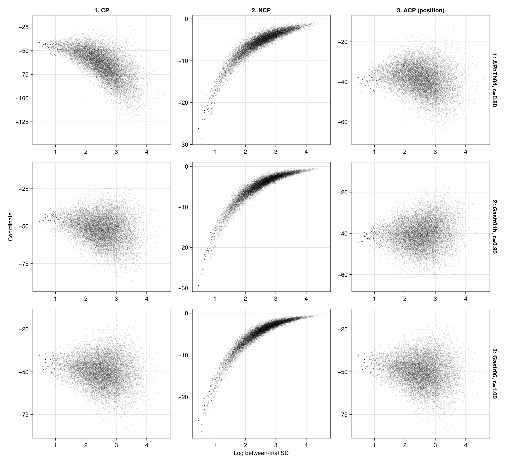
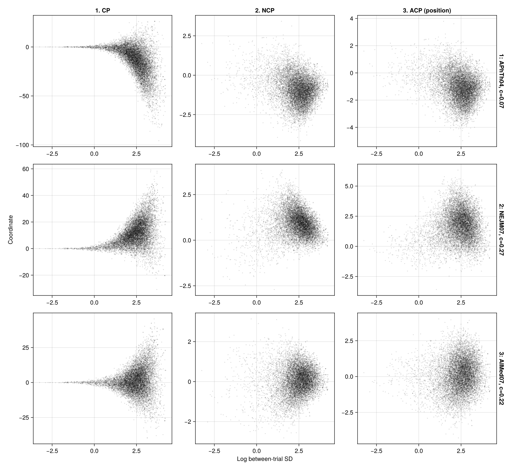

# RBesT meta-analytic-predictive priors: sum-to-zero and automatic totals

## Result

This study takes the meta-analytic-predictive (MAP) model of [RBesT](https://github.com/Novartis/RBesT), Novartis' evidence-synthesis package, and compares three ways of sampling the same posterior: RBesT's own program in its legacy and new sum-to-zero forms, BRM's conventional block under WarmupHMC, and BRM's exact total coefficients with post-hoc and online centering. It was prompted by [Sebastian Weber's report](https://discourse.mc-stan.org/t/help-testing-brms-pr-for-sum-to-zero-and-partial-centering/41542/32) of about 5× efficiency from sum-to-zero in RBesT and about 10× with auto-centering.

On **AS** (binomial, 8 trials), RBesT's sum-to-zero fit under its own control gave 1.68× the total-gradient efficiency of its legacy non-centered fit with no divergences; the same legacy program under CmdStan defaults already gave 2.69×, so much of the gap Weber measured against legacy is RBesT's conservative sampler control. BRM's conventional block under WarmupHMC with online position adaptation was the most efficient arm at 3.74×; BRM's exact totals reached 3.0× at full centering but with 61 divergences, and only 1.55× with online gradient adaptation. On **crohn** (Gaussian with known SE, 6 trials), sum-to-zero gave 2.29×, legacy under CmdStan defaults 2.0×, and BRM's exact totals with online gradient adaptation 7.65×, with 62 divergences; BRM's conventional block with online position adaptation gave 3.38× and was the only WarmupHMC arm with zero divergences there.

The totals arms tell one structural story on both datasets: every selector puts every trial at centeredness 0.8 or above, and every totals arm diverges (6 to 134 divergences, against 0 for RBesT's sum-to-zero non-centered fit). With few trials and a wide population prior, the common shift of the totals and their contrasts want different centering, and one scalar centeredness per trial cannot separate them; the sum-to-zero construction handles the shift direction analytically. RBesT's legacy centered form, which also samples the trial effects with the shift inside them, collapses on AS (533 divergences, 0.03×).

These are one-chain exploratory comparisons on RBesT's shipped datasets. They do not establish a uniformly best parameterization, and RBesT's own auto-centering is not public, so it is not measured here.

## The gMAP model

RBesT's `gMAP` fits a random-effects meta-analysis on the link scale of `H` historical trials and predicts the effect of a new trial: that predictive distribution is the MAP prior. With one exchangeability group per trial,

```math
\theta_h=\beta+\varepsilon_h,\qquad \varepsilon_h\sim N(0,\tau^2),\qquad
\beta\sim N(0,s_\beta^2),\qquad \tau\sim N^+(0,s_\tau),
```

with the likelihood chosen by the family. Two shipped datasets and their documented calls are used:

```r
# AS: ankylosing spondylitis, ASAS20 responders at week 6 in 8 placebo arms (binomial, logit)
gMAP(cbind(r, n - r) ~ 1 | study, family = binomial, data = AS,
     tau.dist = "HalfNormal", tau.prior = 1, beta.prior = 2)

# crohn: CDAI change from baseline in 6 placebo arms (Gaussian with known SE 88/sqrt(n))
gMAP(cbind(y, y.se) ~ 1 | study, family = gaussian,
     data = transform(crohn, y.se = 88 / sqrt(n)), weights = n,
     tau.dist = "HalfNormal", tau.prior = 44, beta.prior = cbind(0, 88))
```

`AS` has `r ~ BinomialLogit(n, θ)` with `s_β = 2`, `s_τ = 1`; `crohn` has `y ~ N(θ, se)` with `s_β = 88`, `s_τ = 44`. The scientific quantities are the population mean `β`, the between-trial SD `τ`, and the `H` trial effects `θ_h`; RBesT's MAP prediction `θ_new ~ N(β, τ)` is a function of the first two.

## RBesT's parameterizations

RBesT 1.11 samples rescaled coordinates `beta_raw`, `tau_raw` (log scale) and one `xi_eta` per trial, with a global switch: non-centered (`θ_h = β + τ ξ_h`, `ξ ~ N(0,1)`, the default) or centered (`ξ` is the trial effect itself in the rescaled intercept frame). Pull request 64 adds a sum-to-zero form: the sampled intercept becomes `α = β + mean(ε)` with the widened prior `N(0, s_β^2 + τ^2/H)`, the `H − 1` contrast coordinates keep the centered/non-centered switch, and `β` is recovered as an exact conditional draw through one extra data-free standard normal. Its default target acceptance drops from 0.99 to 0.95.

BRM's exact totals do the same marginalization in different coordinates: the `H` totals `θ_h` are sampled under their exact joint prior `τ^2 I + s_β^2 11'`, `β` is integrated out and recovered conditionally, and each total has its own centeredness between the model-scale total (`c = 1`) and the total scaled about its prior location (`c = 0`), chosen per trial post hoc or online.

## BRM models

The authoring panes below read the exact fitted declarations. The backend views are regenerated during the docs build. Sampling uses StanBlocks/BridgeStan and WHMC; the generated Turing pane is for inspection only.

### AS

```@eval
Main.BRMDocsComparisons.comparison(@__MODULE__,
    Main.BRMCenteringExamples.authoring(:rbest_as),
    :rbest_as_brm_model;
    title="RBesT AS: binomial gMAP", require_stan=true)
```

### crohn

```@eval
Main.BRMDocsComparisons.comparison(@__MODULE__,
    Main.BRMCenteringExamples.authoring(:rbest_crohn),
    :rbest_crohn_brm_model;
    title="RBesT crohn: Gaussian gMAP with known SE", require_stan=true)
```

BRM's conventional `centered_groups` samples the trial deviation `ε_h` with its `N(0, τ)` prior and keeps `β` separate; that is the `c = 1` endpoint of the ordinary adaptive wrapper. RBesT's legacy centered form samples `θ_h` itself, which is the geometry of BRM's totals at `c = 1` with `β` integrated out. The two "CP" rows are therefore different parameterizations.

## Sampling and adaptation

```julia
using StanBlocks, BridgeStan, WarmupHMC, Enzyme, Random
using DifferentiationInterface: AutoEnzyme

sb = SBBRMI(rbest_as_brm_model(); mod=@__MODULE__)          # total_groups=:auto
problem = StanBlocks.stan_instantiate(sb.model)
names = BridgeStan.param_unc_names(problem.model)
adaptive = adaptive_centering_problem(sb, problem, AutoEnzyme(); centeredness=0.0)
fit = adaptive_warmup_mcmc(Xoshiro(1), adaptive;
    n_draws=10_000, monitor_ess=true, nonlinear_adapt=true)

draws = permutedims(fit.posterior_position)
recovered = recover_population_draws(sb, draws, names; rng=Xoshiro(404))
```

Every arm retains 10,000 draws from one chain, seed 1, from the same empirical per-trial starting point mapped into each program's coordinates. RBesT's programs run under CmdStan 2.39 with a zero-contribution C++ gradient counter, once with RBesT's own control (target acceptance 0.99 legacy or 0.95 sum-to-zero, step size 0.01, tree depth 20, 2,000 warmup iterations) and once under CmdStan defaults (0.8, depth 10, 1,000 warmup). RBesT's default thinning is not applied, since it discards draws without saving gradients. WHMC arms use its adaptive warmup with Pathfinder initialization; post-hoc arms select their controls from the NCP pilot and are charged for it; online arms adapt during warmup with the position or the position–gradient loss.

## One scientific scope per dataset

Both efficiency columns are relative to RBesT 1.11's default non-centered fit under its own control: minimum bulk ESS over the scientific quantities divided by sampling gradients, and divided by total gradients including warmup and pilots.

### AS: 10 quantities

| Method | Total gradients | Sampling efficiency | Total efficiency | Divergences |
|---|---:|---:|---:|---:|
| RBesT 1.11 NCP (its control) · Native Stan | 328,781 | 1× | 1× | 0 |
| RBesT 1.11 CP (its control) · Native Stan | 323,012 | 0.0336× | 0.0319× | 533 |
| RBesT 1.11 NCP (Stan defaults) · Native Stan | 145,801 | 2.44× | 2.69× | 4 |
| RBesT 1.11 CP (Stan defaults) · Native Stan | 138,693 | 0.0627× | 0.0702× | 670 |
| RBesT PR64 S2Z NCP · Native Stan | 262,110 | 1.63× | 1.68× | 0 |
| RBesT PR64 S2Z CP · Native Stan | 182,173 | 1.75× | 1.73× | 9 |
| BRM ordinary NCP · WHMC | 128,794 | 2.16× | 2.59× | 1 |
| BRM ordinary CP · WHMC | 94,686 | 1.08× | 1.29× | 4 |
| BRM ordinary post-hoc position · WHMC | 219,838 | 2.88× | 1.39× | 0 |
| BRM ordinary post-hoc gradient · WHMC | 209,470 | 3.56× | 1.64× | 1 |
| BRM ordinary online position · WHMC | 83,667 | 3.14× | 3.74× | 14 |
| BRM ordinary online gradient · WHMC | 121,115 | 2.45× | 2.93× | 5 |
| BRM total NCP · WHMC | 133,444 | 0.324× | 0.383× | 6 |
| BRM total CP · WHMC | 87,205 | 2.49× | 3× | 61 |
| BRM total post-hoc position · WHMC | 204,019 | 2.3× | 0.919× | 40 |
| BRM total post-hoc gradient · WHMC | 238,614 | 2.34× | 1.23× | 7 |
| BRM total online position · WHMC | 69,353 | 0.226× | 0.269× | 79 |
| BRM total online gradient · WHMC | 89,144 | 1.3× | 1.55× | 19 |

[](assets/rbest-centering/AS-efficiency.png)

### crohn: 8 quantities

| Method | Total gradients | Sampling efficiency | Total efficiency | Divergences |
|---|---:|---:|---:|---:|
| RBesT 1.11 NCP (its control) · Native Stan | 466,164 | 1× | 1× | 0 |
| RBesT 1.11 CP (its control) · Native Stan | 446,598 | 0.377× | 0.376× | 53 |
| RBesT 1.11 NCP (Stan defaults) · Native Stan | 224,025 | 1.79× | 2× | 8 |
| RBesT 1.11 CP (Stan defaults) · Native Stan | 163,427 | 1.73× | 1.92× | 124 |
| RBesT PR64 S2Z NCP · Native Stan | 246,616 | 2.33× | 2.29× | 0 |
| RBesT PR64 S2Z CP · Native Stan | 167,317 | 2.49× | 2.41× | 42 |
| BRM ordinary NCP · WHMC | 194,050 | 1.18× | 1.38× | 7 |
| BRM ordinary CP · WHMC | 97,820 | 1.46× | 1.63× | 44 |
| BRM ordinary post-hoc position · WHMC | 315,028 | 3.55× | 1.63× | 9 |
| BRM ordinary post-hoc gradient · WHMC | 292,381 | 3.48× | 1.4× | 12 |
| BRM ordinary online position · WHMC | 138,160 | 2.82× | 3.38× | 0 |
| BRM ordinary online gradient · WHMC | 99,443 | 3.55× | 4.25× | 47 |
| BRM total NCP · WHMC | 387,777 | 0.0844× | 0.0349× | 510 |
| BRM total CP · WHMC | 70,628 | 2.9× | 3.13× | 134 |
| BRM total post-hoc position · WHMC | 460,830 | 3.88× | 0.731× | 42 |
| BRM total post-hoc gradient · WHMC | 464,218 | 4.36× | 0.854× | 59 |
| BRM total online position · WHMC | 69,343 | 3.59× | 4.28× | 38 |
| BRM total online gradient · WHMC | 71,425 | 6.42× | 7.65× | 62 |

[](assets/rbest-centering/crohn-efficiency.png)

## Saved-draw geometry

Each figure reuses the same 10,000 post-hoc-position draws across its columns, with CP as the visualization baseline; rows select the trials with minimum, middle and maximum inferred centeredness. The interactive previews in the KB brief show every fifth draw.

### AS

[](assets/rbest-centering/AS-total_pairs.png)

[](assets/rbest-centering/AS-ordinary_pairs.png)

### crohn

[](assets/rbest-centering/crohn-total_pairs.png)

[](assets/rbest-centering/crohn-ordinary_pairs.png)

## Diagnostics, recovery and limits

Every arm is one chain of 10,000 draws; these are pilots, not replicated rankings. Divergences: on AS, 0 for RBesT legacy NCP and both S2Z NCP fits, 533 and 670 for legacy CP, 9 for S2Z CP, 1 to 14 for BRM's conventional arms, and 6 to 79 for the totals arms; on crohn, 0 for legacy NCP and S2Z NCP, 53 and 124 for legacy CP, 42 for S2Z CP, 0 to 47 for the conventional arms (online position 0), and 38 to 510 for the totals arms (NCP 510). The centered conventional AS arm also had 7 Stan-side numerical rejections, charged and rejected as native Stan does.

Posterior means were compared to the RBesT legacy NCP baseline in units of the combined MCSE over all quantities and arms. On AS every one of the 180 comparisons is below 3 (maximum 2.75). On crohn three arms exceed 3 on one trial total each: legacy CP under CmdStan defaults (3.09), BRM total CP (3.11) and BRM total online position (4.67), all divergent arms; the rest are below 3. Recovering the integrated population mean with ten different seeds leaves every totals arm's minimum ESS unchanged, because the between-trial SD is the limiting quantity in every arm; only the population mean's own ESS moves with the seed.

RBesT's default thinning (4) was not applied; its warmup and control were. Native counts come from the same zero-contribution C++ gradient counter as the other pages, checked against leapfrogs plus one per retained transition.

Both BRM targets and both wrappers passed their density, gradient, transport and finite-difference checks, and BRM's targets were evaluated against RBesT's own compiled programs at mapped points: the legacy program against the conventional block and the sum-to-zero program against the exact totals differ by a constant Jacobian only, with identical trial effects. BRM omits the constant half-Normal normalizer of the bounded SD declaration; adding `log 2` aligns the densities. Out of scope on this page: RBesT's other `tau` prior families, per-stratum `tau`, Student-t random effects, and RBesT's unpublished auto-centering.

## Inspect and reproduce

- [BRM models, priors and reference densities](https://github.com/nsiccha/BayesianRegressionModels.jl/blob/ns/devibe/research/rbest_centering/model.jl).
- [Density, gradient, wrapper and RBesT cross-check audit](https://github.com/nsiccha/BayesianRegressionModels.jl/blob/ns/devibe/research/rbest_centering/audit.jl).
- [Twelve WarmupHMC arms](https://github.com/nsiccha/BayesianRegressionModels.jl/blob/ns/devibe/research/rbest_centering/run.jl).
- [RBesT data and program capture](https://github.com/nsiccha/BayesianRegressionModels.jl/blob/ns/devibe/research/rbest_centering/capture.R).
- [Native RBesT arms under CmdStan](https://github.com/nsiccha/BayesianRegressionModels.jl/blob/ns/devibe/research/rbest_centering/native.R).
- [Native-arm diagnostics](https://github.com/nsiccha/BayesianRegressionModels.jl/blob/ns/devibe/research/rbest_centering/native_analysis.jl).
- [Recovery sensitivity and MCSE checks](https://github.com/nsiccha/BayesianRegressionModels.jl/blob/ns/devibe/research/rbest_centering/complete.jl).
- [Saved-draw pairs](https://github.com/nsiccha/BayesianRegressionModels.jl/blob/ns/devibe/research/rbest_centering/pairs.jl).
- [Full raw-fit archive manifest](https://github.com/nsiccha/BayesianRegressionModels.jl/blob/ns/devibe/research/rbest_centering/results/fits/manifest.json).
- [Primary-source model check and reproduction](https://github.com/nsiccha/BayesianRegressionModels.jl/blob/ns/devibe/research/rbest_centering/README.md).
- [AS: comparison table](https://github.com/nsiccha/BayesianRegressionModels.jl/blob/ns/devibe/research/rbest_centering/results/AS/comparison.tsv).
- [AS: per-quantity MCSE](https://github.com/nsiccha/BayesianRegressionModels.jl/blob/ns/devibe/research/rbest_centering/results/AS/per_quantity_mcse.tsv).
- [AS: recovery sensitivity](https://github.com/nsiccha/BayesianRegressionModels.jl/blob/ns/devibe/research/rbest_centering/results/AS/recovery_seed_sensitivity.tsv).
- [AS: MCSE summary](https://github.com/nsiccha/BayesianRegressionModels.jl/blob/ns/devibe/research/rbest_centering/results/AS/mcse_summary.tsv).
- [AS, RBesT legacy: Stan](https://github.com/nsiccha/BayesianRegressionModels.jl/blob/ns/devibe/research/rbest_centering/reference/native/AS/legacy/clean.stan).
- [AS, RBesT legacy: data (NCP)](https://github.com/nsiccha/BayesianRegressionModels.jl/blob/ns/devibe/research/rbest_centering/reference/native/AS/legacy/data-ncp.json).
- [AS, RBesT legacy: data (CP)](https://github.com/nsiccha/BayesianRegressionModels.jl/blob/ns/devibe/research/rbest_centering/reference/native/AS/legacy/data-cp.json).
- [AS, RBesT s2z: Stan](https://github.com/nsiccha/BayesianRegressionModels.jl/blob/ns/devibe/research/rbest_centering/reference/native/AS/s2z/clean.stan).
- [AS, RBesT s2z: data (NCP)](https://github.com/nsiccha/BayesianRegressionModels.jl/blob/ns/devibe/research/rbest_centering/reference/native/AS/s2z/data-ncp.json).
- [AS, RBesT s2z: data (CP)](https://github.com/nsiccha/BayesianRegressionModels.jl/blob/ns/devibe/research/rbest_centering/reference/native/AS/s2z/data-cp.json).
- [AS, rbest_ncp: gradient counts](https://github.com/nsiccha/BayesianRegressionModels.jl/blob/ns/devibe/research/rbest_centering/reference/native/AS/rbest_ncp/gradient_counts.tsv).
- [AS, rbest_cp: gradient counts](https://github.com/nsiccha/BayesianRegressionModels.jl/blob/ns/devibe/research/rbest_centering/reference/native/AS/rbest_cp/gradient_counts.tsv).
- [AS, s2z_ncp: gradient counts](https://github.com/nsiccha/BayesianRegressionModels.jl/blob/ns/devibe/research/rbest_centering/reference/native/AS/s2z_ncp/gradient_counts.tsv).
- [AS, s2z_cp: gradient counts](https://github.com/nsiccha/BayesianRegressionModels.jl/blob/ns/devibe/research/rbest_centering/reference/native/AS/s2z_cp/gradient_counts.tsv).
- [AS, stan_ncp: gradient counts](https://github.com/nsiccha/BayesianRegressionModels.jl/blob/ns/devibe/research/rbest_centering/reference/native/AS/stan_ncp/gradient_counts.tsv).
- [AS, stan_cp: gradient counts](https://github.com/nsiccha/BayesianRegressionModels.jl/blob/ns/devibe/research/rbest_centering/reference/native/AS/stan_cp/gradient_counts.tsv).
- [AS: BRM exact-totals Stan](https://github.com/nsiccha/BayesianRegressionModels.jl/blob/ns/devibe/research/rbest_centering/reference/automatic_totals/AS/automatic_totals.stan).
- [AS: BRM conventional Stan](https://github.com/nsiccha/BayesianRegressionModels.jl/blob/ns/devibe/research/rbest_centering/reference/automatic_totals/AS/ordinary_ncp.stan).
- [crohn: comparison table](https://github.com/nsiccha/BayesianRegressionModels.jl/blob/ns/devibe/research/rbest_centering/results/crohn/comparison.tsv).
- [crohn: per-quantity MCSE](https://github.com/nsiccha/BayesianRegressionModels.jl/blob/ns/devibe/research/rbest_centering/results/crohn/per_quantity_mcse.tsv).
- [crohn: recovery sensitivity](https://github.com/nsiccha/BayesianRegressionModels.jl/blob/ns/devibe/research/rbest_centering/results/crohn/recovery_seed_sensitivity.tsv).
- [crohn: MCSE summary](https://github.com/nsiccha/BayesianRegressionModels.jl/blob/ns/devibe/research/rbest_centering/results/crohn/mcse_summary.tsv).
- [crohn, RBesT legacy: Stan](https://github.com/nsiccha/BayesianRegressionModels.jl/blob/ns/devibe/research/rbest_centering/reference/native/crohn/legacy/clean.stan).
- [crohn, RBesT legacy: data (NCP)](https://github.com/nsiccha/BayesianRegressionModels.jl/blob/ns/devibe/research/rbest_centering/reference/native/crohn/legacy/data-ncp.json).
- [crohn, RBesT legacy: data (CP)](https://github.com/nsiccha/BayesianRegressionModels.jl/blob/ns/devibe/research/rbest_centering/reference/native/crohn/legacy/data-cp.json).
- [crohn, RBesT s2z: Stan](https://github.com/nsiccha/BayesianRegressionModels.jl/blob/ns/devibe/research/rbest_centering/reference/native/crohn/s2z/clean.stan).
- [crohn, RBesT s2z: data (NCP)](https://github.com/nsiccha/BayesianRegressionModels.jl/blob/ns/devibe/research/rbest_centering/reference/native/crohn/s2z/data-ncp.json).
- [crohn, RBesT s2z: data (CP)](https://github.com/nsiccha/BayesianRegressionModels.jl/blob/ns/devibe/research/rbest_centering/reference/native/crohn/s2z/data-cp.json).
- [crohn, rbest_ncp: gradient counts](https://github.com/nsiccha/BayesianRegressionModels.jl/blob/ns/devibe/research/rbest_centering/reference/native/crohn/rbest_ncp/gradient_counts.tsv).
- [crohn, rbest_cp: gradient counts](https://github.com/nsiccha/BayesianRegressionModels.jl/blob/ns/devibe/research/rbest_centering/reference/native/crohn/rbest_cp/gradient_counts.tsv).
- [crohn, s2z_ncp: gradient counts](https://github.com/nsiccha/BayesianRegressionModels.jl/blob/ns/devibe/research/rbest_centering/reference/native/crohn/s2z_ncp/gradient_counts.tsv).
- [crohn, s2z_cp: gradient counts](https://github.com/nsiccha/BayesianRegressionModels.jl/blob/ns/devibe/research/rbest_centering/reference/native/crohn/s2z_cp/gradient_counts.tsv).
- [crohn, stan_ncp: gradient counts](https://github.com/nsiccha/BayesianRegressionModels.jl/blob/ns/devibe/research/rbest_centering/reference/native/crohn/stan_ncp/gradient_counts.tsv).
- [crohn, stan_cp: gradient counts](https://github.com/nsiccha/BayesianRegressionModels.jl/blob/ns/devibe/research/rbest_centering/reference/native/crohn/stan_cp/gradient_counts.tsv).
- [crohn: BRM exact-totals Stan](https://github.com/nsiccha/BayesianRegressionModels.jl/blob/ns/devibe/research/rbest_centering/reference/automatic_totals/crohn/automatic_totals.stan).
- [crohn: BRM conventional Stan](https://github.com/nsiccha/BayesianRegressionModels.jl/blob/ns/devibe/research/rbest_centering/reference/automatic_totals/crohn/ordinary_ncp.stan).

RBesT: `3d5fa1dda74f9d68360094a11983f32dd1b61c10` (1.11-0) and pull request 64 head `a5acbbc39c2cd620f0549159aa7c1991d4c28d6a`; WHMC `7aed40b18bd4cdabb75330f285d5c9b355575ab9`; Julia 1.10.11, CmdStan 2.39.0, CmdStanR 0.9.0.
