````@raw html
---
title: Epidemic renewal models
description: "A renewal-equation model of daily case counts on the @brm formula surface: the reproduction number as a formula line, the renewal recursion as Stan functions, six coupled patches, a forecast, and a reporting-delay model, all checked against simulated truth."
---
````

# Epidemic renewal models

A renewal model explains daily case counts through a latent infection process:
today's infections are the recent infections, weighted by how infectious a case
is some days after its own infection, times the reproduction number `R(t)`. The
statistical question is the path of `R(t)`; everything between that path and the
counts is a fixed mechanical map.

This page writes such a model with `@brm`, in three steps of growing size:

1. a **reporting-delay model** fitted to a linelist, which is where the
   reporting-delay distribution of the other two models comes from;
2. **one population**, where `log R(t)` is a random walk, plus a forecast and a
   prior predictive check obtained from the same declaration;
3. **six coupled patches**, where infections spread between patches, the patches
   share one `R` trend and deviate from it in a spatially correlated way.

Two things are worth seeing here. The statistical parts are **formula lines** — a
reader who knows `y ~ 1 + x + (1 | g)` can read `log_R ~ 1 + rw(time)`. The
mechanical part stays what it is, a **function**: the renewal recursion is
written once as Stan functions with `StanBlocks.@deffun` and called from the
model by name.

All data are simulated from known parameter values, so every figure below shows
the truth next to the estimate. The page is built from one checked-in script,
[`research/epi_renewal/renewal.jl`](https://github.com/nsiccha/BayesianRegressionModels.jl/blob/ns/devibe/research/epi_renewal/renewal.jl):
the code blocks are read from it at build time, and the figures are drawn from
the summaries it writes.

Formula interfaces for the reproduction number are established practice in R —
[`epidemia`](https://github.com/ImperialCollegeLondon/epidemia) models `R` with a
regression formula that accepts random-walk terms, and
[`EpiNow2`](https://github.com/epiforecasts/EpiNow2) and
[`epinowcast`](https://github.com/epinowcast/epinowcast) expose comparable
building blocks. What differs here is the division of labour: the package knows
nothing about epidemics, the terms `rw` and `cdar` are general-purpose
([Formula terms](formula-terms.md)), and the epidemic mechanics are user code.

## The process

Let ``w_s`` be the generation-interval distribution (the probability that a
transmission happens ``s = 1, \dots, 13`` days after the infector's own
infection) and ``\pi_d`` the reporting-delay distribution (the probability that
an infection is reported ``d = 0, \dots, 14`` days later). Both are fixed and
enter the model as data. With infections ``I_t``, expected reported cases
``Y_t`` and observed counts ``y_t``:

```math
I_t = R_t \sum_{s=1}^{13} w_s\, I_{t-s}, \qquad
Y_t = \sum_{d=0}^{14} \pi_d\, I_{t-d}, \qquad
y_t \sim \operatorname{NegBin}\!\left(\text{mean } Y_t,\ \text{variance } Y_t + c^2 Y_t^2\right).
```

The recursion needs infections before day 1. They are an exponential history
``I_s = I_0\, e^{r (s - 1)}`` for ``s \le 0``, whose growth rate ``r`` is the one
implied by the first reproduction number through the Euler–Lotka equation
``\sum_s w_s e^{-r s} = 1 / R_1`` (two Newton steps from ``r = 0``). So the
infection process has one free scale, ``\log I_0``.

The reproduction number is a random walk on the log scale,

```math
\log R_t = \beta_0 + \sigma \sum_{u=2}^{t} z_u, \qquad z_u \sim \mathcal N(0, 1),
```

which on the formula surface is the line `log_R ~ 1 + rw(time)`: the intercept
is ``\log R_1`` and `rw(time)` is the walk.

## The mechanics, as Stan functions

The recursion carries state from one day to the next, and with several patches
every patch's next day depends on all patches' past. That is a loop, so it is
written as one: `StanBlocks.@deffun` turns the Julia-syntax definitions below
into Stan functions that a model can call by name. Sizes such as `T` and `G` in
the signatures are bound from the arguments. (The
[wastewater page](wastewater.md) runs a similar recursion inside a
`kernel(...)` cell, one independent site per cell; here the patches are coupled,
so the function takes the whole predictor vector through a top-level
assignment.)

```@eval
Main.BRMDocsComparisons.source_code_region(
    "research/epi_renewal/renewal.jl";
    starting_at="    # ── renewal recursion: one population ──",
    ending_before="    # ── observation family",
)
```

The observation family is declared the same way. `@lhs @lpxf` makes
`cases ~ nb_cases(Y, cluster, observed)` a valid likelihood statement; the
`_lpmfs` variant returns the pointwise log likelihood and `_rng` the posterior
predictive draw, and the generated model uses both. A row with `observed == 0`
is not scored, but the generator still draws it — that draw is the forecast for
that row.

```@eval
Main.BRMDocsComparisons.source_code_region(
    "research/epi_renewal/renewal.jl";
    starting_at="    # ── observation family",
    ending_before="    # ── renewal recursion: coupled patches ──",
)
```

```@eval
let mod = Main.BRMDocsComparisons.example_module(:renewal)
    Main.BRMDocsComparisons.evaluate_source_prelude(
        mod, "research/epi_renewal/renewal.jl"; before=:reporting_delay_model)
end
nothing
```

## Step 1: the reporting delay, from a linelist

A linelist records, for each case, the day of the event and the day of the
report. Two things bias the delays it shows. Days are intervals, so an event
"on day 3" happened somewhere within that day, and the report likewise
(**double interval censoring**). And on the day of the analysis, a recent event
is in the data only if its delay was short (**right truncation**), so during a
growing epidemic — when most events are recent — the observed delays are far too
short.

The model states the delay as LogNormal and corrects for both: the family
`censored_delay(mu, sigma, window)` scores each delay ``d`` with
``P(d \le P + T < d + 1 \mid P + T < \text{window})``, where ``P`` is uniform
within the event day, ``T`` is the LogNormal delay, and `window` is the number
of days between the event and the analysis.

```@eval
Main.BRMDocsComparisons.source_code_region(
    "research/epi_renewal/renewal.jl";
    starting_at="    # ── reporting delay: doubly interval-censored",
    ending_before="# 4. The data each model reads",
)
```

Every declaration on this page is rendered in the standard comparison panes:
the `@brm` source, its intermediate representation, the StanBlocks model it
lowers to, the generated Stan program, and the Turing backend. These are
StanBlocks models. `@deffun` functions and `@lpxf` families are Stan code with
no Turing counterpart, so the Turing pane reports each model as unsupported and
names the statement it cannot lower.

```@eval
Main.BRMDocsComparisons.comparison(
    Main.BRMDocsComparisons.example_module(:renewal),
    Main.BRMDocsComparisons.source_function(
        "research/epi_renewal/renewal.jl", :reporting_delay_model,
    ),
    :reporting_delay_model;
    title="Reporting delay from a right-truncated linelist",
    require_stan=true,
)
```

The simulated linelist holds 250 events from a growing epidemic, seen on day 21;
the true delay is LogNormal(1.5, 0.5). The points are the delays as they appear
in the linelist: events of the last days before the analysis can only be in the
data with a delay of zero or one day, so short delays are heavily
over-represented and the mean observed delay is 3.7 days against a true 5.5.
The dashed line is the truth, and the bands are the posterior of the daily delay
distribution (50 %, 80 % and 95 %), which undoes the truncation.

[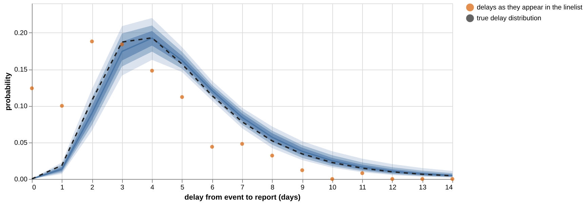](assets/renewal/delay.png)

## Step 2: one population

One row per day. The data carry the counts, the two fixed distributions
`gen_pmf` and `delay_pmf`, and the `observed` mask.

```@eval
Main.BRMDocsComparisons.comparison(
    Main.BRMDocsComparisons.example_module(:renewal),
    Main.BRMDocsComparisons.source_function(
        "research/epi_renewal/renewal.jl", :renewal_single_model,
    ),
    :renewal_single_model;
    title="Renewal model of one population",
    require_stan=true,
)
```

Reading the declaration top to bottom:

- `log_I0` and `cluster` are scalar parameters with a prior each.
- `log_R ~ 1 + rw(time)` is a predictor like any other. Its parts are addressed
  the usual way: `effect(log_R, Intercept)` is ``\log R_1`` and
  `sd(:, rw(time))` is the walk's daily scale ``\sigma``.
- `Y = expected_cases(...)` is a top-level assignment: the whole predictor
  vector goes into the Stan function, and `Y` becomes a named quantity of the
  model.
- `cases ~ nb_cases(Y, cluster, observed)` is the likelihood.

Fifty-six days of counts recover the level and the trend of `R(t)`. The
posterior is a smooth path: the counts cannot resolve the day-to-day steps of
the true walk, and the walk's scale is only weakly identified (see the table at
the end), so single-day excursions of the truth leave the 95 % band. The last
days are the least certain, because their infections have mostly not been
reported yet.

[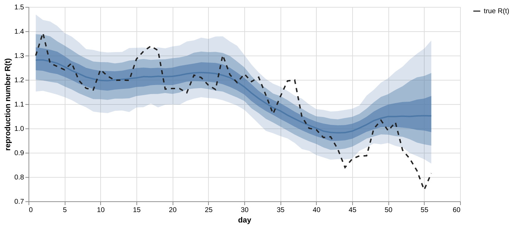](assets/renewal/single_R.png)

The posterior predictive bands of the daily counts (`cases_gen` in the generated
model) against the reported counts and the true expectation, on a logarithmic
axis:

[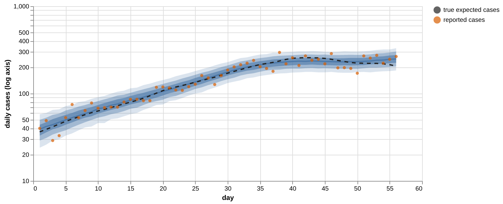](assets/renewal/single_cases.png)

### A prior predictive check from the same declaration

Building the same model with `SBBRMI(model; held_out=:all)` drops every
likelihood contribution, so sampling it draws from the prior, and `cases_gen`
becomes the prior predictive distribution. By day 56 the prior's 95 % band runs
from a handful of daily cases to more than a million; the counts are what pins
`R(t)` down.

[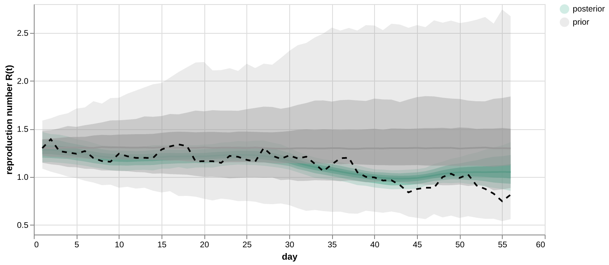](assets/renewal/prior_R.png)

[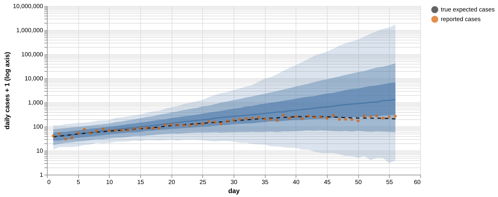](assets/renewal/prior_cases.png)

### A forecast is a mask

Setting `observed` to zero from day 43 on turns the last two weeks into a
forecast. Nothing else changes: the walk `rw(time)` still spans all 56 days, the
innovations of the unobserved days are informed by the prior only, and the
recursion carries the uncertainty forward into the counts.

A random walk forecasts "no change": the band fans out around the last
estimated level. In this simulation the true `R(t)` started to fall a few days
before day 42 — too late to show in the counts reported by then — and kept
falling, so the held-out counts end up at the lower edge of the predictive
band.

[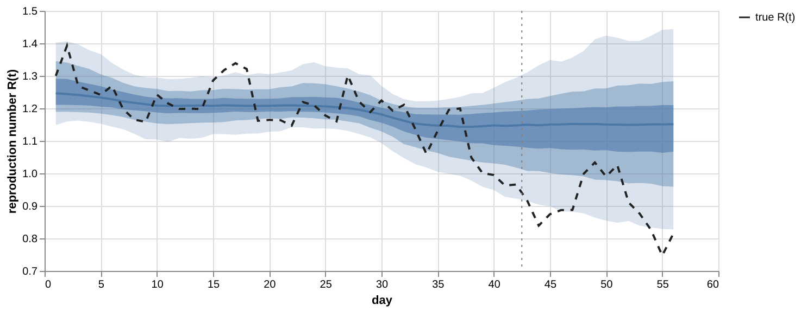](assets/renewal/forecast_R.png)

[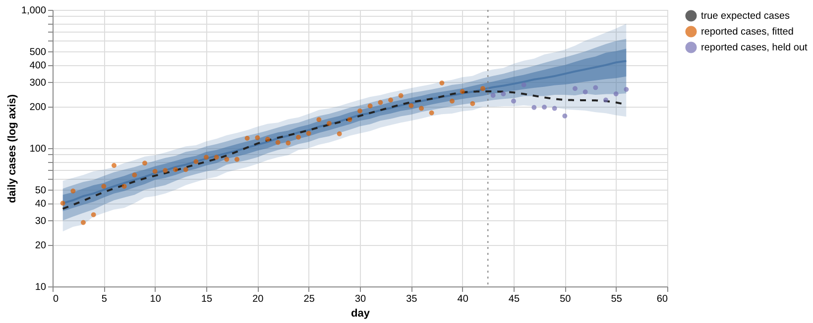](assets/renewal/forecast_cases.png)

## Step 3: six coupled patches

Six patches of different population sizes sit on a 100 km square. The outbreak
starts in the smallest one; the others are seeded with a small fraction of a
case and catch the epidemic through mixing.

[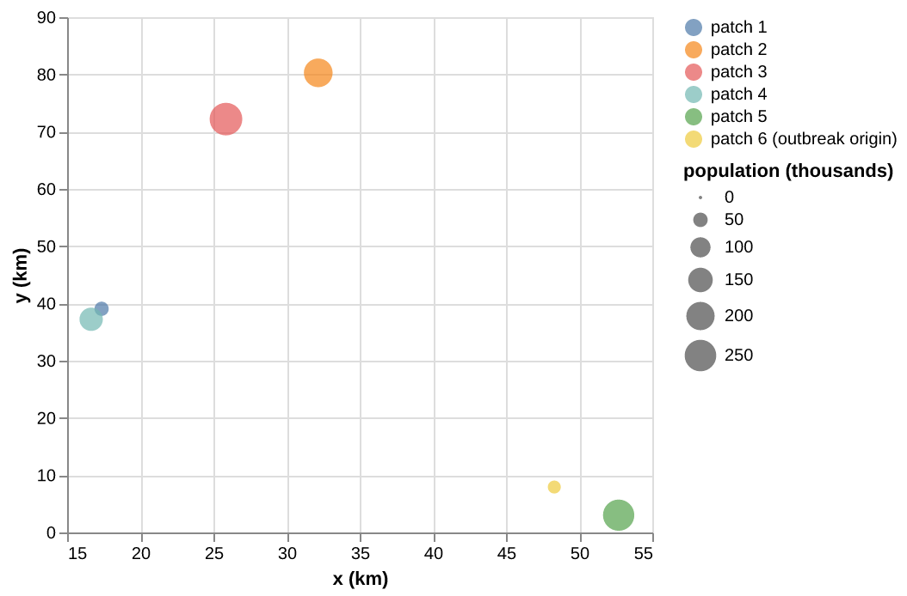](assets/renewal/patches_map.png)

Infection pressure on patch ``g`` is a mixture over all patches ``h``, with
gravity weights that grow with both population sizes ``N`` and fall with
distance ``d``,

```math
I_{g,t} = R_{g,t} \sum_{h} K_{gh} \sum_{s} w_s\, I_{h,t-s}, \qquad
K_{gh} \propto \begin{cases} 1 & g = h \\[2pt]
\dfrac{(N_g / \bar N)(N_h / \bar N)}{d_{gh}^{\gamma}} & g \ne h \end{cases}
\quad\text{(rows sum to one)},
```

and every patch has its own reproduction number: a shared trend plus a weekly
deviation,

```math
\log R_{g,t} = \beta_0 + W_t + \delta_{g, w(t)}, \qquad
\delta_{\cdot,w} = \rho\, \delta_{\cdot,w-1} + \sigma_\delta \sqrt{1 - \rho^2}\; L\, \eta_w, \qquad
L L^\top = C,\quad C_{gh} = e^{-d_{gh} / 30}.
```

``W_t`` is the same random walk as before. The deviations are damped (``\rho``)
and their innovations are correlated between patches: neighbouring patches
deviate together.

The mechanics gain a mixing step; the rest is the single-population recursion
per patch.

```@eval
Main.BRMDocsComparisons.source_code_region(
    "research/epi_renewal/renewal.jl";
    starting_at="    # ── renewal recursion: coupled patches ──",
    ending_before="    # ── reporting delay: doubly interval-censored",
)
```

The data are one row per (day, patch), 336 rows, ordered by patch and then by
day. `C` is a matrix-valued field; `pop`, `dist_flat` and the two distributions
are shared vectors.

```@eval
Main.BRMDocsComparisons.comparison(
    Main.BRMDocsComparisons.example_module(:renewal),
    Main.BRMDocsComparisons.source_function(
        "research/epi_renewal/renewal.jl", :renewal_patch_model,
    ),
    :renewal_patch_model;
    title="Renewal model of six coupled patches",
    require_stan=true,
)
```

Three formula lines carry the statistical structure:

- `log_R ~ 1 + rw(time) + cdar(week; by=patch, cor=C)` — on a long frame,
  `rw(time)` is one walk over the distinct days, shared by all rows of a day,
  and `cdar(week; by=patch, cor=C)` gives every patch a damped weekly path whose
  innovations are correlated through `C`. `sd(:, cdar(week))` addresses
  ``\sigma_\delta`` and `ar(:, cdar(week))` addresses ``\rho``.
- `log_I0 ~ 0 + offset(seed_mean) + factor(patch)` — a predictor without an
  intercept codes its first categorical term by **cell means**
  ([Home](index.md)): one coefficient per patch, no reference level. With the
  prior mean as an offset, the line says
  ``\log I_{0,g} = m_g + \delta_g,\ \delta_g \sim \mathcal N(0, 0.5)``.
- `gamma` is an ordinary scalar parameter; the mixing matrix is computed from
  it inside the Stan function.

Per-patch reproduction numbers, 56 days of counts in six patches:

[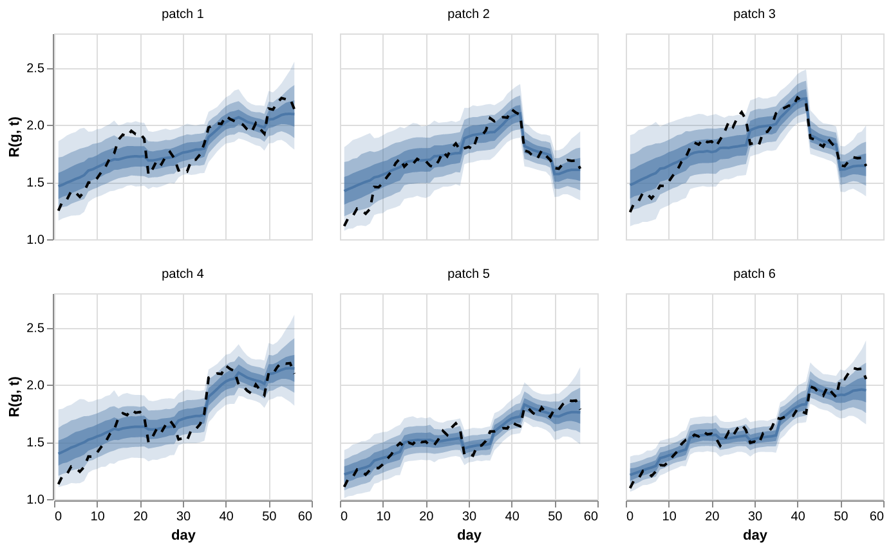](assets/renewal/patch_R.png)

Daily counts per patch, on a logarithmic axis. The five patches that start
without cases are fitted through the zeros of the early weeks:

[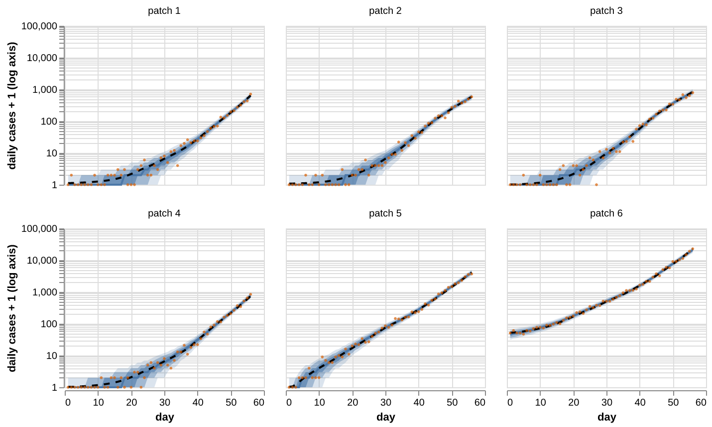](assets/renewal/patch_cases.png)

The seeds, as the cell means estimate them: posterior median with 50 % and 95 %
intervals, the prior mean (grey dot) and the truth (black dot). For the five
patches without early cases the counts say little about the seed beyond "very
small", so the posterior stays close to the prior; the origin's seed is pinned
down by its counts:

[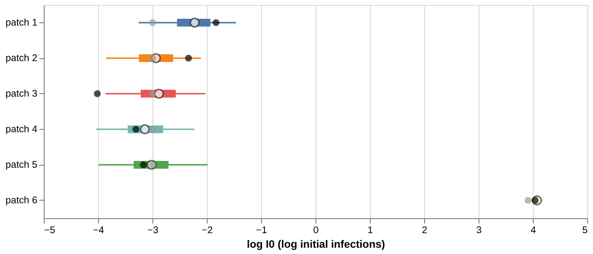](assets/renewal/patch_seeds.png)

## Parameters and sampler diagnostics

Posterior medians and 95 % intervals next to the values the data were simulated
from. The table is generated from the summaries of the fits shown above.

```@eval
using JSON, Markdown
let root = Main.BRMDocsComparisons.REPOSITORY_ROOT
    rows = JSON.parsefile(joinpath(root, "research", "epi_renewal", "results", "renewal", "scalars.json"))
    fmt(x) = string(round(x; sigdigits=3))
    lines = ["| Model | Parameter | Truth | Median | 95 % interval | Truth inside |", "|:--|:--|--:|--:|:--|:--|"]
    for r in rows
        inside = r["q025"] <= r["truth"] <= r["q975"] ? "yes" : "no"
        push!(lines, "| $(r["model"]) | `$(r["name"])` | $(fmt(r["truth"])) | $(fmt(r["q50"])) | [$(fmt(r["q025"])), $(fmt(r["q975"]))] | $inside |")
    end
    Markdown.parse(join(lines, "\n"))
end
```

How often the truth lies inside the pointwise 95 % band, per figure:

```@eval
using JSON, Markdown
let root = Main.BRMDocsComparisons.REPOSITORY_ROOT
    rows(name) = JSON.parsefile(joinpath(root, "research", "epi_renewal", "results", "renewal", name))
    inside(rs) = "$(count(r -> r["q025"] <= r["truth"] <= r["q975"], rs)) of $(length(rs))"
    forecast = rows("forecast_R.json")
    lines = ["| Quantity | Truth inside the 95 % band |", "|:--|:--|",
             "| `R(t)`, one population, 56 days | $(inside(rows("single_R.json"))) |",
             "| `R(t)`, fitted on days 1–42: fitted days | $(inside(filter(r -> r["phase"] == "fitted", forecast))) |",
             "| `R(t)`, fitted on days 1–42: held-out days | $(inside(filter(r -> r["phase"] != "fitted", forecast))) |",
             "| `R(g, t)`, six patches, 336 patch-days | $(inside(rows("patch_R.json"))) |",
             "| seeds, six patches | $(inside(rows("patch_seeds.json"))) |"]
    Markdown.parse(join(lines, "\n"))
end
```

Each model was sampled with one chain of NUTS
([WarmupHMC.jl](https://github.com/nsiccha/WarmupHMC.jl)) on the log density
that BridgeStan compiles from the generated Stan program. The one-population
posterior couples the walk scale with 55 innovations that the counts determine
tightly, which calls for a small step size; those two fits therefore run at a
target acceptance of 0.995. The settings and diagnostics of every fit:

```@eval
using JSON, Markdown
let root = Main.BRMDocsComparisons.REPOSITORY_ROOT
    rows = JSON.parsefile(joinpath(root, "research", "epi_renewal", "results", "renewal", "fits.json"))
    lines = ["| Model | Parameters | Draws | Target acceptance | Divergences | Min. ESS | Max. R-hat | Seconds |", "|:--|--:|--:|--:|--:|--:|--:|--:|"]
    for r in rows
        push!(lines, "| $(r["model"]) | $(r["dim"]) | $(r["draws"]) | $(r["target_acceptance_rate"]) | $(r["divergences"]) | $(round(Int, r["min_ess"])) | $(round(r["max_rhat"]; digits=3)) | $(round(Int, r["seconds"])) |")
    end
    Markdown.parse(join(lines, "\n"))
end
```

The route from a declaration to draws is short. `mod=@__MODULE__` tells the
backend where the `@deffun` functions live:

```@eval
Main.BRMDocsComparisons.source_code_region(
    "research/epi_renewal/renewal.jl";
    starting_at="function build(brmi; held_out=())",
    ending_before="stem(n) = ",
)
```

## Scope

- The generation-interval and reporting-delay distributions are fixed inputs of
  the renewal models. Step 1 estimates a delay distribution, but its
  uncertainty is not propagated into steps 2 and 3.
- The correlation matrix `C` of `cdar` is data, not a sampled covariance; its
  length scale (30 km) is fixed.
- The data are simulated from the model family that is fitted, so the figures
  show that the declarations recover their own parameters — not how the model
  behaves under misspecification, reporting artefacts or day-of-week effects.
- The models use the StanBlocks backend. The Turing backend refuses top-level
  assignments that call `@deffun` functions, and custom `@lpxf` families, naming
  the statement.

## Run it

After bootstrapping the repository's test environment, the first command fits
all models and writes the summaries; the second draws the figures and needs an
environment that provides AlgebraOfVega.jl and the `vl-convert` command-line
tool.

```sh
julia --startup-file=no --project=test research/epi_renewal/renewal.jl
julia --startup-file=no --project=<plot env> research/epi_renewal/renewal_figures.jl
```
