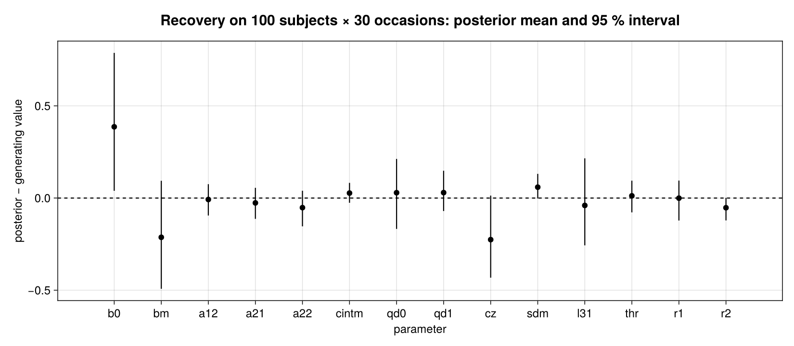
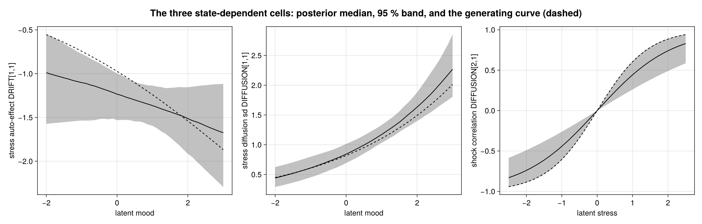
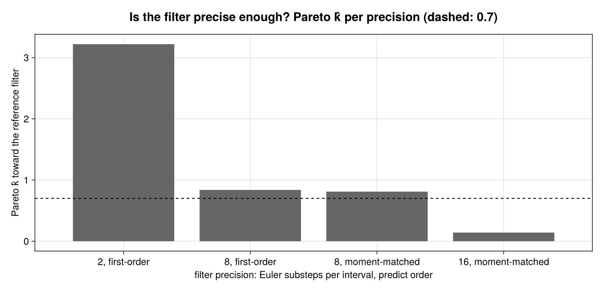
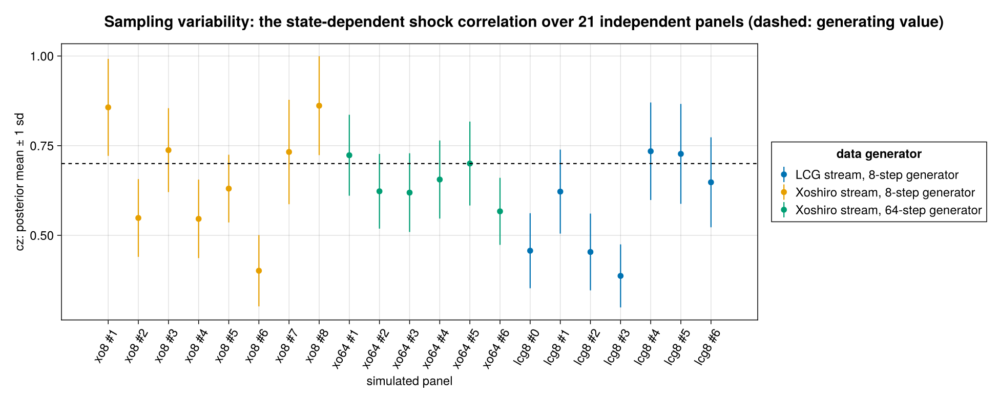

````@raw html
---
title: Continuous-time state-space models
description: "Hierarchical continuous-time state-space models in BRM: latent states sampled, or integrated out per subject by a Kalman, extended Kalman or moment-matched filter inside a kernel cell; recovery, an importance-sampling check of the filter's precision, and replication."
---
````

# Continuous-time state-space models

A panel of people answers a few questions on their phones, several times a day, at
irregular times. Behind the answers are latent processes — stress, mood — that evolve
continuously, push on each other, and differ between people. This page builds that kind
of model in BRM four ways, from *sample every latent state* to *integrate every latent
state out*, fits it, and checks how much the numerical approximation inside the
likelihood can be trusted.

The models are the demonstration models of [**ctsem**](https://github.com/cdriveraus/ctsem),
Charles Driver's R package for hierarchical continuous-time dynamic modelling
([Driver, Oud & Voelkle 2017](https://doi.org/10.18637/jss.v077.i05);
[Driver & Voelkle 2018](https://doi.org/10.1037/met0000168)). The model specifications,
their parameterisation and the generating values used below are his; this page is about
expressing and fitting them with `@brm`. Everything shown is built or measured from the
sources in `research/ema_ctsem/`; all data are simulated.

## The model class

Each subject ``i`` has a latent state ``\eta_i(t)`` (here: stress and mood) following a
stochastic differential equation, observed at irregular times ``t_{i1} < t_{i2} < \dots``:

```math
\begin{aligned}
d\eta_i(t) &= \bigl(A_i(\eta_i)\,\eta_i(t) + b_i\bigr)\,dt + G_i(\eta_i, x_i)\,dW(t),
  &&\text{latent dynamics}\\
\eta_i(t_{ij}^{+}) &= \eta_i(t_{ij}^{-}) + M_i\,x_{ij},
  &&\text{input impulses at observations}\\
y_{ij} &\sim p\bigl(\,\cdot \mid \Lambda\,\eta_i(t_{ij}) + \tau\bigr),
  &&\text{measurement}
\end{aligned}
```

with Gaussian measurement error for continuous indicators and a logistic link for binary
ones. The drift ``A`` and the diffusion ``G`` may depend on inputs and on the latent state
itself; the subject-level parameters in ``A_i, b_i, G_i, M_i`` follow a population model
with covariates and correlated random effects.

## Three layers, one model

Every model on this page divides the work the same way:

| layer | holds | written as |
| --- | --- | --- |
| **formula surface** | the population model: covariates and (correlated) random effects on subject-level parameters | `b0 ~ 1 + age + treatment + (1 \| p \| subject)` |
| **`kernel(...)` cell** | one subject: that subject's series and that subject's parameter values | `pred ~ kernel(dt, stressReport, …, b0, …) do … end` |
| **`@deffun`** | the recurrence — a loop with carried state, emitted as a Stan function | an SDE path, or a filter |

`kernel(...)` lowers to a loop over subjects whose body is the cell. What differs between
the four models is only **what the cell does with the latent path**: sample it, or
integrate it out. The population model on the formula surface is untouched by that choice.

## 1. Sampling the latent states

The direct translation: the latent path is a deterministic function of standard-normal
innovations, and the innovations are parameters of the cell. The recurrence is an
Euler–Maruyama scan:

```@eval
Main.BRMDocsComparisons.evaluate_source_prelude(
    Main.BRMDocsComparisons.example_module(:ssm_sampled),
    "research/ema_ctsem/ema_sampled.jl";
    before=:ema_sampled_model,
    starting_at="StanBlocks.@deffun begin",
)
Main.BRMDocsComparisons.source_code_region(
    "research/ema_ctsem/ema_sampled.jl";
    starting_at="StanBlocks.@deffun begin",
    ending_before="\"\"\"Synthetic EMA panel",
)
```

The model: stress recovers at a rate that depends on mood (a softplus keeps it
negative), stress volatility depends on the workload input, the two shocks are
correlated, workload pushes stress by an impulse at each observation, and three
indicators — two continuous reports and a binary `smoked` — measure the states. Four
subject-level parameters share **one** correlated random-effect block through the
brms-style `(1 | p | subject)`.

```@eval
Main.BRMDocsComparisons.comparison(
    Main.BRMDocsComparisons.example_module(:ssm_sampled),
    Main.BRMDocsComparisons.source_function(
        "research/ema_ctsem/ema_sampled.jl", :ema_sampled_model,
    ),
    :ema_sampled_model;
    title="Hierarchical EMA model, latent states sampled",
    require_stan=true,
)
```

On the 6-subject × 10-occasion fixture this model has **190** parameters, most of them
innovations: its dimension grows with subjects × occasions × processes, and the
innovations meet their scale parameters in the funnel geometry familiar from every
non-marginalized hierarchical model. It is the most flexible form — any observation
family, any nonlinearity — and the most expensive one. (The Turing pane is retained on
this page even though kernel cells are outside the current Turing executor; its
construction error documents that backend boundary.)

## 2. Integrating the states out exactly: a Kalman filter in the cell

If the dynamics are linear and everything is Gaussian, the latent path can be integrated
out in closed form. The filter becomes a **custom likelihood family**: a StanBlocks
`@lpxf` triad — `_lpdf` (the log-likelihood), `_lpdfs` (its pointwise terms, for LOO and
hold-out) and `_rng` (posterior-predictive draws) — that the cell calls once per subject
as `ys ~ kalman2(...)`.

```@eval
Main.BRMDocsComparisons.evaluate_source_prelude(
    Main.BRMDocsComparisons.example_module(:ssm_kalman),
    "research/ema_ctsem/ema_kernel_kalman.jl";
    before=:ema_kernel_kalman_model,
    starting_at="StanBlocks.@deffun begin",
)
Main.BRMDocsComparisons.source_code_region(
    "research/ema_ctsem/ema_kernel_kalman.jl";
    starting_at="StanBlocks.@deffun begin",
    ending_before="\"\"\"Synthetic EMA panel",
)
```

```@eval
Main.BRMDocsComparisons.comparison(
    Main.BRMDocsComparisons.example_module(:ssm_kalman),
    Main.BRMDocsComparisons.source_function(
        "research/ema_ctsem/ema_kernel_kalman.jl", :ema_kernel_kalman_model,
    ),
    :ema_kernel_kalman_model;
    title="Linear-Gaussian model, states Kalman-marginalized per subject",
    require_stan=true,
)
```

No latent state is a parameter any more: **38** dimensions on the 5-subject fixture, and
that number does not grow with the number of occasions. The formula surface is unchanged
in kind — per-subject parameters are still ordinary linear predictors with covariates and
random effects; only the cell's likelihood was swapped.

## 3. The nonlinear, non-Gaussian model: an extended Kalman filter in the cell

The full model of section 1 is neither linear (softplus recovery) nor Gaussian (the binary
indicator), so the marginalization is approximate: between observations the state mean
and covariance are propagated by Euler substeps with the drift's Jacobian (an extended
Kalman filter); at an observation the two continuous reports update the state exactly,
and the binary indicator is integrated by Gauss–Hermite quadrature over the latent
predictor, with a moment-matched state update.

```@eval
Main.BRMDocsComparisons.evaluate_source_prelude(
    Main.BRMDocsComparisons.example_module(:ssm_ekf),
    "research/ema_ctsem/ema_kernel_marginalized.jl";
    before=:ema_kernel_ekf_model,
    starting_at="StanBlocks.@deffun begin",
)
Main.BRMDocsComparisons.source_code_region(
    "research/ema_ctsem/ema_kernel_marginalized.jl";
    starting_at="StanBlocks.@deffun begin",
    ending_before="\"\"\"Synthetic EMA panel",
)
```

```@eval
Main.BRMDocsComparisons.comparison(
    Main.BRMDocsComparisons.example_module(:ssm_ekf),
    Main.BRMDocsComparisons.source_function(
        "research/ema_ctsem/ema_kernel_marginalized.jl", :ema_kernel_ekf_model,
    ),
    :ema_kernel_ekf_model;
    title="Hierarchical EMA model, states EKF-marginalized per subject",
    require_stan=true,
)
```

This is the same population model as in section 1 — the same covariates, the same
correlated `(1 | p | subject)` block — at **59** dimensions instead of 190, and it stays
at 59 however long the series get.

## 4. Dynamics that depend on the latent state

In the second demonstration model three cells of the system matrices are functions of the
*latent state*: stress recovers faster in good mood, stress is more volatile in good mood,
and the two shocks couple more tightly the more stressed the person is,

```math
A_{11} = -\operatorname{softplus}(b_0 + b_m\,\text{mood}),\qquad
G_{11} = \exp(q_0 + q_1\,\text{mood}),\qquad
\operatorname{corr}(dW_1, dW_2) = \tanh(c_z\,\text{stress}).
```

So the process-noise covariance depends on the very states being integrated out. The
filter's predict step comes in two orders: first-order (drift Jacobian and noise
covariance evaluated at the filtered mean), or **moment-matched** — the Euler map and the
noise covariance averaged over the current state uncertainty with a Gauss–Hermite rule.

```@eval
Main.BRMDocsComparisons.evaluate_source_prelude(
    Main.BRMDocsComparisons.example_module(:ssm_state_dependent),
    "research/ema_ctsem/ema_state_dependent.jl";
    before=:ema_state_dependent_model,
    starting_at="StanBlocks.@deffun begin",
)
Main.BRMDocsComparisons.source_code_region(
    "research/ema_ctsem/ema_state_dependent.jl";
    starting_at="StanBlocks.@deffun begin",
    ending_before="\"\"\"\nSynthetic panel drawn",
)
```

All parameters are shared across subjects here, so there is no random-effect grouping;
the kernel takes the subject count from the pre-grouped (vector-of-vectors) columns.

```@eval
Main.BRMDocsComparisons.comparison(
    Main.BRMDocsComparisons.example_module(:ssm_state_dependent),
    Main.BRMDocsComparisons.source_function(
        "research/ema_ctsem/ema_state_dependent.jl", :ema_state_dependent_model,
    ),
    :ema_state_dependent_model;
    title="State-dependent drift and diffusion, states marginalized per subject",
    require_stan=true,
)
```

**19** dimensions, whatever the panel size.

### The filter's precision is data

The last two arguments of `ema_sd` — `nsub`, the number of Euler substeps per observation
interval, and `gh`, the predict order (`0` first-order, `3` or `5` a Gauss–Hermite rule) —
are not literals in the model. They are scalar fields of the data, read inside the cell:

```julia
with_filter(d; nsub=8, gh=3) = merge(d, (; nsub, gh))
```

Every precision is therefore the **same compiled Stan model on the same parameter
space**. That is what makes the precision check further down a loop over log-density
evaluations rather than a family of models.

## Reading a ctsem specification as a `@brm` model

| ctsem | here |
| --- | --- |
| `DRIFT`, `CINT` | the drift terms inside the `@deffun` recurrence |
| `DIFFUSION`, `T0VAR`, `MANIFESTVAR` | sd / fisher-z cells: the variance is the cell squared, an off-diagonal cell is a correlation through `tanh` — declared as sds (`Exponential`) and unconstrained correlations (`Normal`, then `tanh`) |
| `TDPREDEFFECT` (time-dependent predictors) | an **impulse** added to the state at each observation row, using that row's value |
| `LAMBDA`, `MANIFESTMEANS` | loadings and intercepts in the measurement update |
| binary indicators | Gauss–Hermite integration over the latent predictor inside the filter |
| `T0MEANS` | initial state means, global or `~ 1 + (1 \| subject)` |
| individual differences (`indvarying`, the population covariance) | random effects on the formula surface; **one** correlated block is the shared `(1 \| p \| subject)` |
| time-independent predictors (`TIpred` effects) | covariates on the formula surface: `b0 ~ 1 + age + treatment + …` |
| integrating over the latent states | the cell's likelihood is the filter: `ys ~ ema_ekf(...)` |

## Fitting: recovery on a simulated panel

The state-dependent model is fitted to a panel simulated from known values: 100 subjects
× 30 occasions at log-normally spaced intervals (median one time unit), measurement sd
0.3. The posterior is sampled with
[WarmupHMC](https://github.com/nsiccha/WarmupHMC.jl)'s `adaptive_warmup_mcmc` on the
BridgeStan problem that StanBlocks instantiates from the `@brm` model — 600 draws, 16
substeps, moment-matched predict.

[](assets/state-space-models/recovery.png)

Thirteen of the fourteen 95 % intervals cover the generating value; `b0`'s just misses, and
`cz` sits two posterior sds low (taken up under *Sampling variability* below). The three
state-dependent cells, as functions of the latent state:

[](assets/state-space-models/state-dependence.png)

The dependence of stress volatility on mood is recovered tightly; the mood-dependence of
the recovery rate is the weakest-identified of the three (its two parameters `b0`, `bm`
trade off against each other).

## Is the filter precise enough?

The likelihood contains a numerical approximation — the substepped Gaussian filter — and
its error biases the posterior by an amount that is unknown a priori. This is the
situation that [Timonen, Siccha, Bales, Lähdesmäki & Vehtari](https://arxiv.org/abs/2205.09059)
treat for ODE solvers, and their workflow carries over with the filter in the solver's
place:

1. sample the posterior with a **cheap** approximation ``M``;
2. evaluate the same draws under a **precise** approximation ``M^*`` and Pareto-smooth the
   importance ratios ``p_{M^*}(\theta \mid y) / p_M(\theta \mid y)``
   ([PSIS](https://arxiv.org/abs/1507.02646));
3. a small Pareto ``\hat k`` certifies ``M`` for this posterior, and the reweighted draws
   *are* the ``M^*`` posterior at the cost of one likelihood evaluation per draw; a large
   ``\hat k`` says: raise the precision and go to 1.

Because the precision is data, the draws of one rung are valid points for every other
rung. On the 100 × 30 panel, against the reference ``M^*`` = (32 substeps, 5-node
moment-matched predict):

[](assets/state-space-models/filter-precision.png)

| substeps, predict | fit | sd of log-ratio | ``\hat k`` | IS-ESS / 600 | largest shift of a posterior mean vs. certified |
| --- | --- | --- | --- | --- | --- |
| 2, first-order | 98 s | 11.7 | 3.22 | 1 | 3.95 sd |
| 8, first-order | 285 s | 1.92 | 0.84 | 34 | 0.54 sd |
| 8, moment-matched | 1715 s | 2.75 | 0.81 | 22 | 0.64 sd |
| **16, moment-matched** | 3009 s | 0.92 | **0.14** | **289** | 0.21 sd (own mean vs. reweighted) |

- **The precision axis that matters is the substep count** — the analogue of the solver's
  step size. Moving from a 3- to a 5-node quadrature changes the log-density by less than
  ``10^{-6}``, and moment matching at 8 substeps is no closer to the reference than the
  first-order predict; halving the step cuts the spread of the log-ratios threefold, as
  the ``O(h)`` error of the Euler scheme predicts.
- Reweighting 600 draws to the reference takes about 8 minutes; a refit takes 30 to 50.
  One diagnostic run replaces a precision sweep of MCMC fits.
- Reweighted estimates are reported only for the rung that passes. An importance-sampling
  estimate whose ``\hat k`` exceeds the threshold is not an estimate.

## Sampling variability across panels

One simulated panel is one draw from the sampling distribution of the estimator, and with
fourteen parameters a posterior mean two sds from its generating value is expected
somewhere. To separate sampling variability from systematic error, the model is refitted
(8 substeps, first-order, about five minutes per panel) on 21 independently simulated
panels of the same design, under three generators: two random streams, and a generator
eight times finer than the filter's mesh.

[](assets/state-space-models/replication.png)

| generator | panels | mean `cz` | se |
| --- | --- | --- | --- |
| Xoshiro stream, 8 Euler–Maruyama steps per interval | 8 | 0.664 | 0.057 |
| Xoshiro stream, 64 steps per interval | 6 | 0.648 | 0.023 |
| LCG stream, 8 steps per interval (includes the panel fitted above) | 7 | 0.576 | 0.053 |
| all | 21 | 0.630 | 0.029 |

Against the generating value 0.70 and a single-panel posterior sd of 0.115, the estimates
scatter around the truth with a shortfall of at most 10 %; the panel used for the recovery
figure is the second lowest of the 21. The precision check above rules out the filter's
discretisation as the reason for that panel's low value: the certified posterior says
0.476 ± 0.120.

## Notes for ctsem users

- **Step mesh.** The filters here substep every observation interval (`nsub`), and the
  generator integrates on a fine mesh. A filter that takes one step per observation
  interval (ctsem's does unless a maximum time step is set) evaluates state-dependent
  cells once per interval; data simulated on a finer mesh then come from a different
  process than the one that filter assumes, and a state-dependent parameter such as `cz`
  is the first to show it. When comparing fits across packages, match the meshes.
- **Estimator.** The fits on this page are full posteriors by NUTS under weakly
  informative priors, not maximum-likelihood fits with Hessian-based standard errors.

## Reproduce

After bootstrapping the repository's test environment (`julia --project=test test/setup_env.jl`):

```sh
# build each model: @brm -> StanBlocks -> stanc -> BridgeStan, finite log-density + gradient
julia --project=test research/ema_ctsem/ema_sampled.jl
julia --project=test research/ema_ctsem/ema_kernel_kalman.jl
julia --project=test research/ema_ctsem/ema_kernel_marginalized.jl
julia --project=test research/ema_ctsem/ema_state_dependent.jl

# fit (nsub gh), the precision ladder, one replication panel
julia --project=test research/ema_ctsem/ema_state_dependent_fit.jl 16 3
julia --project=test research/ema_ctsem/ema_state_dependent_psis.jl OUTDIR
julia --project=test research/ema_ctsem/ema_state_dependent_replicate.jl xo8 1

# tables and figures
julia research/ema_ctsem/ema_state_dependent_summaries.jl OUTDIR
julia --project=research/adaptive_centering/plots research/ema_ctsem/figures.jl
```

`research/ema_ctsem/ema_brm.jl` builds the model of section 1 up incrementally, from the
pure formula surface to the kernel cell. The measured tables behind the figures are in
`research/ema_ctsem/results/`.

## References

- C. C. Driver, J. H. L. Oud, M. C. Voelkle (2017). Continuous Time Structural Equation
  Modeling with R Package ctsem. *Journal of Statistical Software* 77(5).
  [doi:10.18637/jss.v077.i05](https://doi.org/10.18637/jss.v077.i05)
- C. C. Driver, M. C. Voelkle (2018). Hierarchical Bayesian Continuous Time Dynamic
  Modeling. *Psychological Methods* 23(4), 774–799.
  [doi:10.1037/met0000168](https://doi.org/10.1037/met0000168)
- J. Timonen, N. Siccha, B. Bales, H. Lähdesmäki, A. Vehtari. An importance sampling
  approach for reliable and efficient inference in Bayesian ordinary differential equation
  models. [arXiv:2205.09059](https://arxiv.org/abs/2205.09059)
- A. Vehtari, D. Simpson, A. Gelman, Y. Yao, J. Gabry. Pareto Smoothed Importance
  Sampling. [arXiv:1507.02646](https://arxiv.org/abs/1507.02646)
